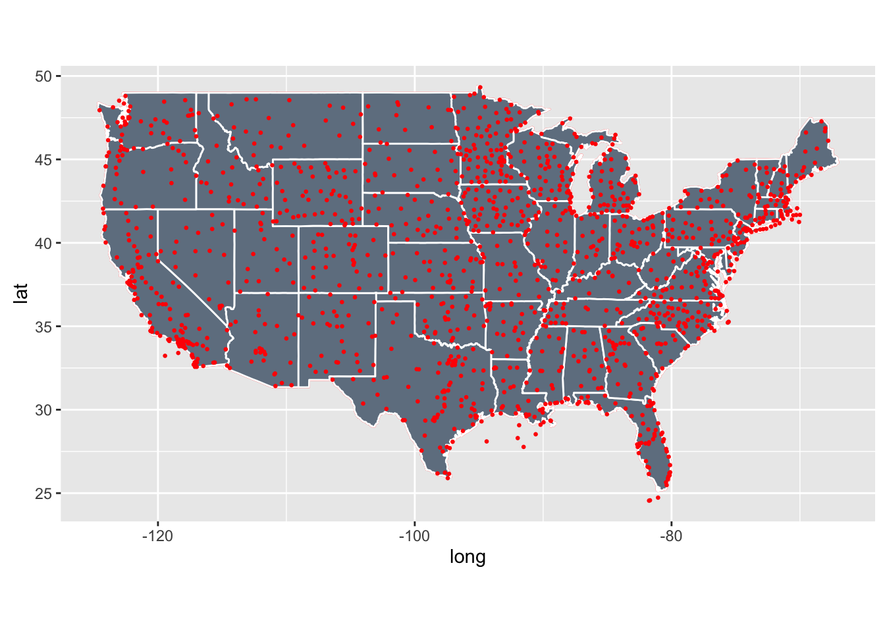

# Analysis of Linear Trends in USA Aiport Temperatures
Andy Pickering  
10/8/2016  


<https://www.r-bloggers.com/annual-mean-temperature-trends-12-airports/>


```r
rm(list=ls())
library(weatherData)
suppressPackageStartupMessages(library(lubridate))
library(ggplot2)
suppressPackageStartupMessages(library(plyr))
suppressPackageStartupMessages(library(maps))
library(RColorBrewer)
```

Now we need a list of the weather stations we will use. Luckily the weatherData package already contains a data frame 'USAirportWeatherStations' with all the stations and info about them.

```r
head(USAirportWeatherStations)
```

```
##           Station State airportCode   Lat     Lon Elevation   WMO
## 1         Central    AK        PARL 65.57 -144.80       292 99999
## 2            Atka    AK        PAAK 52.22 -174.20        17 99999
## 3        Buckland    AK        PABL 65.99 -161.12         0 99999
## 4 Portage Glacier    AK        PATO 60.79 -148.83        29 99999
## 5        Nivalina    AK        PAVL 67.73 -164.55         3 70148
## 6         Golovin    AK        PAGL 64.55 -163.05         8 70199
```

```r
# Years we will get data for
year_list=1980:2016
# station KMMO 1993 not working?
st_list <-USAirportWeatherStations$airportCode
st_list <- st_list[-which(st_list=="KMMO")]
```

Let's first plot all the station locations. For now, I'll just use those in the continental/lower 48 US states. Including others like Alaska, Hawaii, Virgin Islands etc. makes the map very large and difficult to see.

```r
# just plot all station locations
usa <- map_data("usa")
states <- map_data("state")

g<-ggplot() + geom_polygon(data = usa, aes(x=long, y = lat, group = group), fill=NA, color="red") + coord_fixed(1.3) 
g2<-g+geom_polygon(data=states,aes(x = long, y = lat, group = group), fill="slategray",color = "white") + guides(fill=FALSE)  # do this to leave off the color legend
all_cont=subset(USAirportWeatherStations,State!="AK" & State!="MP" & State!="PR" & State!="HI" & State!="VI" & State!="GU")
g2+geom_point(data=all_cont,aes(x=Lon,y=Lat),color="white",size=0.5)
```

<!-- -->

The next bit of code downloads the data from <http://www.wunderground.com>. This is the most time-consuming part of the analysis. It appears that the wunderground API only lets you download a year of data at a time. With my laptop and wifi speed, I estimate it takes about 2-3 sec to download each 1 year data file. For 36 years of data (1980-2016) at about 1600 stations, that works out to about 48 hours! Luckily it is easy to write a loop to do this, and I just let it run overnight or in the background until it was done.

```r
# Define function to download daily weather for 1 year
get_yearly_weather <- function (year,st_code){
        url <- paste0("http://www.wunderground.com/history/airport/",st_code,"/",year,"/1/1/CustomHistory.html?dayend=31&monthend=12&yearend=",year,"&req_city=NA&req_state=NA&req_statename=NA&format=1")
}

# Define a function to download the weather data for a given station code
get_all_years <- function(st_code){
        for (i in seq_along(year_list)) {
                year <- year_list[i]
                savefile<-file.path("~/AirportTemps/Data",paste0("wea",st_code,year,".csv"))
                if (file.exists(savefile)){
                        print(paste(savefile," already downloaded"))
                }else{
                        url=get_yearly_weather(year,st_code)
                        print(paste("Getting weather data for ",st_code," for year ",year))
                        download.file(url,savefile)
                }
        }
}

# Apply that function to station list to get data for all stations
tryapply(st_list, get_all_years)
```


Ok, we finally have all the yearly data files downloaded. 

```r
# Remove bad temperature values (marked as -99999 in data)
rm_bad_wea_values <- function(dat){
        dat$Min.TemperatureF[which(dat$Min.TemperatureF==-99999)]<-NA
        dat$Max.TemperatureF[which(dat$Max.TemperatureF==-99999)]<-NA
        dat$Mean.TemperatureF[which(dat$Mean.TemperatureF==-99999)]<-NA
        dat<-subset(dat,Mean.TemperatureF>-50);
        dat<-subset(dat,Mean.TemperatureF<150);
        dat
}

# Define a function to load and combine all years for a station into one dataframe
combine_years_wea <- function(st_code){
        savefile <-file.path( "~/AirportTemps/Data",paste0("wea",st_code,"combined.csv"))
        #        if (file.exists(savefile)){
        #                print(paste(savefile," already combined"))
        #        }else{
        print(paste("combining years for station ", st_code))
        # Load csv files for each year and combine into a single data frame
        year_list=1980:2015
        dat_all=data.frame()
        for (i in seq_along(year_list)) {
                year <- year_list[i]
                #print(year)
                dat <- read.csv( file.path( "~/AirportTemps/Data",paste0("wea",st_code,year,".csv")))
                dat<-rm_bad_wea_values(dat)
                dat$dd <- ymd(dat[,1])
                #                print(head(dat))
                dat_all=rbind(dat_all,dat)
                #print(dim(dat_all))
        }
        # Check to make sure we have data (some files are empty)
        if (nrow(dat_all)>(20*365)){
                # Save csv with combined data...
                write.csv(dat_all,savefile)
        }else{
                print(paste("station ",st_code," doesn't have data"))
        }
        #        }
}

# some stations don't work, so need tryapply()
tryapply(st_list, combine_years_wea)
```


```r
# Define a function to load a specified station and do fit

# save data frame with fit coeffs, p value etc.
temp_fits<-data.frame()
for (i in seq_along(st_list)) {
        fname<-file.path( "~/AirportTemps/Data",paste0("wea",st_list[i],"combined.csv"))
        if (file.exists(fname)){
                print(paste("Fitting to ",st_list[i]))
                dat<- read.csv(fname)
                dat$dd <- ymd(dat$dd)
                fit1 <- lm(Mean.TemperatureF~dd,data=dat)
                summary(fit1)
                temp_fits<-rbind(temp_fits,data.frame(airportCode=st_list[i],trend=fit1$coefficients[2],pval=summary(fit1)$coefficients[2,4]))
        }else{
                print(paste("combined file for station ", st_list[i], " doesn't exist, skipping"))
        }
}

# save a csv file with the fit results
write.csv(temp_fits,file.path( "~/AirportTemps/Data","temp_fits.csv"))
```


```r
# function to load combined 1980-2016 csv file for specified station
load_combined<-function(st_code){
        fname<-file.path( "~/AirportTemps/Data",paste0("wea",st_code,"combined.csv"))
        dat<- read.csv(fname)
        dat$dd <- ymd(dat$dd)
        dat
}
```


```r
temp_fits <- read.csv(file.path( "~/AirportTemps/Data","temp_fits.csv"))

# convert trend to deg/decade
temp_fits$trend <- temp_fits$trend*365*10


# How many fits have significant/non sig. pvalues?
ig<-which(temp_fits$pval<0.025)
ib<-which(temp_fits$pval>0.025)
length(ig)
```

```
## [1] 629
```

```r
length(ib)
```

```
## [1] 395
```

```r
max(temp_fits$trend[ig])
```

```
## [1] 3.473326
```

```r
max(temp_fits$trend[ib])
```

```
## [1] 2.645032
```

```r
par(mfrow=c(1,3))
hist(temp_fits$trend,xlim=c(-5,5),breaks=10)
hist(temp_fits$trend[ib],xlim=c(-5,5),breaks=10)
hist(temp_fits$trend[ig],xlim=c(-5,5),breaks=10)
```

<!-- -->

```r
# look at big outliers
# looks like in the stations with absurdly huge trends, they have a couple of very small values

#max(temp_fits$trend)
#idb<-which(temp_fits$trend>6)
#View(temp_fits[idb,])

#id<-idb[1]
#print(temp_fits$airportCode[id])
#print(temp_fits$trend[id])
#d3 <- load_combined(temp_fits$airportCode[id])
#min(d3$Mean.TemperatureF,na.rm = TRUE)
#d3<-subset(d3,Mean.TemperatureF>-100)
#g<-ggplot(d3,aes(x=dd,y=Mean.TemperatureF))+geom_line()+geom_smooth(method="lm")
#g
#}

# look at details of fit
#fit1 <- lm(Mean.TemperatureF~dd,data=d3)
#summary(fit1)

# Join to data frame with station info
results2 <- join(temp_fits,USAirportWeatherStations,by="airportCode")

# Convert from deg/day to deg/decade
#results2$trend <- results2$trend*365*10

# Keep only continental and lower 48 states (map doesn't look good with others)
results2<-subset(results2,State!="AK" & State!="MP" & State!="PR" & State!="HI" )

sortdat<-arrange(results2,desc(trend))
head(sortdat)
```

```
##       X airportCode    trend         pval      Station State   Lat     Lon
## 1 dd574        KOLF 3.473326 5.393107e-34   Wolf Point    MT 48.10 -105.58
## 2 dd703        KHTO 2.013744 4.799912e-44 East Hampton    NY 40.97  -72.25
## 3 dd513        KMOX 1.831821 8.707694e-07       Morris    MN 45.57  -95.97
## 4 dd688        KRNO 1.666679 7.237582e-38         Reno    NV 39.50 -119.78
## 5 dd365        KHUT 1.636124 1.180091e-21   Hutchinson    KS 38.07  -97.87
## 6 dd521        KRGK 1.627320 5.429190e-06     Red Wing    MN 44.58  -92.48
##   Elevation   WMO
## 1       605 99999
## 2        55 99999
## 3       344 99999
## 4      1341 72488
## 5       470 99999
## 6       239 99999
```

```r
tail(sortdat)
```

```
##          X airportCode     trend         pval      Station State   Lat
## 996  dd342        KEKM -2.152481 5.944056e-38      Elkhart    IN 41.72
## 997  dd339        KAID -2.152536 2.705784e-13     Anderson    IN 40.12
## 998  dd497        KELO -2.278304 7.698791e-21          Ely    MN 47.82
## 999  dd181        KTEX -2.347279 4.200821e-34    Telluride    CO 37.95
## 1000 dd340        KBAK -2.369682 1.266927e-24     Columbus    IN 39.27
## 1001 dd433        KPQI -3.380191 5.686474e-66 Presque Isle    ME 46.68
##          Lon Elevation   WMO
## 996   -86.00       237 99999
## 997   -85.62       280 99999
## 998   -91.83       443 99999
## 999  -107.90      2767 99999
## 1000  -85.90       200 99999
## 1001  -68.05       146 72713
```

## Plot map with circles proportional to trend


```r
## Plot map with circles proportional to trend
usa <- map_data("usa")
states <- map_data("state")

g<-ggplot() + geom_polygon(data = usa, aes(x=long, y = lat, group = group), fill=NA, color="red") + coord_fixed(1.3) 

g2<-g+geom_polygon(data=states,aes(x = long, y = lat, group = group), fill="slategray",color = "white") + guides(fill=FALSE)  # do this to leave off the color legend

g2 + geom_point(data = results2, aes(x = Lon, y = Lat,size = abs(trend),color=trend)) + scale_color_gradient2(midpoint=0, low="blue", mid="white",high="red", space ="Lab" ,limits=c(-3,3)) +ggtitle("Linear trend [deg/decade] in mean temp., 1980-2016") + labs(x="Longitude",y="Latitude")
```

<!-- -->
