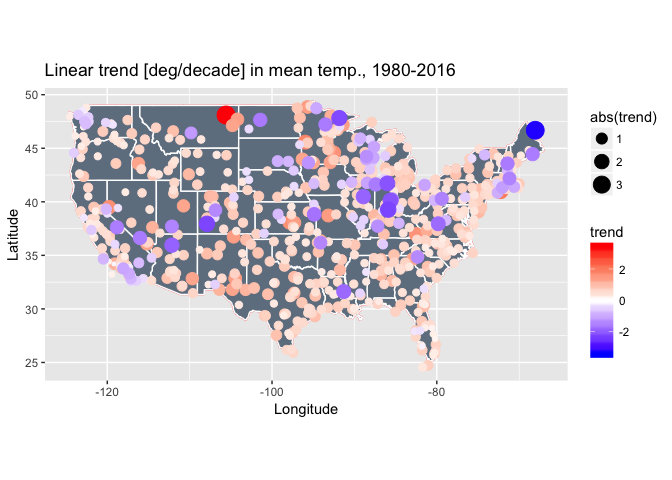

# Analysis of Linear Trends in USA Aiport Temperatures
Andy Pickering  
10/8/2016  


<https://www.r-bloggers.com/annual-mean-temperature-trends-12-airports/>


```r
rm(list=ls())
library(weatherData)
suppressPackageStartupMessages(library(lubridate))
library(ggplot2)
suppressPackageStartupMessages(library(plyr))
suppressPackageStartupMessages(library(maps))
library(RColorBrewer)
library(magrittr)
library(leaflet)
```

Now we need a list of the weather stations we will use. Luckily the weatherData package already contains a data frame 'USAirportWeatherStations' with all the stations and info about them.

```r
head(USAirportWeatherStations)
```

```
##           Station State airportCode   Lat     Lon Elevation   WMO
## 1         Central    AK        PARL 65.57 -144.80       292 99999
## 2            Atka    AK        PAAK 52.22 -174.20        17 99999
## 3        Buckland    AK        PABL 65.99 -161.12         0 99999
## 4 Portage Glacier    AK        PATO 60.79 -148.83        29 99999
## 5        Nivalina    AK        PAVL 67.73 -164.55         3 70148
## 6         Golovin    AK        PAGL 64.55 -163.05         8 70199
```

```r
# Years we will get data for
year_list=1980:2016
# station KMMO 1993 not working?
st_list <-USAirportWeatherStations$airportCode
st_list <- st_list[-which(st_list=="KMMO")]
```

Let's first plot all the station locations. For now, I'll just use those in the continental/lower 48 US states. Including others like Alaska, Hawaii, Virgin Islands etc. makes the map very large and difficult to see.

```r
# just plot all station locations
cont_us=subset(USAirportWeatherStations,State!="AK" & State!="MP" & State!="PR" & State!="HI" & State!="VI" & State!="GU")

m <- leaflet() %>%
        setMaxBounds(-125,23,-67,50)%>%
        addTiles() %>%  # Add default OpenStreetMap map tiles
        addCircleMarkers(lng=cont_us$Lon,lat=cont_us$Lat,popup=cont_us$Station,radius=2,fill=TRUE,color="grey")#,clusterOptions = markerClusterOptions())
#addCircles(lng=cont_us$Lon,lat=cont_us$Lat)
m  # Print the map
```

<!--html_preserve--><div id="htmlwidget-7a62270cd27fe3795027" style="width:672px;height:480px;" class="leaflet html-widget"></div>
<script type="application/json" data-for="htmlwidget-7a62270cd27fe3795027">{"x":{"calls":[{"method":"setMaxBounds","args":[23,-125,50,-67]},{"method":"addTiles","args":["http://{s}.tile.openstreetmap.org/{z}/{x}/{y}.png",null,null,{"minZoom":0,"maxZoom":18,"maxNativeZoom":null,"tileSize":256,"subdomains":"abc","errorTileUrl":"","tms":false,"continuousWorld":false,"noWrap":false,"zoomOffset":0,"zoomReverse":false,"opacity":1,"zIndex":null,"unloadInvisibleTiles":null,"updateWhenIdle":null,"detectRetina":false,"reuseTiles":false,"attribution":"&copy; <a href=\"http://openstreetmap.org\">OpenStreetMap\u003c/a> contributors, <a href=\"http://creativecommons.org/licenses/by-sa/2.0/\">CC-BY-SA\u003c/a>"}]},{"method":"addCircleMarkers","args":[[33.18,33.58,32.62,30.63,33.57,32.9,34.65,31.32,31.42,33.97,34.65,32.3,30.68,34.75,32.38,31.28,33.22,31.87,35.21,36.28,34.55,35.26,36.13,36.18,35.73,35.97,33.22,36.3,35.33,36,34.48,36.27,35.83,34.73,34.92,34.18,36.37,34.6,36.2,33.45,36.35,36.37,35.94,33.64,32.95,32.17,31.47,33.68,32.82,33.47,31.6,35.13,32.88,35.95,33.42,35.1,35.27,35.02,33.32,33.53,31.42,32.65,36.93,33.43,34.65,33.62,34.52,34.27,32.12,35.65,32.5,35.66,33.4,34.37,33.04,35.67,40.98,38.22,39.13,35.43,37.37,33.62,39.28,40.88,33.93,34.2,37.98,41.78,39.8,34.22,33.97,33.13,32.62,34.85,34.9,34.77,40.8,34.08,36.77,33.87,33.92,36.32,37.67,32.83,34.6,33.93,34.05,33.82,34.67,37.7,37.28,38.55,41.32,35.07,37.62,37.63,36.58,34.23,32.82,39.1,33.3,35.68,32.82,32.85,36.33,32.57,33.23,34.12,37.42,34.3,32.7,40.02,37.73,34.05,39.49,34.2,35.66,37.47,34.63,34.1,35.67,33.83,36.03,33.95,40.15,40.5,37.33,33.88,41.5,38.52,32.73,34.43,35.23,37.9,34.75,32.57,32.83,37.62,41.78,37.37,33.78,38.7,34.02,34.9,33.68,36.67,37.52,38.52,38.27,40.38,33.8,39.32,33.63,38.9,39.13,38.38,34.73,36.32,34.22,34.73,34.72,33.22,36.99,36.94,39.53,38.97,40.17,37.45,39.57,39.22,39.92,39.72,39.24,40.5,37.3,38.82,39.87,37.15,39.65,38.68,40.45,39.12,38.53,40.43,40.48,38.07,38.05,39.27,39.22,40.05,38.5,38.28,37.27,37.95,37.28,41.51,41.93,41.17,41.37,41.33,41.73,41.27,41.75,41.48,39.13,38.69,39.68,28.01,28.23,27.18,26,26.25,26.15,29.73,28.47,27.95,30.78,28.23,30.33,29.62,29.18,30.4,24.55,26.07,26.58,27.5,26.2,28.05,29.68,30.43,25.48,30.5,27.98,28.82,27.85,28.43,25.82,28.1,24.73,30.84,30.23,30.35,24.57,30.4,30.72,30.22,29.17,25.9,28.55,30.07,26.68,30.22,30.07,26.92,27.92,30.47,26.53,28.78,29.97,27.77,27.4,28.52,30.38,25.65,27.97,28.62,30.48,27.65,33.99,33.98,34.01,32.95,33.02,34.13,32.19,31.53,33.37,33.95,31.53,33.65,31.25,31.25,32.52,33.4,33.34,33.78,34.72,34.32,31.88,32.33,32.7,33.92,33.31,33.88,34.35,32.13,31.15,32.02,30.97,30.78,32.63,41.58,41.7,41.4,42.55,41.28,43.08,41.99,41.68,42.06,40.78,42.75,41.27,43.08,41.88,42.05,41.02,41.02,41.83,42.4,43.28,41.98,41.53,41.62,42.44,40.47,43.4,41.05,42.55,40.67,40.71,41.63,40.63,42.78,43.15,42.11,41.37,42.23,42.68,43,41.1,41.3,41.01,40.75,43.21,43.17,42.61,42.4,41.67,42.32,43.57,42.55,47.77,43.63,43.52,42.73,46.38,42.17,47.45,43.05,44.88,45.82,42.92,44.35,45.12,43.5,42.48,44.52,43.83,42.65,44.21,38.9,41.77,38.55,40.48,40.03,38.57,39.83,41.92,41.87,38.76,37.78,41.78,41.45,41.37,38.32,39.48,37.75,41.98,40.67,42.12,42.2,39.85,41.75,42.42,39.95,40.12,39.27,39.15,41.72,38.05,39.8,41,40.65,41.62,41.53,38.25,39.45,39.73,40.42,40.25,39.58,41.7,41.45,37.75,37.08,39.55,37.67,37.77,37,38.33,38.05,38.95,39.05,38.35,37.93,39.37,39.38,38.07,38.85,37.62,37.65,38.83,37.05,39.02,39.13,38.85,37.3,37.33,38.87,38.8,39.07,37.3,36.97,39.05,37.82,38.25,37.9,36.67,37.6,38.03,38.23,37.08,37.73,37.07,38.18,38,31.74,32.52,27.77,28.1,29.35,29.33,29.7,29.78,29.78,28.3,29.07,29.1,31.33,30.03,29.25,32.5,30.53,32.53,31.4,29.57,30.12,30.21,30.2,32.52,29.98,29.83,30.05,29.6,31.05,29.72,30.34,28.53,32.47,42.43,41.25,42.7,42.55,42.15,42.47,42.37,41.87,42.58,42.2,41.68,41.68,41.65,41.67,42.72,41.4,42.57,42.27,42.18,42.07,41.92,42.21,38.31,39.28,38.82,39.47,39.18,39.7,39.33,38.28,38.33,45.47,44.32,44.8,44.45,46.87,46.61,47.28,46.12,43.97,44.05,44.05,45.65,43.88,46.68,43.65,44.07,43.4,44.53,45.3,43.62,43.96,45.97,44.99,41.87,43.72,43.32,42.1,42.57,41.94,41.81,45.07,42.22,42.23,43.78,42.13,42.3,44.28,46.25,41.93,42.74,47.17,42.42,42.23,45.75,42.97,42.88,41.92,44.37,45.82,46.53,42.27,42.77,44.27,42.25,43.53,43.43,43.17,45.13,46.53,46.31,43.62,44.45,42.63,44.02,47.45,45.92,45.01,45.57,42.67,42.91,46.35,44.73,46.47,45.9,42.23,46.45,46.42,46.84,46.99,48.15,45.7,45.24,45.23,47.75,47.84,48.75,47.78,47.82,45.89,43.99,45.1,45.31,46.75,45.56,46.38,48.94,43.91,44.86,48.27,43.68,46.55,45.15,48.02,45.33,43.67,45.87,48.73,47.2,47.5,46.4,45.57,47.85,46.7,46.83,46.83,44.02,47.82,49.32,45.7,47.4,44.33,45.64,44.76,44.83,46.28,43.65,45.5,47.22,44.87,47.38,45.12,48.57,45.95,44.63,45.07,43.65,44.99,44.22,44.45,45.57,44.88,44.97,44.08,43.65,44.12,46.9,43.98,44.58,48.85,43.92,44.55,45.55,44.95,48.07,47.05,44.32,38.1,37.23,38.82,38.72,37.77,40.1,38.58,37.15,39.32,39.12,36.77,37.23,38.93,39.77,38.75,38.67,38.73,37.73,38.13,36.88,39.82,34.3,30.37,34.99,32.33,31.27,34.38,30.42,33.65,33.48,30.4,33.45,33.5,31.62,32.32,31.18,32.33,32.55,30.46,31.47,34.27,32.35,48.6,46.67,46.35,46.43,47.6,45.82,45.95,45.78,48.6,45.25,48.3,47.13,48.22,47.48,46.6,46.25,48.55,47.33,45.7,47.05,46.43,44.57,46.92,48.1,47.7,44.65,36.22,35.48,36.28,35.42,35.53,35.78,34.73,35.65,36.22,35.94,35.57,36.46,35.82,36.43,35.2,35.02,36.3,35.19,35.65,35.43,36.05,35.22,36.27,35.38,35.07,36.03,34.98,35.63,35.13,35.33,36.08,35.27,35.03,34.79,35.73,35.22,35,34.27,35.43,36.13,35.33,35.76,35.92,34.72,34.9,34.83,35.17,35.87,36.44,35.85,35.23,34.61,46.77,46.8,48.12,46.9,47.95,48.18,46.93,48.42,48.27,47.65,46.1,47.97,46.01,42.05,42.58,40.88,41.43,41.87,40.3,42.83,40.73,41.45,40.08,40.97,40.6,40.45,40.52,41.13,40.85,40.78,40.2,42.05,41.62,41.12,41.98,41.05,41.45,41.3,42.47,41.37,41.1,41.77,42.87,42.8,42.78,44.58,43.2,42.9,44.35,43.57,43.63,42.93,44.27,43.08,43.29,41.2,39.45,40.18,40.88,40.7,39.37,40.8,39.93,40.03,40.85,40.28,40.02,39.02,40.62,41.01,32.85,34.1,34.98,35.8,35.05,35.14,32.83,36.45,32.33,34.43,34.38,32.27,36.9,36.75,35.17,35.52,32.85,32.68,35.88,32.28,35.65,33.3,35.62,36.45,33.47,32.63,35.18,33.23,35,36.74,41.67,40.6,36.62,40.83,39.28,38.55,36.21,36.08,40.07,36.23,39.42,37.62,39.52,39.5,38.05,39.5,40.9,41.11,40.77,42.57,42.11,40.85,40.82,42.75,42.63,44,42.22,42.93,42.5,42.17,40.73,43.33,44.05,41.07,40.97,43.1,40.8,42.48,40.65,43.35,42.15,41.51,40.77,44.93,41.7,44.68,44.69,41.63,43.12,42.85,44.38,41.5,43.12,43.15,41.07,41.04,39.9,40.47,39.36,40.87,41.52,40.92,41.57,41.42,40,39.9,39.59,41.33,41.34,41.02,40.71,40.62,39.83,39.82,39.75,39.1,40.82,40.08,41.6,41.56,41.27,39.43,39.95,40.02,41.78,35.02,36.77,36.61,34.8,34.72,36.68,34.3,34.15,36.77,35.33,36.33,34.65,36.3,34.98,34.57,34.67,35.85,34.88,35.65,35.4,36.73,35.53,36.17,35.42,36.2,36.04,36.38,34.34,45.25,42.05,44.4,46.15,44.83,43.58,44.5,45.67,45.62,44.12,45.53,44.58,44.58,45.28,42.17,42.15,45.19,45.52,42.37,44.02,43.42,45.68,45.6,45.2,43.23,44.25,42.58,45.42,44.92,45.77,42.62,45.55,45.93,40.33,40.24,41.14,40.65,40.82,40.13,40.35,40.3,41.33,41.8,40.78,40.77,40.22,41.18,42.08,41.38,41.25,40.63,40.32,41.63,40.28,40.12,40.2,40.43,40.2,39.88,40.5,40.08,40.38,39.92,40.85,41.05,41.35,41.17,41.6,41.73,41.92,41.45,34.25,34.45,34.67,34.5,33.95,32.9,33.82,34.18,34.85,34.9,33.92,33.97,33.68,32.48,33.97,33.46,34.98,43.02,43.73,45.57,43.8,45.45,45.04,44.92,44.3,44.73,43.58,44.38,43.77,45.54,44.05,44.38,44.05,44.15,45.93,42.92,43.4,45.67,35.21,36.09,36.34,35.2,36.38,35.58,35.21,35.65,35.17,36.12,35.03,35.95,36,35.05,35.6,36.02,35.35,36.48,35.82,36.02,30.22,32.7,30.05,33.18,32.66,32.03,32.71,29.7,32.42,31.62,32.97,32.98,27.73,35.23,30.3,30.19,35.7,29.95,25.9,30.74,34.43,30.58,28.45,27.77,30.36,32.85,32.9,36.02,29.37,29.37,33.2,30.68,30.07,29.52,32.43,29.6,31.8,33.72,30.9,32.82,31.83,32.35,29.3,31.07,33.07,29.35,31.15,29.65,26.23,29.97,31.08,31.78,30.5,33.65,29.12,31.23,27.55,31.95,26.18,30.37,32.78,32.77,27.7,27.5,31.58,33.63,28.73,31.48,32.68,28.08,29.53,29.7,29.53,29.89,32.22,29.62,31.37,29.38,33.98,29.33,31.15,32.35,30.75,28.85,31.92,26.16,37.62,38.37,37.7,37.7,40.73,41.12,41.78,38.43,38.76,41.2,39.62,40.22,37.08,40.78,39.33,39,40.43,38.01,38.25,36.66,38.53,38.27,39.08,37.65,36.89,36.69,37.14,36.63,37.21,38.13,38.72,36.57,38.85,37.13,38.72,37.95,38.95,37.08,36.77,36.98,37.33,36.93,36.82,38.5,37.7,36.9,37.13,37.18,37.5,37.32,36.7,37.36,39.14,36.69,38.27,36.68,36.99,37.85,44.42,44.47,44.2,44.5,43.53,43.35,42.89,47.97,46.1,48.17,47.53,48.55,48.8,48.12,47.4,47.03,47.3,48.52,47.63,47.08,46.57,46.97,48.46,46.12,47.2,48.35,46.97,47.9,46.27,46.75,47.5,47.5,47.45,47.68,47.23,47.62,47.28,47.13,46.48,47.27,47.95,45.62,46.57,45.15,45.2,43.02,44.61,43.16,46.72,43.43,42.89,45.93,45.15,45.93,44.25,43.42,44.93,44.78,43.7,44.87,43.77,44.48,46.02,44.44,42.62,42.6,43.22,43.87,44.63,42.95,43.13,44.13,45.1,43.12,42.61,45.31,43.98,45.7,42.76,45.63,45.48,43.77,44.55,44.85,46.68,43.17,43.02,43.93,46.55,38.99,37.78,37.3,39.3,38.37,38.88,40.18,38.37,37.87,39.65,39.4,39.35,41.71,43.93,41.64,41.92,42.58,44.75,41.53,41.71,44.21,42.83,41.29,41.43,43.09,43.94,44.29,44.27,42.56,44.53,41.05,43.1,41.79,41.93,42.44,41.13,43.12,41.15,41.41,42.06,42.75,42.57,44.52,42.92,41.15,41.28,44.35,43.6,41.32,42.82,44.55,43.07,41.6,41.8,44.77,43.97,44.38,44.52],[-86.78,-85.85,-85.43,-88.07,-86.75,-87.25,-86.95,-85.45,-87.04,-86.08,-86.77,-86.4,-88.25,-87.62,-86.37,-85.72,-87.62,-86.02,-91.74,-94.31,-93.58,-93.09,-90.92,-94.12,-91.65,-89.95,-92.8,-92.47,-94.37,-94.17,-93.1,-93.15,-90.65,-92.23,-92.15,-91.93,-94.1,-91.57,-94.48,-93.98,-94.22,-92.47,-89.83,-91.76,-111.77,-110.88,-109.6,-112.08,-109.68,-111.73,-110.35,-111.67,-112.72,-112.15,-112.38,-114.34,-113.95,-110.73,-111.65,-112.38,-110.85,-114.62,-111.45,-112.02,-112.42,-111.92,-109.38,-110,-110.93,-112.15,-114.4,-109.06,-118.42,-118.57,-116.91,-121.28,-124.1,-122.28,-121.43,-119.05,-118.37,-114.72,-120.72,-121.67,-116.97,-118.35,-122.05,-124.23,-121.85,-119.08,-117.63,-117.28,-116.47,-116.78,-117.88,-114.62,-124.17,-118.03,-119.72,-117.98,-118.33,-119.63,-122.12,-115.58,-120.07,-118.4,-118.24,-118.15,-120.47,-121.82,-120.52,-121.3,-122.32,-118.15,-118.83,-120.95,-121.85,-118.07,-117.13,-121.57,-117.35,-117.68,-115.68,-117.12,-119.95,-117.12,-119.45,-119.12,-122.05,-116.17,-117.22,-124.07,-122.22,-117.6,-121.62,-119.2,-117.83,-122.12,-118.08,-117.78,-120.63,-116.5,-119.07,-117.45,-122.25,-122.3,-121.82,-117.27,-120.53,-121.5,-117.17,-119.83,-120.63,-121.25,-118.73,-116.98,-116.97,-122.38,-122.47,-121.93,-118.05,-121.58,-118.45,-120.45,-117.87,-121.6,-122.25,-122.82,-121.93,-120.57,-118.33,-120.13,-116.17,-120,-123.2,-121.96,-120.58,-119.4,-118.48,-118.22,-120.57,-117.35,-120.11,-121.79,-107.8,-104.82,-103.22,-105.87,-104.85,-106.87,-105.12,-104.75,-102.29,-107.52,-108.63,-104.72,-104.67,-107.75,-106.92,-104.77,-105.02,-108.53,-106.93,-104.63,-107.22,-102.68,-103.52,-103.67,-106.32,-107.89,-107.9,-104.52,-104.33,-107.9,-102.61,-72.83,-72.68,-73.13,-73.48,-72.05,-72.65,-72.88,-72.18,-73.13,-75.47,-75.36,-75.6,-82.35,-81.44,-80.22,-80.24,-80.11,-81.77,-85.03,-82.45,-81.78,-86.52,-80.6,-81.52,-83.1,-81.05,-86.47,-81.75,-80.15,-81.87,-80.37,-80.17,-81.75,-82.27,-86.68,-80.38,-81.7,-82.02,-81.81,-82.52,-81.32,-80.28,-80.65,-81.05,-85.18,-81.68,-87.32,-81.68,-81.42,-87.02,-81.88,-82.22,-80.28,-81.33,-85.58,-80.12,-85.68,-83.58,-81.99,-82.68,-87.18,-81.75,-81.23,-81.33,-82.63,-82.55,-80.8,-84.37,-80.43,-82.53,-80.72,-86.53,-80.42,-83.67,-83.97,-84.6,-84.27,-85.07,-84.85,-82.37,-84.18,-81.97,-83.32,-82.5,-84.42,-82.4,-81.47,-84.93,-82,-84.57,-84.52,-84.87,-83.83,-81.57,-84.83,-83.65,-84.52,-84.77,-84.3,-85.17,-81.2,-81.38,-81.15,-83.2,-83.28,-83.6,-95.34,-94.92,-95.05,-92.4,-91.67,-94.27,-93.62,-93.57,-93.86,-91.13,-93.77,-95.77,-92.62,-91.7,-94.78,-93.37,-94.36,-90.33,-90.7,-91.73,-95.38,-93.65,-90.58,-93.87,-91.43,-94.75,-91.98,-94.18,-91.33,-95.03,-91.55,-93.9,-96.2,-93.33,-92.91,-91.13,-91.17,-91.98,-96.08,-92.45,-93.12,-95.26,-95.42,-95.83,-95.2,-95.24,-96.38,-93.02,-113.33,-116.22,-113.77,-116.82,-116.63,-112.07,-114.46,-117.02,-112.3,-115.68,-115.87,-116.1,-115.43,-112.6,-112.18,-113.88,-114.3,-114.48,-114.22,-111.81,-111.58,-114.93,-90.05,-88.47,-89.85,-88.92,-88.28,-90.15,-88.87,-88.25,-87.6,-87.61,-89.25,-87.75,-90.52,-88.68,-88.87,-88.28,-89.02,-87.9,-89.68,-87.92,-89.1,-89.67,-89.67,-87.87,-91.2,-85.62,-85.9,-86.62,-86,-87.53,-86.1,-85.2,-86.15,-87.42,-85.79,-86.95,-87.32,-86.27,-86.93,-85.4,-85.8,-86.32,-87.01,-97.22,-95.57,-97.65,-95.48,-99.97,-101.9,-96.18,-97.28,-95.67,-96.77,-98.87,-100.72,-101.7,-99.83,-97.87,-99.27,-97.27,-97.43,-94.88,-100.97,-95.22,-96.67,-94.73,-98.58,-95.52,-98.82,-97.65,-95.62,-97,-86.42,-84.67,-87.68,-84.9,-85.97,-87.5,-83.32,-84.6,-85.67,-84.08,-87.17,-88.77,-85.73,-84.6,-93.1,-92.58,-91.52,-94.4,-89.43,-89.4,-91.1,-92.13,-93.3,-91.98,-91.87,-90.2,-92.55,-91.88,-89.97,-93.67,-91.15,-93.75,-92.3,-90.67,-93.22,-93.14,-91.98,-92.03,-90.25,-90.03,-90.03,-91.3,-93.03,-91.33,-89.82,-90.58,-93.82,-73.29,-70.07,-73.17,-71.76,-72.72,-71.28,-71.03,-71.02,-70.92,-72.53,-70,-70.97,-70.52,-70.28,-71.12,-70.62,-72.27,-71.88,-71.18,-70.22,-70.73,-71.11,-75.12,-76.61,-76.87,-76.17,-76.67,-77.73,-76.42,-76.4,-75.52,-69.58,-69.8,-68.83,-68.37,-68.02,-69.53,-68.32,-67.8,-69.72,-70.95,-70.28,-68.68,-69.93,-68.05,-70.32,-69.1,-70.72,-69.68,-85.27,-84.74,-86.41,-86.17,-85.2,-84.07,-85.5,-84.69,-83.16,-84.42,-83.43,-85.44,-83.57,-83.75,-85.55,-82.99,-86.43,-85.25,-85.42,-84.47,-85.05,-86.11,-88.5,-83.02,-83.33,-87.03,-83.75,-85.52,-84.59,-84.68,-88.12,-90.13,-84.47,-84.6,-86.25,-84.96,-84.08,-83.87,-86.25,-87.63,-87.55,-85.46,-82.83,-83.4,-83.98,-82.8,-87.9,-85.92,-84.7,-84.8,-83.42,-82.53,-87.4,-85.58,-84.37,-84.6,-83.53,-95.21,-92.8,-96.66,-94.2,-94.52,-92.95,-93.99,-96,-90.34,-90.38,-96.94,-93.65,-92.69,-93.27,-94.56,-94.51,-96.42,-94.38,-93.61,-94.81,-95.35,-95.11,-93.03,-92.48,-93.37,-93.68,-93.22,-92.86,-96.65,-92.93,-95.4,-94.62,-91.4,-94.93,-94.13,-93.27,-96.62,-92.5,-92.18,-95.88,-92.83,-91.83,-94.9,-96.5,-92.5,-93.32,-95.32,-94.08,-93.45,-96.15,-94.42,-95.7,-93.52,-94.38,-92.83,-95.08,-93.38,-94.35,-93.23,-93.35,-94.98,-96.18,-93.92,-95.82,-95.97,-93.22,-95.72,-91.7,-95.58,-93.25,-95.07,-96.32,-92.48,-95.7,-92.5,-95.08,-94.07,-93.07,-96.18,-91.75,-94.5,-92.55,-89.57,-92.22,-93.17,-90.44,-92.55,-92.15,-94.5,-94.72,-94.6,-90.32,-93.38,-90.43,-94.92,-90.37,-90.65,-93.55,-92.13,-91.77,-91.9,-93.58,-90.51,-89.45,-89.78,-90.22,-89.25,-89.53,-88.92,-88.45,-90.98,-89.07,-88.58,-90.08,-91.3,-90.08,-90.47,-88.75,-88.57,-88.53,-89.33,-88.77,-91.03,-113.1,-113.15,-104.26,-109.83,-115.37,-108.61,-112.5,-111.15,-112.37,-112.55,-114.27,-104.8,-106.62,-111.37,-112,-114.15,-109.77,-106.93,-110.45,-109.47,-105.87,-112.32,-114.08,-105.58,-104.2,-111.1,-81.67,-81.17,-78.98,-80.15,-78.38,-80.3,-76.66,-80.52,-81.1,-79.07,-77.05,-80.55,-81.61,-81.42,-81.16,-80.62,-77.17,-83.86,-79.9,-82.55,-79.47,-80.93,-76.18,-78.73,-77.05,-76.57,-78.88,-77.39,-78.93,-77.97,-79.95,-75.55,-79.5,-79.37,-81.38,-75.62,-77.98,-77.9,-81.94,-80.22,-77.62,-80.96,-75.7,-77.45,-76.88,-77.62,-79.02,-78.78,-77.71,-77.9,-79.4,-79.06,-100.75,-102.8,-98.92,-96.8,-97.18,-103.63,-98.68,-101.35,-101.28,-101.43,-97.15,-97.4,-102.66,-102.8,-100,-98,-99.65,-103.6,-96.75,-103.1,-99,-96.53,-95.6,-98.32,-98.43,-99.33,-101.62,-100.68,-96.75,-99.77,-100.58,-101.07,-98.95,-95.92,-97.43,-101.8,-97.33,-95.9,-98.68,-96.02,-102.98,-96.17,-100.55,-72,-71.52,-71.18,-71.5,-72.27,-71.55,-71.42,-72.3,-71.43,-71.3,-70.82,-70.92,-74.63,-74.57,-74.13,-74.28,-74.17,-75.07,-74.42,-74.84,-74.35,-74.07,-74.82,-74.6,-74.92,-74.67,-74.74,-104.47,-105.68,-106.05,-107.18,-106.62,-106.8,-105.98,-103.15,-104.27,-103.08,-103.32,-107.72,-106.58,-108.23,-107.9,-108.78,-106.1,-103.22,-106.28,-106.92,-105.15,-104.53,-106.08,-105.67,-105.53,-108.15,-103.6,-107.27,-105.66,-104.66,-115.78,-116.87,-116.02,-115.78,-114.85,-118.63,-115.19,-115.17,-118.57,-115.03,-118.7,-114.52,-115.97,-119.78,-117.08,-117.08,-117.8,-114.97,-73.98,-77.71,-77.99,-72.62,-72.87,-73.8,-77.05,-76.02,-75.98,-78.73,-79.28,-76.9,-73.42,-73.62,-75.73,-73.7,-72.25,-78.95,-73.1,-76.45,-73.78,-76.39,-79.27,-74.26,-73.9,-74.85,-74.8,-75.47,-73.52,-73.88,-77.67,-73.93,-74.2,-74.1,-76.12,-75.38,-71.92,-81.47,-83.14,-81.42,-84.52,-81.89,-81.68,-81.43,-81.48,-81.87,-82.88,-84.2,-84.22,-84.42,-82.17,-83.67,-84.03,-83.06,-84.05,-82.93,-82.67,-84.42,-82.52,-83.07,-83.8,-83.48,-80.67,-83.79,-81.9,-82.46,-80.7,-94.62,-98.67,-94.74,-96.67,-97.22,-101.51,-97.02,-97.12,-96.02,-99.2,-97.92,-98.4,-99.77,-99.05,-98.42,-99.27,-97.42,-95.78,-95.37,-97.6,-97.1,-97.65,-97.08,-97.38,-95.9,-95.98,-97.78,-98.98,-122.77,-124.28,-118.97,-123.88,-117.82,-118.95,-123.28,-121.88,-121.17,-123.22,-122.95,-124.07,-124.05,-118,-120.4,-121.73,-123.14,-118.4,-122.87,-117.02,-124.25,-118.85,-122.6,-123.97,-123.35,-121.15,-117.89,-123.82,-123,-122.86,-123.37,-122.4,-119.26,-75.12,-75.56,-75.38,-75.43,-76.86,-80.28,-79.93,-78.32,-75.73,-78.63,-79.95,-80.4,-76.85,-78.9,-80.18,-79.87,-76.92,-79.1,-78.83,-80.21,-79.4,-76.3,-76.77,-76.57,-75.15,-75.25,-80.22,-75.02,-75.97,-76.87,-77.85,-78.41,-71.8,-71.58,-71.42,-71.43,-71.5,-71.3,-82.16,-79.88,-82.89,-82.72,-81.12,-80.03,-78.72,-79.72,-82.35,-82.22,-80.8,-80.99,-78.93,-80.72,-80.47,-80.86,-81.06,-102.51,-103.62,-103.52,-99.32,-98.43,-102.02,-97.15,-96.82,-103.87,-96.73,-98.22,-98.03,-100.41,-101.6,-100.28,-103.07,-103.1,-102.17,-97.38,-99.8,-96.99,-89.39,-88.46,-88.38,-88.5,-88.99,-89.59,-89.04,-88.38,-88.22,-86.68,-85.2,-85.08,-89.4,-90,-88.92,-86.52,-89.87,-82.4,-83.98,-84.23,-96.37,-97.05,-102.21,-96.59,-97.09,-96.4,-96.27,-98.2,-99.68,-97.22,-96.83,-97.32,-98.03,-101.7,-97.7,-97.67,-101.4,-94.02,-97.43,-98.24,-100.28,-96.37,-99.22,-97.5,-95.41,-96.85,-97.03,-102.55,-100.78,-100.92,-97.18,-97.68,-95.55,-95.24,-99.85,-95.17,-106.4,-96.67,-102.9,-97.37,-104.8,-94.65,-94.8,-97.83,-96.07,-99.18,-97.72,-95.28,-97.65,-95.35,-97.68,-103.2,-99.77,-101.82,-95.47,-94.75,-99.47,-102.18,-98.23,-104.02,-98.07,-97.45,-97.28,-97.82,-94.72,-95.45,-96.25,-97.32,-96.87,-97.05,-98.28,-93.95,-98.47,-97.86,-98.18,-95.65,-100.5,-98.58,-98.5,-98.47,-97.4,-95.4,-95.99,-96.92,-102.39,-97.33,-109.47,-110.72,-112.15,-113.1,-114.03,-111.97,-111.85,-113.01,-109.75,-112.02,-110.75,-111.72,-113.6,-111.97,-112.58,-110.17,-109.52,-77.97,-78.05,-76.32,-77.86,-77.45,-77.56,-75.76,-81.35,-82.03,-80.68,-80.01,-80.41,-78.45,-77.18,-79.33,-77.03,-76.62,-77.52,-79.83,-77.45,-76.37,-80.82,-82.53,-79.2,-76.28,-76.03,-77.3,-77.43,-76.2,-76.5,-77.51,-77.33,-79.97,-76.9,-78.44,-78.14,-78.05,-78.9,-76.6,-77,-75.48,-72.02,-73.15,-72.57,-72.62,-72.95,-72.52,-73.25,-117.43,-118.28,-122.16,-122.3,-117.88,-122.53,-123.5,-120.2,-120.53,-119.52,-123.02,-117.53,-122.58,-119.6,-123.93,-119.52,-122.9,-119.32,-122.65,-122.9,-122.28,-119.12,-117.12,-122.75,-122.22,-122.3,-117.32,-123.15,-117.65,-121.33,-122.48,-122.8,-122.58,-124.55,-122.66,-120.53,-92.53,-89.71,-91.12,-88.73,-90.68,-92.04,-88.7,-90.23,-89.27,-89.12,-89.73,-88.52,-88.13,-89.63,-89.67,-89.8,-91.48,-88.49,-88.13,-91.45,-89.83,-89.03,-87.93,-90.18,-91.25,-90.18,-87.9,-89.33,-87.68,-90.3,-88.03,-89.59,-92.69,-88.55,-90.4,-87.81,-89.47,-91.72,-87.85,-89.53,-87.42,-92.1,-88.72,-88.14,-90.27,-90.92,-79.14,-81.12,-81.2,-80.23,-81.6,-79.85,-80.65,-82.55,-80.4,-79.92,-77.98,-81.43,-106.21,-105.44,-108.58,-104.94,-108.28,-109.37,-109.46,-107.78,-106.1,-105.86,-110.77,-104.34,-107.32,-106.64,-104.62,-108.87,-106.85,-106.81,-105.46,-110.32,-110.5,-109.96,-105.03,-106.56,-106.33,-105.4,-104.87,-104.15,-105.38,-110.1,-109.02,-106.47,-104.82,-111.03,-105.53,-110.73,-105.67,-108.73,-110.42,-108.47,-109.07,-107.2,-106.97,-107.95,-106.72,-108.08],2,null,null,{"lineCap":null,"lineJoin":null,"clickable":true,"pointerEvents":null,"className":"","stroke":true,"color":"grey","weight":5,"opacity":0.5,"fill":true,"fillColor":"grey","fillOpacity":0.2,"dashArray":null},null,null,["Alabaster","Anniston","Auburn-Opelika","Mobile Downtown","Birmingham","Centreville","Decatur","Dothan","Evergreen","Gadsden","Huntsville","Montgomery","Mobile","Muscle Shoals","Maxwell AFB","Ozark","Tuscaloosa","Troy","Searcy","NW Arkansas Airport","Mount Ida","Russellville","Walnut Ridge","Springdale","Batesville","Blytheville","El Dorado","Flippin","Fort Smith","Fayetteville","Hot Springs","Harrison","Jonesboro","Little Rock","Little Rock AFB","Pine Bluff","Rogers","Stuttgart","Siloam Spring","Texarkana","Bentonville","Mountain Home","Blytheville","Monticello","Casa Grande","Tucson Davis Monthan","Douglas Bisbee","Phoenix Deer Valley","Safford","Mesa","Sierra Vista","Flagstaff","Gila Bend","Grand Canyon","Goodyear","Bullhead City","Kingman","Winslow","Williams AFB","Glendale Luke AFB","Nogales","Yuma MCAS","Page","Phoenix","Prescott","Scottsdale","St. Johns","Show Low","Tucson","Valle","Yuma","Window Rock","Avalon","Newhall","Ramona","Point Piedras","Arcata","Napa County","Beale AFB","Bakersfield","Bishop","Blythe","Blue Canyon","Burney","Beaumont","Burbank","Concord","Crescent City","Chico","Camarillo","Chino","Carlsbad","Campo","Daggett-Barstow","Edwards AFB","Needles","Eureka","El Monte","Fresno","Fullerton","Hawthorne","Hanford","Hayward","Imperial","Santa Ynez","Los Angeles","Los Angeles Downtown","Long Beach","Lompoc","Livermore","Merced","Mather AFB","Mount Shasta","Mojave","Mammoth","Modesto City","Monterey","Mount Wilson","San Diego Montgomery","Marysville","Camp Pendleton","China Lake","El Centro","Miramar MCAS","Lemoore NAS","Imperial Beach","San Nicolas Island","Point Mugu","Moffett NAS","Twentynine Palms","North Island","Shelter Cove","Oakland","Ontario","Oroville","Oxnard","Inyokern","Palo Alto","Palmdale","La Verne","Paso Robles","Palm Springs","Porterville","Riverside","Red Bluff","Redding","San Jose Reid","Riverside March","Alturas","Sacramento","San Diego","Santa Barbara","San Luis Obispo","Stockton","Sandberg","San Diego Brown","San Diego Gille","San Francisco","Montague","San Jose","Los Alamitos","Sacramento International","Santa Monica","Santa Maria","Santa Ana","Salinas","San Carlos","Santa Rosa","Fairfield","Susanville","Torrance","Truckee-Tahoe","Thermal","South Lake Tahoe","Ukiah","Vacaville","Vandenberg AFB","Visalia","Van Nuys","Lancaster","Vandenberg","Oceanside","Madera","Watsonville","Rifle","Air Force Academy","Akron","Alamosa","Denver Centennial","Aspen","Broomfield","Aurora","Burlington","Craig","Cortez","Colorado Springs","Denver","Durango","Eagle","Fort Carson","Fort Collins","Grand Junction","Gunnison","Greeley","Hayden","Lamar","La Junta","Limon","Leadville","Meeker","Montrose","Pueblo","Trinidad","Telluride","Springfield","Meriden","Hartford","Bridgeport","Danbury","Groton","Hartford Brainard","New Haven","Willimantic","Oxford","Dover AFB","Georgetown","Wilmington","Tampa Vandenberg","Kissimmee","Stuart","Hollywood","Pompano Beach","Naples","Apalachicola","Brooksville","Bartow","Crestview","Cocoa","Jacksonville Craig","Cross City","Daytona Beach","Destin","Key West","Ft Lauderdale","Fort Myers","Ft Pierce","Fort Lauderdale","Winter Haven","Gainesville","Hurlburt Field","Homestead AFB","Jacksonville","Lakeland Region","Leesburg","Tampa Macdill AFB","Orlando International","Miami","Melbourne","Marathon","Marianna","Jacksonville NAS","Pensacola NAS","Key West NAS","Mayport NS","Whiting Fld NAS","Cecil Field","Ocala","Opa Locka","Orlando","Panama City Tyndall AFB","West Palm Beach","Panama City","Perry","Punta Gorda","St. Petersburg International","Pensacola","Fort Myers International","Sanford","St. Augustine","St. Petersburg","Sarasota","Titusville","Tallahassee","Kendall","Tampa","Nasa Shuttle","Valparaiso","Vero Beach","Winder","Lawrenceville","Marietta McCollum Field","Thomaston","La Grange","Cartersville","Vidalia","Albany","Augusta Bush","Athens","Alma","Atlanta","Waycross","Brunswick","Columbus","Augusta","Peachtree City","Atlanta Fulton","Dalton","Gainesville","Ft. Stewart","Fort Benning","Macon","Marietta","Newnan","Atlanta Dekalb","Rome","Savannah","Saint Simons Island","Savannah Hunter","Valdosta","Valdosta Regional","Warner Robins","Harlan","Audubon","Atlantic","Waterloo","Washington","Algona","Ames","Ankeny","Boone","Burlington","Clarion","Council Bluffs","Charles City","Cedar Rapids","Carroll","Chariton","Creston","Clinton","Dubuque","Decorah","Denison","Des Moines","Davenport","Webster City","Keokuk","Estherville","Fairfield","Fort Dodge","Fort Madison","Clarinda","Iowa City","Lamoni","Le Mars","Mason City","Marshalltown","Muscatine","Monticello","Oelwein","Orange City","Ottumwa","Knoxville","Red Oak","Shenandoah","Sheldon","Spencer","Storm Lake","Sioux City","Newton","Malta","Boise","Burley","Coeur d'Alene","Caldwell","Idaho Falls","Jerome","Lewiston","Malad City","Mullan Pass","Mountain Home","McCall","Lowell","Pocatello","Spencer","Salmon","Hailey","Twin Falls","Challis","Rexburg","Soda Springs","Stanley","Alton","Aurora","Belleville","Bloomington","Champaign","Cahokia","Decatur","Chicago DuPage","Chicago Meigs","Lawrenceville","Carbondale","Chicago Midway","Moline","Marseilles","Mount Vernon","Mattoon","Marion Regional","Chicago","Peoria Regional","Chicago Palwauk","Rockford","Springfield","Sterling","Waukegan","Quincy","Anderson","Columbus","Bloomington","Elkhart","Evansville","Eagle Creek","Fort Wayne","Peru","Gary","Goshen","Huntingburg","Terre Haute","Indianapolis","Lafayette","Muncie","Shelbyville","South Bend","Valparaiso","Wichita Jabara","Coffeyville","Concordia","Chanute","Dodge City","Elkhart","Emporia","Newton","Topeka Forbes","Ft Riley","Great Bend","Garden City","Goodland","Hill City","Hutchinson","Hays","McConnell AFB","Wichita","Olathe New Century","Liberal","Lawrence","Manhattan","Olathe","Medicine Lodge","Parsons","Russell","Salina","Topeka","Winfield","Bowling Green","Covington","Henderson City","Frankfort","Fort Knox","Fort Campbell","Jackson","Lexington","Louisville Bowman","London-Corbin","Owensboro","Paducah","Louisville","Somerset","Natchitoches","Ruston","Green Canyon 184","High Island","Venice","Boothville","Amelia","Intracoastal City","Cameron","South Marsh Island","South Marsh Island 268","Fourchon","Alexandria","New Iberia","Grand Isle","Barksdale AFB","Baton Rouge","Shreveport Downtown","Alexandria Esle","Houma","Lake Charles Regional","Lake Charles","Lafayette","Monroe","New Orleans","New Orleans NAS","New Orleans Lakefront","Salt Point","Fort Polk","Patterson","Slidell","South Timbalier","Shreveport","Pittsfield","Nantucket","North Adams","Fitchburg","Westfield","Bedford","Boston","Taunton","Beverly","Chicopee","Chatham","New Bedford","Otis AFB","Hyannis","Lawrence","Martha's Vineyard","Orange","Worcester","Norwood","Provincetown","Plymouth","East Milton","Ocean City","Maryland Science Center","Andrews AFB","Phillips Army Airfield","Baltimore","Hagerstown","Baltimore Martin","Patuxent River","Salisbury","Greenville","Augusta","Bangor","Bar Harbor","Caribou","Clayton Lake","Frenchville","Houlton","Wiscasset","Fryeburg","Auburn-Lewiston","Millinocket","Brunswick","Presque Isle","Portland","Rockland","Sanford","Waterville","Charlevoix","Mount Pleasant","Ludington","Manistique","Bellaire","Adrian","Big Rapids","Alma","Grosse Ile","Mason","Monroe","Sturgis","Alpena","Ann Arbor","Kalamazoo","Bad Axe","Benton Harbor","Battle Creek","Cadillac","Chippewa","Coldwater","Holland","Houghton","Detroit","Detroit Metro","Escanaba","Flint","Grand Rapids","Hillsdale","Houghton Lake","Iron Mountain","Ironwood","Jackson","Lansing","Manistee","Marshall","Saginaw","Saginaw Browne","Muskegon","Menominee","Marquette","Newberry","Mt. Clemens","Wurtsmith AFB","Howell","Port Hope","Copper Harbor","Seul Choix Pt","Gaylord","Pellston","Pontiac","Port Huron","Gwinn","Traverse City","Sault Ste Marie","Mackinac Island","Ypsilanti","Wadena","Moose Lake","Moorhead","Longville","Waskish","Rush City","Maple Lake","Appleton","Grand Marais","Grand Marais Airport","Hallock","Bigfork","Cook","Mora","St. James","Litchfield","Ortonville","Pine River","Princeton","Staples","Warroad","Windom","South St. Paul","Crane Lake","Albert Lea","Aitkin","Anoka County","Orr","Benson","Austin","Alexandria","Baudette","Silver Bay","Bemidji","Brainerd","Cambridge","Crookston","Cloquet","Duluth","Detroit Lakes","Dodge Center","Ely","Flag Island","Wheaton NDB","Eveleth","Faribault","Glenwood","Glencoe","Minneapolis Flying Cloud","Fergus Falls","Fairmont","Fosston","Grand Rapids","Hutchinson","Hibbing","Willmar","International Falls","Little Falls","Lakeville","Minneapolis Crystal","Jackson","Madison","Mankato","Marshall","Morris","Minneapolis","Montevideo","Winona","Worthington","Owatonna","Park Rapids","Pipestone","Red Wing","Roseau","Rochester","Redwood Falls","St. Cloud","St. Paul","Thief River Falls","Two Harbors","New Ulm","Kaiser","Cape Girardeau","Columbia","Sedalia","Farmington","Kirksville","Jefferson City","Joplin","Kansas City International","Kansas City","Poplar Bluff","Springfield","St. Charles","St. Joseph","St. Louis","Spirit of St Louis","Whiteman AFB","Fort Leonard Wood","Rolla","West Plains","Chillicothe","Clarksdale","Bay St Louis","Olive Branch","Jackson Hawkins Field","Hattiesburg","Oxford","Biloxi","Columbus AFB","Greenville","Gulfport","Golden Triangle","Greenwood","Natchez","Jackson","McComb","Meridian","Meridian NAS","Pascagoula","Pine Belt","Tupelo","Vicksburg","Browning","Drummond","Baker","Harlowton","Thompson Falls","Billings","Butte","Bozeman","Cut Bank","Dillon","Kalispell","Glendive","Glasgow","Great Falls","Helena","Hamilton","Havre","Jordan","Livingston","Lewistown","Miles City","Monida","Missoula","Wolf Point","Sidney-Richland","West Yellowstone","Boone","Lincolntown","Roxboro","Albemarle","Smithfield","Lexington","Beaufort","Salisbury","North Wilkesboro","Chapel Hill","Washington","Mount Airy","Morgantown","Jefferson","Gastonia","Monroe","Ahoskie","Andrews","Asheboro","Asheville","Burlington","Charlotte","Elizabeth City","Erwin","New Bern","Edenton","Fayetteville","Greenville","Fort Bragg","Goldsboro","Greensboro","Cape Hatteras","Mackall AAF","Laurinburg-Maxton","Hickory","Hatteras","Kenansville","Wilmington","Rutherfordton","Winston-Salem","Kinston","Statesville","Manteo","New River MCAS","Cherry Point","Jacksonville","Pope AFB","Raleigh-Durham Airport","Roanoke Rapids","Rocky Mount","Southern Pines","Lumberton","Bismarck","Dickinson","Devils Lake","Fargo","Grand Forks","Williston","Jamestown","Minot AFB","Minot","Garrison","Lidgerwood","Grand Forks AFB","Hettinger","Alliance","Ainsworth","Aurora","Broken Bow","Scottsbluff","Beatrice","Chadron","Kearney","Fremont","Falls City","Grand Island","Hastings","Holdrege","Imperial","North Platte","Lincoln","Lexington","McCook","Mullen","Ord","Omaha Offutt","Norfolk","Ogallala","Columbus","Omaha","O'Neill","North Omaha","Sidney","Tekamah","Valentine","Jaffrey","Nashua","Berlin","Concord","Keene","Whitefield","Laconia","Lebanon","Manchester","Mt. Washington","Portsmouth","Rochester","Sussex","Atlantic City","Belmar-Farmingdale","Caldwell","Newark","Millville","Morristown","Mount Holly","Lakehurst NAS","Teterboro","Trenton","McGuire AFB","Wildwood","Somerville","Andover","Artesia","Corona","Moriarty","Cuba","Albuquerque","Albuquerque Double Eagle","Alamogordo","Clayton","Carlsbad","Clovis","Clovis Cannon AFB","Deming","Chama","Farmington","Grants-Milan","Gallup","Holloman AFB","Hobbs","Los Alamos","Las Cruces","Las Vegas","Roswell","Santa Fe","Taos","Ruidoso","Silver City","Tucumcari","Truth Or Consequences","Clines Corner","Raton","Wildhorse Resevoir","Battle Mountain","Mercury","Elko","Ely","Hawthorne","North Las Vegas","Las Vegas","Lovelock","Nellis AFB","Fallon NAS","Caliente","Eureka","Reno","Tonopah","Austin","Winnemucca","Wells","Central Park","Dansville","Wellsville","Westhampton Beach","Shirley","Albany","Penn Yan","Watertown","Binghamton","Buffalo","Dunkirk","Elmira","Farmingdale","Glens Falls","Fort Drum","White Plains","East Hampton","Niagara Falls","Islip","Ithaca","New York JFK","Fulton","Jamestown","Montgomery","New York","Massena","Monticello","Ogdensburg","Plattsburgh","Poughkeepsie","Rochester","Schenectady","Saranac Lake","Newburgh","Syracuse","Utica","Montauk","Akron","Bolton Field","New Philadelphia","Hamilton","Wooster","Cleveland Burke","Akron Canton","Cleveland Cuyahoga","Cleveland","Columbus","Dayton","Dayton Wright","Defiance","Lorain","Findlay","Lima","Marion","Wright-Patt AFB","Rickenbacker","Lancaster","Cincinnati","Mansfield","Ohio State University","Toledo","Toledo Metcalf","Youngstown","Wilmington","Zanesville","Newark Heath","Ashtabula","Poteau","Alva","Grove","Ada","Pauls Valley","Guyman","Ardmore","Ardmore Downtown","Bartlesville","Clinton-Sherman","Enid Vance AFB","Fort Sill","Gage","Hobart","Lawton","Altus AFB","Guthrie","McAlester","Muskogee","Oklahoma City","Ponca City","Oklahoma City Wiley Post","Stillwater","Tinker AFB","Tulsa","Tulsa Jones","Enid","Frederick","Aurora","Brookings","John Day State","Astoria","Baker","Burns","Corvallis","Cascade Locks","The Dalles","Eugene","Portland Hillsboro","Newport","Newport Airport","La Grande","Lakeview AWS","Klamath Falls","McMinnville","Meacham","Medford","Ontario","North Bend","Pendleton","Portland","Pacific City","Roseburg","Redmond","Rome","Tillamook","Salem","Scappoose","Sexton Summit","Portland Troutdale","Hermiston","Doylestown","Pottstown","Mt. Pocono","Allentown","Selinsgrove","Washington","Pittsburgh Allegheny Co.","Altoona","Avoca","Bradford","Butler","Beaver Falls","Harrisburg","Du Bois","Erie","Franklin","Williamsport","Indiana","Johnstown","Meadville","Latrobe","Lancaster","Middletown","Fort Indiantown Gap","Willow Grove","Philadelphia","Pittsburgh","Northeast Philadelphia","Reading","York","State College","Clearfield","Westerly","Block Island","N. Kingstown","Providence","Pawtucket","Newport","Greenwood","Darlington","Clemson","Anderson","Columbia","Charleston","North Myrtle Beach","Florence","Greenville Downtown","Greenville","Eastover","Columbia Owens","Myrtle Beach","Beaufort MCAS","Shaw AFB","Orangeburg","Rock Hill","Pine Ridge","Custer","Buffalo","Chamberlain","Aberdeen","Faith","Watertown","Brookings","Belle Fourche","Sioux Falls","Huron","Mitchell","Mobridge","Philip","Pierre","Rapid City","Ellsworth AFB","Lemmon","Yankton","Winner","Sisseton","Somerville","Huntingdon","Paris","Selmer","Union City","Covington","Bolivar","Lexington","Savannah","Nashville","Chattanooga","Crossville","Dyersburg","Memphis","Jackson","Smyrna","Millington","Tri-Cities","Knoxville","Oak Ridge","Brenham","Grand Prarie","Dryden","McKinney","Arlington","Corsicana","Terrell","New Braunfels","Abilene","Waco","Dallas Addison","Fort Worth Alliance","Alice","Amarillo","Austin","Austin Bergstrom","Borger","Beaumont","Brownsville","Burnet","Childress","College Station","Cotulla","Corpus Christi","Conroe","Dallas Love","Dallas/Ft Worth","Dalhart","Del Rio Laughlin AFB","Del Rio","Denton","Georgetown","Houston Hooks","Houston Clover","Abilene Dyess","Ellington Field","El Paso","Sherman-Denison","Fort Stockton","Fort Worth","Guadalupe Pass","Longview","Galveston","Fort Hood","Greenville","Hondo","Killeen/Ft Hood","Houston","Harlingen","Houston Intercontinental","Killeen","Wink","Junction","Lubbock","Angleton","Lufkin","Laredo","Midland","McAllen","Marfa","Mineral Wells","Fort Worth NAS","Corpus Chr NAS","Kingsville NAS","Nacogdoches","Paris","Palacios","McGregor","Dallas Redbird","Rockport","Randolph AFB","Sabine Pass","San Antonio","San Marcos","Stephenville","Houston Hull","San Angelo","Kelly AFB","Wichita Falls","San Antonio Stinson","Temple","Tyler","Huntsville","Victoria","Odessa","Port Isabel","Blanding","Hanksville","Bryce Canyon","Cedar City","Wendover","Ogden Hill AFB","Logan","Milford","Moab Airport","Ogden","Price","Provo","St. George","Salt Lake City","Delta","Green River","Vernal","Louisa","Orange","Chesapeake","Culpeper","Fredericksburg","Leesburg","Melfa","Marion","Abingdon","Dublin","Martinsville","Blacksburg","Charlottesville","Fort Belvoir","Danville","Washington","Fort Eustis","Manassas","Hot Springs","Dulles Airport","Langley AFB","Galax","Wise","Lynchburg","Norfolk NAS","Oceana NAS","Quantico","Richmond Hanover County","Norfolk","Newport News","Petersburg","Richmond","Roanoke","Franklin","Farmville","Winchester","South Hill","Staunton","Suffolk","Wakefield","Wallops Island","St. Johnsbury","Burlington","Montpelier","Morrisville","Rutland State","Springfield","Bennington","Deer Park","Walla Walla","Arlington","Seattle Boeing","Colville","Bellingham","Port Angeles","Wenatchee","Ellensburg","Ephrata","Friday Harbor","Spokane","Fort Lewis","Hanford","Hoquiam","Omak","Kelso-Longview","Moses Lake","Whidbey Island","Olympia","Everett","Pasco","Pullman","Bremerton","Renton","Seattle","Spokane Felts","Shelton","Spokane Fairchild","Stampede Pass","Tacoma","Toledo","Tacoma Narrows","Quillayute","Vancouver","Yakima","New Richmond","Merrill","Prarie Du Chien","Clintonville","Boscobel","Superior","Juneau","Mineral Point","Eagle River","Antigo","Minocqua","Appleton","West Bend","Wausau","Mosinee","Baraboo","Eau Claire","Fond du Lac","Green Bay","Hayward","Wisconsin Rapids","Janesville","Kenosha","Lone Rock","La Crosse","Marshfield","Milwaukee","Madison","Manitowoc","Medford","Milwaukee Timmerman","Monroe","Osceola","Oshkosh","Phillips","Racine","Rhinelander","Rice Lake","Sheboygan","Stevens Point","Sturgeon Bay","Superior","Watertown","Waukesha","Volk","Ashland","Petersburg","Beckley","Bluefield","Clarksburg","Charleston","Elkins","Wheeling","Huntington","Lewisburg","Morgantown","Martinsburg","Parkersburg","Arlington","Belle Fourche","Bitter Creek","Bordeaux","Beaver Rim","Chief Joseph","Cemetery Separation","Continental Divide","Dead Horse","Deer Creek","First Divide","Gunbarrel","Hiland","I-25 Divide","Inyan Kara","Meeteese Rim","Pathfinder Hill","Piney Creek","Pumpkin Vine","Rim","Sage","Shute Creek","Sibley Peak","Skyline","Twenty Mile Hill","Vedauwoo","Whitaker","Torrington","Douglas","Big Piney","Cody","Casper","Cheyenne","Evanston","Gillette","Jackson","Laramie","Lander","Yellowstone","Riverton","Rock Springs","Rawlins","Sheridan","Worland","Buffalo","Greybull"]]}],"limits":{"lat":[24.55,49.32],"lng":[-124.55,-67.8]}},"evals":[],"jsHooks":[]}</script><!--/html_preserve-->

The next bit of code downloads the data from <http://www.wunderground.com>. This is the most time-consuming part of the analysis. It appears that the wunderground API only lets you download a year of data at a time. With my laptop and wifi speed, I estimate it takes about 2-3 sec to download each 1 year data file. For 36 years of data (1980-2016) at about 1600 stations, that works out to about 48 hours! Luckily it is easy to write a loop to do this, and I just let it run overnight or in the background until it was done.

```r
# Define function to download daily weather for 1 year
get_yearly_weather <- function (year,st_code){
        url <- paste0("http://www.wunderground.com/history/airport/",st_code,"/",year,"/1/1/CustomHistory.html?dayend=31&monthend=12&yearend=",year,"&req_city=NA&req_state=NA&req_statename=NA&format=1")
}

# Define a function to download the weather data for a given station code
get_all_years <- function(st_code){
        for (i in seq_along(year_list)) {
                year <- year_list[i]
                savefile<-file.path("~/AirportTemps/Data",paste0("wea",st_code,year,".csv"))
                if (file.exists(savefile)){
                        print(paste(savefile," already downloaded"))
                }else{
                        url=get_yearly_weather(year,st_code)
                        print(paste("Getting weather data for ",st_code," for year ",year))
                        download.file(url,savefile)
                }
        }
}

# Apply that function to station list to get data for all stations
tryapply(st_list, get_all_years)
```


Ok, we finally have all the yearly data files downloaded. 

```r
# Remove bad temperature values (marked as -99999 in data)
rm_bad_wea_values <- function(dat){
        dat$Min.TemperatureF[which(dat$Min.TemperatureF==-99999)]<-NA
        dat$Max.TemperatureF[which(dat$Max.TemperatureF==-99999)]<-NA
        dat$Mean.TemperatureF[which(dat$Mean.TemperatureF==-99999)]<-NA
        dat<-subset(dat,Mean.TemperatureF>-50);
        dat<-subset(dat,Mean.TemperatureF<150);
        dat
}

# Define a function to load and combine all years for a station into one dataframe
combine_years_wea <- function(st_code){
        savefile <-file.path( "~/AirportTemps/Data",paste0("wea",st_code,"combined.csv"))
        #        if (file.exists(savefile)){
        #                print(paste(savefile," already combined"))
        #        }else{
        print(paste("combining years for station ", st_code))
        # Load csv files for each year and combine into a single data frame
        year_list=1980:2015
        dat_all=data.frame()
        for (i in seq_along(year_list)) {
                year <- year_list[i]
                #print(year)
                dat <- read.csv( file.path( "~/AirportTemps/Data",paste0("wea",st_code,year,".csv")))
                dat<-rm_bad_wea_values(dat)
                dat$dd <- ymd(dat[,1])
                #                print(head(dat))
                dat_all=rbind(dat_all,dat)
                #print(dim(dat_all))
        }
        # Check to make sure we have data (some files are empty)
        if (nrow(dat_all)>(20*365)){
                # Save csv with combined data...
                write.csv(dat_all,savefile)
        }else{
                print(paste("station ",st_code," doesn't have data"))
        }
        #        }
}

# some stations don't work, so need tryapply()
tryapply(st_list, combine_years_wea)
```


```r
# Define a function to load a specified station and do fit

# save data frame with fit coeffs, p value etc.
temp_fits<-data.frame()
for (i in seq_along(st_list)) {
        fname<-file.path( "~/AirportTemps/Data",paste0("wea",st_list[i],"combined.csv"))
        if (file.exists(fname)){
                print(paste("Fitting to ",st_list[i]))
                dat<- read.csv(fname)
                dat$dd <- ymd(dat$dd)
                fit1 <- lm(Mean.TemperatureF~dd,data=dat)
                summary(fit1)
                temp_fits<-rbind(temp_fits,data.frame(airportCode=st_list[i],trend=fit1$coefficients[2],pval=summary(fit1)$coefficients[2,4]))
        }else{
                print(paste("combined file for station ", st_list[i], " doesn't exist, skipping"))
        }
}

# save a csv file with the fit results
write.csv(temp_fits,file.path( "~/AirportTemps/Data","temp_fits.csv"))
```


```r
# function to load combined 1980-2016 csv file for specified station
load_combined<-function(st_code){
        fname<-file.path( "~/AirportTemps/Data",paste0("wea",st_code,"combined.csv"))
        dat<- read.csv(fname)
        dat$dd <- ymd(dat$dd)
        dat
}
```


```r
temp_fits <- read.csv(file.path( "~/AirportTemps/Data","temp_fits.csv"))

# convert trend to deg/decade
temp_fits$trend <- temp_fits$trend*365*10


# How many fits have significant/non sig. pvalues?
ig<-which(temp_fits$pval<0.025)
ib<-which(temp_fits$pval>0.025)
length(ig)
```

```
## [1] 629
```

```r
length(ib)
```

```
## [1] 395
```

```r
max(temp_fits$trend[ig])
```

```
## [1] 3.473326
```

```r
max(temp_fits$trend[ib])
```

```
## [1] 2.645032
```

```r
par(mfrow=c(1,3))
hist(temp_fits$trend,xlim=c(-5,5),breaks=10)
hist(temp_fits$trend[ib],xlim=c(-5,5),breaks=10)
hist(temp_fits$trend[ig],xlim=c(-5,5),breaks=10)
```

<!-- -->

```r
# look at big outliers
# looks like in the stations with absurdly huge trends, they have a couple of very small values

#max(temp_fits$trend)
#idb<-which(temp_fits$trend>6)
#View(temp_fits[idb,])

#id<-idb[1]
#print(temp_fits$airportCode[id])
#print(temp_fits$trend[id])
#d3 <- load_combined(temp_fits$airportCode[id])
#min(d3$Mean.TemperatureF,na.rm = TRUE)
#d3<-subset(d3,Mean.TemperatureF>-100)
#g<-ggplot(d3,aes(x=dd,y=Mean.TemperatureF))+geom_line()+geom_smooth(method="lm")
#g
#}

# look at details of fit
#fit1 <- lm(Mean.TemperatureF~dd,data=d3)
#summary(fit1)

# Join to data frame with station info
results2 <- join(temp_fits,USAirportWeatherStations,by="airportCode")
```

```
## Warning in split_indices(keys$y, keys$n): '.Random.seed' is not an integer
## vector but of type 'NULL', so ignored
```

```r
# Convert from deg/day to deg/decade
#results2$trend <- results2$trend*365*10

# Keep only continental and lower 48 states (map doesn't look good with others)
results2<-subset(results2,State!="AK" & State!="MP" & State!="PR" & State!="HI" )

sortdat<-arrange(results2,desc(trend))
head(sortdat)
```

```
##       X airportCode    trend         pval      Station State   Lat     Lon
## 1 dd574        KOLF 3.473326 5.393107e-34   Wolf Point    MT 48.10 -105.58
## 2 dd703        KHTO 2.013744 4.799912e-44 East Hampton    NY 40.97  -72.25
## 3 dd513        KMOX 1.831821 8.707694e-07       Morris    MN 45.57  -95.97
## 4 dd688        KRNO 1.666679 7.237582e-38         Reno    NV 39.50 -119.78
## 5 dd365        KHUT 1.636124 1.180091e-21   Hutchinson    KS 38.07  -97.87
## 6 dd521        KRGK 1.627320 5.429190e-06     Red Wing    MN 44.58  -92.48
##   Elevation   WMO
## 1       605 99999
## 2        55 99999
## 3       344 99999
## 4      1341 72488
## 5       470 99999
## 6       239 99999
```

```r
tail(sortdat)
```

```
##          X airportCode     trend         pval      Station State   Lat
## 996  dd342        KEKM -2.152481 5.944056e-38      Elkhart    IN 41.72
## 997  dd339        KAID -2.152536 2.705784e-13     Anderson    IN 40.12
## 998  dd497        KELO -2.278304 7.698791e-21          Ely    MN 47.82
## 999  dd181        KTEX -2.347279 4.200821e-34    Telluride    CO 37.95
## 1000 dd340        KBAK -2.369682 1.266927e-24     Columbus    IN 39.27
## 1001 dd433        KPQI -3.380191 5.686474e-66 Presque Isle    ME 46.68
##          Lon Elevation   WMO
## 996   -86.00       237 99999
## 997   -85.62       280 99999
## 998   -91.83       443 99999
## 999  -107.90      2767 99999
## 1000  -85.90       200 99999
## 1001  -68.05       146 72713
```

## Plot map with circles proportional to trend


```r
## Plot map with circles proportional to trend
usa <- map_data("usa")
states <- map_data("state")

g<-ggplot() + geom_polygon(data = usa, aes(x=long, y = lat, group = group), fill=NA, color="red") + coord_fixed(1.3) 

g2<-g+geom_polygon(data=states,aes(x = long, y = lat, group = group), fill="slategray",color = "white") + guides(fill=FALSE)  # do this to leave off the color legend

g2 + geom_point(data = results2, aes(x = Lon, y = Lat,size = abs(trend),color=trend)) + scale_color_gradient2(midpoint=0, low="blue", mid="white",high="red", space ="Lab" ,limits=c(-3,3)) +ggtitle("Linear trend [deg/decade] in mean temp., 1980-2016") + labs(x="Longitude",y="Latitude")
```

<!-- -->
