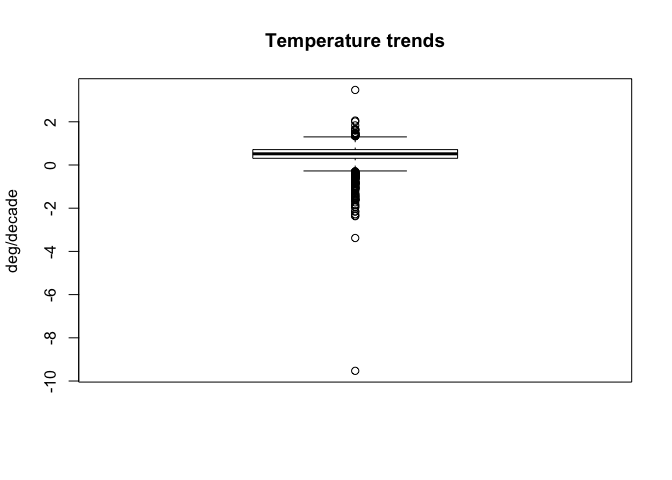

# Analysis of Linear Trends in USA Aiport Temperatures
Andy Pickering  
10/8/2016  


I love looking at weather data and have experimented in the past with some of the airport weather station data available from <www.wunderground.com>. I saw this little analysis on R-bloggers 
<https://www.r-bloggers.com/annual-mean-temperature-trends-12-airports/>
and thought it would be interesting to look at trends from stations across the US and visualize the results on a map.


```r
# Setup, load packages
rm(list=ls())
library(weatherData)
suppressPackageStartupMessages(library(lubridate))
library(ggplot2)
suppressPackageStartupMessages(library(plyr))
suppressPackageStartupMessages(library(maps))
library(RColorBrewer)
library(magrittr)
library(leaflet)
```

First we need a list of the weather stations we will use. Luckily the weatherData package already contains a compiled data frame 'USAirportWeatherStations' with all the stations and info about them. The 'airportCode' field is what will identify the station when we request the data through the wunderground API.

```r
head(USAirportWeatherStations)
```

```
##           Station State airportCode   Lat     Lon Elevation   WMO
## 1         Central    AK        PARL 65.57 -144.80       292 99999
## 2            Atka    AK        PAAK 52.22 -174.20        17 99999
## 3        Buckland    AK        PABL 65.99 -161.12         0 99999
## 4 Portage Glacier    AK        PATO 60.79 -148.83        29 99999
## 5        Nivalina    AK        PAVL 67.73 -164.55         3 70148
## 6         Golovin    AK        PAGL 64.55 -163.05         8 70199
```

I want to fit a long-term trend, so i'll get data starting in 1980 (a lot of the stations seem to go back this far).

```r
# Years we will get data for
year_list=1980:2016
st_list <-USAirportWeatherStations$airportCode
# station KMMO 1993 doesn't work, skip
st_list <- st_list[-which(st_list=="KMMO")]
```

Let's first plot all the station locations. For this analysis, I'll just use those in the continental/lower 48 US states. Including others like Alaska, Hawaii, Virgin Islands etc. makes the map very large and difficult to see. The leaflet pacakge makes a nice interactive map (try zooming and clicking on locations!).

```r
# just plot all station locations
cont_us=subset(USAirportWeatherStations,State!="AK" & State!="MP" & State!="PR" & State!="HI" & State!="VI" & State!="GU")

m <- leaflet() %>%
        setMaxBounds(-125,23,-67,50)%>%
        addTiles() %>%  # Add default OpenStreetMap map tiles
        addCircleMarkers(lng=cont_us$Lon,lat=cont_us$Lat,popup=cont_us$Station,radius=2,fill=TRUE,color="grey")
m  # Print the map
```

<!--html_preserve--><div id="htmlwidget-c062d7e7aa97a966e439" style="width:672px;height:480px;" class="leaflet html-widget"></div>
<script type="application/json" data-for="htmlwidget-c062d7e7aa97a966e439">{"x":{"calls":[{"method":"setMaxBounds","args":[23,-125,50,-67]},{"method":"addTiles","args":["http://{s}.tile.openstreetmap.org/{z}/{x}/{y}.png",null,null,{"minZoom":0,"maxZoom":18,"maxNativeZoom":null,"tileSize":256,"subdomains":"abc","errorTileUrl":"","tms":false,"continuousWorld":false,"noWrap":false,"zoomOffset":0,"zoomReverse":false,"opacity":1,"zIndex":null,"unloadInvisibleTiles":null,"updateWhenIdle":null,"detectRetina":false,"reuseTiles":false,"attribution":"&copy; <a href=\"http://openstreetmap.org\">OpenStreetMap\u003c/a> contributors, <a href=\"http://creativecommons.org/licenses/by-sa/2.0/\">CC-BY-SA\u003c/a>"}]},{"method":"addCircleMarkers","args":[[33.18,33.58,32.62,30.63,33.57,32.9,34.65,31.32,31.42,33.97,34.65,32.3,30.68,34.75,32.38,31.28,33.22,31.87,35.21,36.28,34.55,35.26,36.13,36.18,35.73,35.97,33.22,36.3,35.33,36,34.48,36.27,35.83,34.73,34.92,34.18,36.37,34.6,36.2,33.45,36.35,36.37,35.94,33.64,32.95,32.17,31.47,33.68,32.82,33.47,31.6,35.13,32.88,35.95,33.42,35.1,35.27,35.02,33.32,33.53,31.42,32.65,36.93,33.43,34.65,33.62,34.52,34.27,32.12,35.65,32.5,35.66,33.4,34.37,33.04,35.67,40.98,38.22,39.13,35.43,37.37,33.62,39.28,40.88,33.93,34.2,37.98,41.78,39.8,34.22,33.97,33.13,32.62,34.85,34.9,34.77,40.8,34.08,36.77,33.87,33.92,36.32,37.67,32.83,34.6,33.93,34.05,33.82,34.67,37.7,37.28,38.55,41.32,35.07,37.62,37.63,36.58,34.23,32.82,39.1,33.3,35.68,32.82,32.85,36.33,32.57,33.23,34.12,37.42,34.3,32.7,40.02,37.73,34.05,39.49,34.2,35.66,37.47,34.63,34.1,35.67,33.83,36.03,33.95,40.15,40.5,37.33,33.88,41.5,38.52,32.73,34.43,35.23,37.9,34.75,32.57,32.83,37.62,41.78,37.37,33.78,38.7,34.02,34.9,33.68,36.67,37.52,38.52,38.27,40.38,33.8,39.32,33.63,38.9,39.13,38.38,34.73,36.32,34.22,34.73,34.72,33.22,36.99,36.94,39.53,38.97,40.17,37.45,39.57,39.22,39.92,39.72,39.24,40.5,37.3,38.82,39.87,37.15,39.65,38.68,40.45,39.12,38.53,40.43,40.48,38.07,38.05,39.27,39.22,40.05,38.5,38.28,37.27,37.95,37.28,41.51,41.93,41.17,41.37,41.33,41.73,41.27,41.75,41.48,39.13,38.69,39.68,28.01,28.23,27.18,26,26.25,26.15,29.73,28.47,27.95,30.78,28.23,30.33,29.62,29.18,30.4,24.55,26.07,26.58,27.5,26.2,28.05,29.68,30.43,25.48,30.5,27.98,28.82,27.85,28.43,25.82,28.1,24.73,30.84,30.23,30.35,24.57,30.4,30.72,30.22,29.17,25.9,28.55,30.07,26.68,30.22,30.07,26.92,27.92,30.47,26.53,28.78,29.97,27.77,27.4,28.52,30.38,25.65,27.97,28.62,30.48,27.65,33.99,33.98,34.01,32.95,33.02,34.13,32.19,31.53,33.37,33.95,31.53,33.65,31.25,31.25,32.52,33.4,33.34,33.78,34.72,34.32,31.88,32.33,32.7,33.92,33.31,33.88,34.35,32.13,31.15,32.02,30.97,30.78,32.63,41.58,41.7,41.4,42.55,41.28,43.08,41.99,41.68,42.06,40.78,42.75,41.27,43.08,41.88,42.05,41.02,41.02,41.83,42.4,43.28,41.98,41.53,41.62,42.44,40.47,43.4,41.05,42.55,40.67,40.71,41.63,40.63,42.78,43.15,42.11,41.37,42.23,42.68,43,41.1,41.3,41.01,40.75,43.21,43.17,42.61,42.4,41.67,42.32,43.57,42.55,47.77,43.63,43.52,42.73,46.38,42.17,47.45,43.05,44.88,45.82,42.92,44.35,45.12,43.5,42.48,44.52,43.83,42.65,44.21,38.9,41.77,38.55,40.48,40.03,38.57,39.83,41.92,41.87,38.76,37.78,41.78,41.45,41.37,38.32,39.48,37.75,41.98,40.67,42.12,42.2,39.85,41.75,42.42,39.95,40.12,39.27,39.15,41.72,38.05,39.8,41,40.65,41.62,41.53,38.25,39.45,39.73,40.42,40.25,39.58,41.7,41.45,37.75,37.08,39.55,37.67,37.77,37,38.33,38.05,38.95,39.05,38.35,37.93,39.37,39.38,38.07,38.85,37.62,37.65,38.83,37.05,39.02,39.13,38.85,37.3,37.33,38.87,38.8,39.07,37.3,36.97,39.05,37.82,38.25,37.9,36.67,37.6,38.03,38.23,37.08,37.73,37.07,38.18,38,31.74,32.52,27.77,28.1,29.35,29.33,29.7,29.78,29.78,28.3,29.07,29.1,31.33,30.03,29.25,32.5,30.53,32.53,31.4,29.57,30.12,30.21,30.2,32.52,29.98,29.83,30.05,29.6,31.05,29.72,30.34,28.53,32.47,42.43,41.25,42.7,42.55,42.15,42.47,42.37,41.87,42.58,42.2,41.68,41.68,41.65,41.67,42.72,41.4,42.57,42.27,42.18,42.07,41.92,42.21,38.31,39.28,38.82,39.47,39.18,39.7,39.33,38.28,38.33,45.47,44.32,44.8,44.45,46.87,46.61,47.28,46.12,43.97,44.05,44.05,45.65,43.88,46.68,43.65,44.07,43.4,44.53,45.3,43.62,43.96,45.97,44.99,41.87,43.72,43.32,42.1,42.57,41.94,41.81,45.07,42.22,42.23,43.78,42.13,42.3,44.28,46.25,41.93,42.74,47.17,42.42,42.23,45.75,42.97,42.88,41.92,44.37,45.82,46.53,42.27,42.77,44.27,42.25,43.53,43.43,43.17,45.13,46.53,46.31,43.62,44.45,42.63,44.02,47.45,45.92,45.01,45.57,42.67,42.91,46.35,44.73,46.47,45.9,42.23,46.45,46.42,46.84,46.99,48.15,45.7,45.24,45.23,47.75,47.84,48.75,47.78,47.82,45.89,43.99,45.1,45.31,46.75,45.56,46.38,48.94,43.91,44.86,48.27,43.68,46.55,45.15,48.02,45.33,43.67,45.87,48.73,47.2,47.5,46.4,45.57,47.85,46.7,46.83,46.83,44.02,47.82,49.32,45.7,47.4,44.33,45.64,44.76,44.83,46.28,43.65,45.5,47.22,44.87,47.38,45.12,48.57,45.95,44.63,45.07,43.65,44.99,44.22,44.45,45.57,44.88,44.97,44.08,43.65,44.12,46.9,43.98,44.58,48.85,43.92,44.55,45.55,44.95,48.07,47.05,44.32,38.1,37.23,38.82,38.72,37.77,40.1,38.58,37.15,39.32,39.12,36.77,37.23,38.93,39.77,38.75,38.67,38.73,37.73,38.13,36.88,39.82,34.3,30.37,34.99,32.33,31.27,34.38,30.42,33.65,33.48,30.4,33.45,33.5,31.62,32.32,31.18,32.33,32.55,30.46,31.47,34.27,32.35,48.6,46.67,46.35,46.43,47.6,45.82,45.95,45.78,48.6,45.25,48.3,47.13,48.22,47.48,46.6,46.25,48.55,47.33,45.7,47.05,46.43,44.57,46.92,48.1,47.7,44.65,36.22,35.48,36.28,35.42,35.53,35.78,34.73,35.65,36.22,35.94,35.57,36.46,35.82,36.43,35.2,35.02,36.3,35.19,35.65,35.43,36.05,35.22,36.27,35.38,35.07,36.03,34.98,35.63,35.13,35.33,36.08,35.27,35.03,34.79,35.73,35.22,35,34.27,35.43,36.13,35.33,35.76,35.92,34.72,34.9,34.83,35.17,35.87,36.44,35.85,35.23,34.61,46.77,46.8,48.12,46.9,47.95,48.18,46.93,48.42,48.27,47.65,46.1,47.97,46.01,42.05,42.58,40.88,41.43,41.87,40.3,42.83,40.73,41.45,40.08,40.97,40.6,40.45,40.52,41.13,40.85,40.78,40.2,42.05,41.62,41.12,41.98,41.05,41.45,41.3,42.47,41.37,41.1,41.77,42.87,42.8,42.78,44.58,43.2,42.9,44.35,43.57,43.63,42.93,44.27,43.08,43.29,41.2,39.45,40.18,40.88,40.7,39.37,40.8,39.93,40.03,40.85,40.28,40.02,39.02,40.62,41.01,32.85,34.1,34.98,35.8,35.05,35.14,32.83,36.45,32.33,34.43,34.38,32.27,36.9,36.75,35.17,35.52,32.85,32.68,35.88,32.28,35.65,33.3,35.62,36.45,33.47,32.63,35.18,33.23,35,36.74,41.67,40.6,36.62,40.83,39.28,38.55,36.21,36.08,40.07,36.23,39.42,37.62,39.52,39.5,38.05,39.5,40.9,41.11,40.77,42.57,42.11,40.85,40.82,42.75,42.63,44,42.22,42.93,42.5,42.17,40.73,43.33,44.05,41.07,40.97,43.1,40.8,42.48,40.65,43.35,42.15,41.51,40.77,44.93,41.7,44.68,44.69,41.63,43.12,42.85,44.38,41.5,43.12,43.15,41.07,41.04,39.9,40.47,39.36,40.87,41.52,40.92,41.57,41.42,40,39.9,39.59,41.33,41.34,41.02,40.71,40.62,39.83,39.82,39.75,39.1,40.82,40.08,41.6,41.56,41.27,39.43,39.95,40.02,41.78,35.02,36.77,36.61,34.8,34.72,36.68,34.3,34.15,36.77,35.33,36.33,34.65,36.3,34.98,34.57,34.67,35.85,34.88,35.65,35.4,36.73,35.53,36.17,35.42,36.2,36.04,36.38,34.34,45.25,42.05,44.4,46.15,44.83,43.58,44.5,45.67,45.62,44.12,45.53,44.58,44.58,45.28,42.17,42.15,45.19,45.52,42.37,44.02,43.42,45.68,45.6,45.2,43.23,44.25,42.58,45.42,44.92,45.77,42.62,45.55,45.93,40.33,40.24,41.14,40.65,40.82,40.13,40.35,40.3,41.33,41.8,40.78,40.77,40.22,41.18,42.08,41.38,41.25,40.63,40.32,41.63,40.28,40.12,40.2,40.43,40.2,39.88,40.5,40.08,40.38,39.92,40.85,41.05,41.35,41.17,41.6,41.73,41.92,41.45,34.25,34.45,34.67,34.5,33.95,32.9,33.82,34.18,34.85,34.9,33.92,33.97,33.68,32.48,33.97,33.46,34.98,43.02,43.73,45.57,43.8,45.45,45.04,44.92,44.3,44.73,43.58,44.38,43.77,45.54,44.05,44.38,44.05,44.15,45.93,42.92,43.4,45.67,35.21,36.09,36.34,35.2,36.38,35.58,35.21,35.65,35.17,36.12,35.03,35.95,36,35.05,35.6,36.02,35.35,36.48,35.82,36.02,30.22,32.7,30.05,33.18,32.66,32.03,32.71,29.7,32.42,31.62,32.97,32.98,27.73,35.23,30.3,30.19,35.7,29.95,25.9,30.74,34.43,30.58,28.45,27.77,30.36,32.85,32.9,36.02,29.37,29.37,33.2,30.68,30.07,29.52,32.43,29.6,31.8,33.72,30.9,32.82,31.83,32.35,29.3,31.07,33.07,29.35,31.15,29.65,26.23,29.97,31.08,31.78,30.5,33.65,29.12,31.23,27.55,31.95,26.18,30.37,32.78,32.77,27.7,27.5,31.58,33.63,28.73,31.48,32.68,28.08,29.53,29.7,29.53,29.89,32.22,29.62,31.37,29.38,33.98,29.33,31.15,32.35,30.75,28.85,31.92,26.16,37.62,38.37,37.7,37.7,40.73,41.12,41.78,38.43,38.76,41.2,39.62,40.22,37.08,40.78,39.33,39,40.43,38.01,38.25,36.66,38.53,38.27,39.08,37.65,36.89,36.69,37.14,36.63,37.21,38.13,38.72,36.57,38.85,37.13,38.72,37.95,38.95,37.08,36.77,36.98,37.33,36.93,36.82,38.5,37.7,36.9,37.13,37.18,37.5,37.32,36.7,37.36,39.14,36.69,38.27,36.68,36.99,37.85,44.42,44.47,44.2,44.5,43.53,43.35,42.89,47.97,46.1,48.17,47.53,48.55,48.8,48.12,47.4,47.03,47.3,48.52,47.63,47.08,46.57,46.97,48.46,46.12,47.2,48.35,46.97,47.9,46.27,46.75,47.5,47.5,47.45,47.68,47.23,47.62,47.28,47.13,46.48,47.27,47.95,45.62,46.57,45.15,45.2,43.02,44.61,43.16,46.72,43.43,42.89,45.93,45.15,45.93,44.25,43.42,44.93,44.78,43.7,44.87,43.77,44.48,46.02,44.44,42.62,42.6,43.22,43.87,44.63,42.95,43.13,44.13,45.1,43.12,42.61,45.31,43.98,45.7,42.76,45.63,45.48,43.77,44.55,44.85,46.68,43.17,43.02,43.93,46.55,38.99,37.78,37.3,39.3,38.37,38.88,40.18,38.37,37.87,39.65,39.4,39.35,41.71,43.93,41.64,41.92,42.58,44.75,41.53,41.71,44.21,42.83,41.29,41.43,43.09,43.94,44.29,44.27,42.56,44.53,41.05,43.1,41.79,41.93,42.44,41.13,43.12,41.15,41.41,42.06,42.75,42.57,44.52,42.92,41.15,41.28,44.35,43.6,41.32,42.82,44.55,43.07,41.6,41.8,44.77,43.97,44.38,44.52],[-86.78,-85.85,-85.43,-88.07,-86.75,-87.25,-86.95,-85.45,-87.04,-86.08,-86.77,-86.4,-88.25,-87.62,-86.37,-85.72,-87.62,-86.02,-91.74,-94.31,-93.58,-93.09,-90.92,-94.12,-91.65,-89.95,-92.8,-92.47,-94.37,-94.17,-93.1,-93.15,-90.65,-92.23,-92.15,-91.93,-94.1,-91.57,-94.48,-93.98,-94.22,-92.47,-89.83,-91.76,-111.77,-110.88,-109.6,-112.08,-109.68,-111.73,-110.35,-111.67,-112.72,-112.15,-112.38,-114.34,-113.95,-110.73,-111.65,-112.38,-110.85,-114.62,-111.45,-112.02,-112.42,-111.92,-109.38,-110,-110.93,-112.15,-114.4,-109.06,-118.42,-118.57,-116.91,-121.28,-124.1,-122.28,-121.43,-119.05,-118.37,-114.72,-120.72,-121.67,-116.97,-118.35,-122.05,-124.23,-121.85,-119.08,-117.63,-117.28,-116.47,-116.78,-117.88,-114.62,-124.17,-118.03,-119.72,-117.98,-118.33,-119.63,-122.12,-115.58,-120.07,-118.4,-118.24,-118.15,-120.47,-121.82,-120.52,-121.3,-122.32,-118.15,-118.83,-120.95,-121.85,-118.07,-117.13,-121.57,-117.35,-117.68,-115.68,-117.12,-119.95,-117.12,-119.45,-119.12,-122.05,-116.17,-117.22,-124.07,-122.22,-117.6,-121.62,-119.2,-117.83,-122.12,-118.08,-117.78,-120.63,-116.5,-119.07,-117.45,-122.25,-122.3,-121.82,-117.27,-120.53,-121.5,-117.17,-119.83,-120.63,-121.25,-118.73,-116.98,-116.97,-122.38,-122.47,-121.93,-118.05,-121.58,-118.45,-120.45,-117.87,-121.6,-122.25,-122.82,-121.93,-120.57,-118.33,-120.13,-116.17,-120,-123.2,-121.96,-120.58,-119.4,-118.48,-118.22,-120.57,-117.35,-120.11,-121.79,-107.8,-104.82,-103.22,-105.87,-104.85,-106.87,-105.12,-104.75,-102.29,-107.52,-108.63,-104.72,-104.67,-107.75,-106.92,-104.77,-105.02,-108.53,-106.93,-104.63,-107.22,-102.68,-103.52,-103.67,-106.32,-107.89,-107.9,-104.52,-104.33,-107.9,-102.61,-72.83,-72.68,-73.13,-73.48,-72.05,-72.65,-72.88,-72.18,-73.13,-75.47,-75.36,-75.6,-82.35,-81.44,-80.22,-80.24,-80.11,-81.77,-85.03,-82.45,-81.78,-86.52,-80.6,-81.52,-83.1,-81.05,-86.47,-81.75,-80.15,-81.87,-80.37,-80.17,-81.75,-82.27,-86.68,-80.38,-81.7,-82.02,-81.81,-82.52,-81.32,-80.28,-80.65,-81.05,-85.18,-81.68,-87.32,-81.68,-81.42,-87.02,-81.88,-82.22,-80.28,-81.33,-85.58,-80.12,-85.68,-83.58,-81.99,-82.68,-87.18,-81.75,-81.23,-81.33,-82.63,-82.55,-80.8,-84.37,-80.43,-82.53,-80.72,-86.53,-80.42,-83.67,-83.97,-84.6,-84.27,-85.07,-84.85,-82.37,-84.18,-81.97,-83.32,-82.5,-84.42,-82.4,-81.47,-84.93,-82,-84.57,-84.52,-84.87,-83.83,-81.57,-84.83,-83.65,-84.52,-84.77,-84.3,-85.17,-81.2,-81.38,-81.15,-83.2,-83.28,-83.6,-95.34,-94.92,-95.05,-92.4,-91.67,-94.27,-93.62,-93.57,-93.86,-91.13,-93.77,-95.77,-92.62,-91.7,-94.78,-93.37,-94.36,-90.33,-90.7,-91.73,-95.38,-93.65,-90.58,-93.87,-91.43,-94.75,-91.98,-94.18,-91.33,-95.03,-91.55,-93.9,-96.2,-93.33,-92.91,-91.13,-91.17,-91.98,-96.08,-92.45,-93.12,-95.26,-95.42,-95.83,-95.2,-95.24,-96.38,-93.02,-113.33,-116.22,-113.77,-116.82,-116.63,-112.07,-114.46,-117.02,-112.3,-115.68,-115.87,-116.1,-115.43,-112.6,-112.18,-113.88,-114.3,-114.48,-114.22,-111.81,-111.58,-114.93,-90.05,-88.47,-89.85,-88.92,-88.28,-90.15,-88.87,-88.25,-87.6,-87.61,-89.25,-87.75,-90.52,-88.68,-88.87,-88.28,-89.02,-87.9,-89.68,-87.92,-89.1,-89.67,-89.67,-87.87,-91.2,-85.62,-85.9,-86.62,-86,-87.53,-86.1,-85.2,-86.15,-87.42,-85.79,-86.95,-87.32,-86.27,-86.93,-85.4,-85.8,-86.32,-87.01,-97.22,-95.57,-97.65,-95.48,-99.97,-101.9,-96.18,-97.28,-95.67,-96.77,-98.87,-100.72,-101.7,-99.83,-97.87,-99.27,-97.27,-97.43,-94.88,-100.97,-95.22,-96.67,-94.73,-98.58,-95.52,-98.82,-97.65,-95.62,-97,-86.42,-84.67,-87.68,-84.9,-85.97,-87.5,-83.32,-84.6,-85.67,-84.08,-87.17,-88.77,-85.73,-84.6,-93.1,-92.58,-91.52,-94.4,-89.43,-89.4,-91.1,-92.13,-93.3,-91.98,-91.87,-90.2,-92.55,-91.88,-89.97,-93.67,-91.15,-93.75,-92.3,-90.67,-93.22,-93.14,-91.98,-92.03,-90.25,-90.03,-90.03,-91.3,-93.03,-91.33,-89.82,-90.58,-93.82,-73.29,-70.07,-73.17,-71.76,-72.72,-71.28,-71.03,-71.02,-70.92,-72.53,-70,-70.97,-70.52,-70.28,-71.12,-70.62,-72.27,-71.88,-71.18,-70.22,-70.73,-71.11,-75.12,-76.61,-76.87,-76.17,-76.67,-77.73,-76.42,-76.4,-75.52,-69.58,-69.8,-68.83,-68.37,-68.02,-69.53,-68.32,-67.8,-69.72,-70.95,-70.28,-68.68,-69.93,-68.05,-70.32,-69.1,-70.72,-69.68,-85.27,-84.74,-86.41,-86.17,-85.2,-84.07,-85.5,-84.69,-83.16,-84.42,-83.43,-85.44,-83.57,-83.75,-85.55,-82.99,-86.43,-85.25,-85.42,-84.47,-85.05,-86.11,-88.5,-83.02,-83.33,-87.03,-83.75,-85.52,-84.59,-84.68,-88.12,-90.13,-84.47,-84.6,-86.25,-84.96,-84.08,-83.87,-86.25,-87.63,-87.55,-85.46,-82.83,-83.4,-83.98,-82.8,-87.9,-85.92,-84.7,-84.8,-83.42,-82.53,-87.4,-85.58,-84.37,-84.6,-83.53,-95.21,-92.8,-96.66,-94.2,-94.52,-92.95,-93.99,-96,-90.34,-90.38,-96.94,-93.65,-92.69,-93.27,-94.56,-94.51,-96.42,-94.38,-93.61,-94.81,-95.35,-95.11,-93.03,-92.48,-93.37,-93.68,-93.22,-92.86,-96.65,-92.93,-95.4,-94.62,-91.4,-94.93,-94.13,-93.27,-96.62,-92.5,-92.18,-95.88,-92.83,-91.83,-94.9,-96.5,-92.5,-93.32,-95.32,-94.08,-93.45,-96.15,-94.42,-95.7,-93.52,-94.38,-92.83,-95.08,-93.38,-94.35,-93.23,-93.35,-94.98,-96.18,-93.92,-95.82,-95.97,-93.22,-95.72,-91.7,-95.58,-93.25,-95.07,-96.32,-92.48,-95.7,-92.5,-95.08,-94.07,-93.07,-96.18,-91.75,-94.5,-92.55,-89.57,-92.22,-93.17,-90.44,-92.55,-92.15,-94.5,-94.72,-94.6,-90.32,-93.38,-90.43,-94.92,-90.37,-90.65,-93.55,-92.13,-91.77,-91.9,-93.58,-90.51,-89.45,-89.78,-90.22,-89.25,-89.53,-88.92,-88.45,-90.98,-89.07,-88.58,-90.08,-91.3,-90.08,-90.47,-88.75,-88.57,-88.53,-89.33,-88.77,-91.03,-113.1,-113.15,-104.26,-109.83,-115.37,-108.61,-112.5,-111.15,-112.37,-112.55,-114.27,-104.8,-106.62,-111.37,-112,-114.15,-109.77,-106.93,-110.45,-109.47,-105.87,-112.32,-114.08,-105.58,-104.2,-111.1,-81.67,-81.17,-78.98,-80.15,-78.38,-80.3,-76.66,-80.52,-81.1,-79.07,-77.05,-80.55,-81.61,-81.42,-81.16,-80.62,-77.17,-83.86,-79.9,-82.55,-79.47,-80.93,-76.18,-78.73,-77.05,-76.57,-78.88,-77.39,-78.93,-77.97,-79.95,-75.55,-79.5,-79.37,-81.38,-75.62,-77.98,-77.9,-81.94,-80.22,-77.62,-80.96,-75.7,-77.45,-76.88,-77.62,-79.02,-78.78,-77.71,-77.9,-79.4,-79.06,-100.75,-102.8,-98.92,-96.8,-97.18,-103.63,-98.68,-101.35,-101.28,-101.43,-97.15,-97.4,-102.66,-102.8,-100,-98,-99.65,-103.6,-96.75,-103.1,-99,-96.53,-95.6,-98.32,-98.43,-99.33,-101.62,-100.68,-96.75,-99.77,-100.58,-101.07,-98.95,-95.92,-97.43,-101.8,-97.33,-95.9,-98.68,-96.02,-102.98,-96.17,-100.55,-72,-71.52,-71.18,-71.5,-72.27,-71.55,-71.42,-72.3,-71.43,-71.3,-70.82,-70.92,-74.63,-74.57,-74.13,-74.28,-74.17,-75.07,-74.42,-74.84,-74.35,-74.07,-74.82,-74.6,-74.92,-74.67,-74.74,-104.47,-105.68,-106.05,-107.18,-106.62,-106.8,-105.98,-103.15,-104.27,-103.08,-103.32,-107.72,-106.58,-108.23,-107.9,-108.78,-106.1,-103.22,-106.28,-106.92,-105.15,-104.53,-106.08,-105.67,-105.53,-108.15,-103.6,-107.27,-105.66,-104.66,-115.78,-116.87,-116.02,-115.78,-114.85,-118.63,-115.19,-115.17,-118.57,-115.03,-118.7,-114.52,-115.97,-119.78,-117.08,-117.08,-117.8,-114.97,-73.98,-77.71,-77.99,-72.62,-72.87,-73.8,-77.05,-76.02,-75.98,-78.73,-79.28,-76.9,-73.42,-73.62,-75.73,-73.7,-72.25,-78.95,-73.1,-76.45,-73.78,-76.39,-79.27,-74.26,-73.9,-74.85,-74.8,-75.47,-73.52,-73.88,-77.67,-73.93,-74.2,-74.1,-76.12,-75.38,-71.92,-81.47,-83.14,-81.42,-84.52,-81.89,-81.68,-81.43,-81.48,-81.87,-82.88,-84.2,-84.22,-84.42,-82.17,-83.67,-84.03,-83.06,-84.05,-82.93,-82.67,-84.42,-82.52,-83.07,-83.8,-83.48,-80.67,-83.79,-81.9,-82.46,-80.7,-94.62,-98.67,-94.74,-96.67,-97.22,-101.51,-97.02,-97.12,-96.02,-99.2,-97.92,-98.4,-99.77,-99.05,-98.42,-99.27,-97.42,-95.78,-95.37,-97.6,-97.1,-97.65,-97.08,-97.38,-95.9,-95.98,-97.78,-98.98,-122.77,-124.28,-118.97,-123.88,-117.82,-118.95,-123.28,-121.88,-121.17,-123.22,-122.95,-124.07,-124.05,-118,-120.4,-121.73,-123.14,-118.4,-122.87,-117.02,-124.25,-118.85,-122.6,-123.97,-123.35,-121.15,-117.89,-123.82,-123,-122.86,-123.37,-122.4,-119.26,-75.12,-75.56,-75.38,-75.43,-76.86,-80.28,-79.93,-78.32,-75.73,-78.63,-79.95,-80.4,-76.85,-78.9,-80.18,-79.87,-76.92,-79.1,-78.83,-80.21,-79.4,-76.3,-76.77,-76.57,-75.15,-75.25,-80.22,-75.02,-75.97,-76.87,-77.85,-78.41,-71.8,-71.58,-71.42,-71.43,-71.5,-71.3,-82.16,-79.88,-82.89,-82.72,-81.12,-80.03,-78.72,-79.72,-82.35,-82.22,-80.8,-80.99,-78.93,-80.72,-80.47,-80.86,-81.06,-102.51,-103.62,-103.52,-99.32,-98.43,-102.02,-97.15,-96.82,-103.87,-96.73,-98.22,-98.03,-100.41,-101.6,-100.28,-103.07,-103.1,-102.17,-97.38,-99.8,-96.99,-89.39,-88.46,-88.38,-88.5,-88.99,-89.59,-89.04,-88.38,-88.22,-86.68,-85.2,-85.08,-89.4,-90,-88.92,-86.52,-89.87,-82.4,-83.98,-84.23,-96.37,-97.05,-102.21,-96.59,-97.09,-96.4,-96.27,-98.2,-99.68,-97.22,-96.83,-97.32,-98.03,-101.7,-97.7,-97.67,-101.4,-94.02,-97.43,-98.24,-100.28,-96.37,-99.22,-97.5,-95.41,-96.85,-97.03,-102.55,-100.78,-100.92,-97.18,-97.68,-95.55,-95.24,-99.85,-95.17,-106.4,-96.67,-102.9,-97.37,-104.8,-94.65,-94.8,-97.83,-96.07,-99.18,-97.72,-95.28,-97.65,-95.35,-97.68,-103.2,-99.77,-101.82,-95.47,-94.75,-99.47,-102.18,-98.23,-104.02,-98.07,-97.45,-97.28,-97.82,-94.72,-95.45,-96.25,-97.32,-96.87,-97.05,-98.28,-93.95,-98.47,-97.86,-98.18,-95.65,-100.5,-98.58,-98.5,-98.47,-97.4,-95.4,-95.99,-96.92,-102.39,-97.33,-109.47,-110.72,-112.15,-113.1,-114.03,-111.97,-111.85,-113.01,-109.75,-112.02,-110.75,-111.72,-113.6,-111.97,-112.58,-110.17,-109.52,-77.97,-78.05,-76.32,-77.86,-77.45,-77.56,-75.76,-81.35,-82.03,-80.68,-80.01,-80.41,-78.45,-77.18,-79.33,-77.03,-76.62,-77.52,-79.83,-77.45,-76.37,-80.82,-82.53,-79.2,-76.28,-76.03,-77.3,-77.43,-76.2,-76.5,-77.51,-77.33,-79.97,-76.9,-78.44,-78.14,-78.05,-78.9,-76.6,-77,-75.48,-72.02,-73.15,-72.57,-72.62,-72.95,-72.52,-73.25,-117.43,-118.28,-122.16,-122.3,-117.88,-122.53,-123.5,-120.2,-120.53,-119.52,-123.02,-117.53,-122.58,-119.6,-123.93,-119.52,-122.9,-119.32,-122.65,-122.9,-122.28,-119.12,-117.12,-122.75,-122.22,-122.3,-117.32,-123.15,-117.65,-121.33,-122.48,-122.8,-122.58,-124.55,-122.66,-120.53,-92.53,-89.71,-91.12,-88.73,-90.68,-92.04,-88.7,-90.23,-89.27,-89.12,-89.73,-88.52,-88.13,-89.63,-89.67,-89.8,-91.48,-88.49,-88.13,-91.45,-89.83,-89.03,-87.93,-90.18,-91.25,-90.18,-87.9,-89.33,-87.68,-90.3,-88.03,-89.59,-92.69,-88.55,-90.4,-87.81,-89.47,-91.72,-87.85,-89.53,-87.42,-92.1,-88.72,-88.14,-90.27,-90.92,-79.14,-81.12,-81.2,-80.23,-81.6,-79.85,-80.65,-82.55,-80.4,-79.92,-77.98,-81.43,-106.21,-105.44,-108.58,-104.94,-108.28,-109.37,-109.46,-107.78,-106.1,-105.86,-110.77,-104.34,-107.32,-106.64,-104.62,-108.87,-106.85,-106.81,-105.46,-110.32,-110.5,-109.96,-105.03,-106.56,-106.33,-105.4,-104.87,-104.15,-105.38,-110.1,-109.02,-106.47,-104.82,-111.03,-105.53,-110.73,-105.67,-108.73,-110.42,-108.47,-109.07,-107.2,-106.97,-107.95,-106.72,-108.08],2,null,null,{"lineCap":null,"lineJoin":null,"clickable":true,"pointerEvents":null,"className":"","stroke":true,"color":"grey","weight":5,"opacity":0.5,"fill":true,"fillColor":"grey","fillOpacity":0.2,"dashArray":null},null,null,["Alabaster","Anniston","Auburn-Opelika","Mobile Downtown","Birmingham","Centreville","Decatur","Dothan","Evergreen","Gadsden","Huntsville","Montgomery","Mobile","Muscle Shoals","Maxwell AFB","Ozark","Tuscaloosa","Troy","Searcy","NW Arkansas Airport","Mount Ida","Russellville","Walnut Ridge","Springdale","Batesville","Blytheville","El Dorado","Flippin","Fort Smith","Fayetteville","Hot Springs","Harrison","Jonesboro","Little Rock","Little Rock AFB","Pine Bluff","Rogers","Stuttgart","Siloam Spring","Texarkana","Bentonville","Mountain Home","Blytheville","Monticello","Casa Grande","Tucson Davis Monthan","Douglas Bisbee","Phoenix Deer Valley","Safford","Mesa","Sierra Vista","Flagstaff","Gila Bend","Grand Canyon","Goodyear","Bullhead City","Kingman","Winslow","Williams AFB","Glendale Luke AFB","Nogales","Yuma MCAS","Page","Phoenix","Prescott","Scottsdale","St. Johns","Show Low","Tucson","Valle","Yuma","Window Rock","Avalon","Newhall","Ramona","Point Piedras","Arcata","Napa County","Beale AFB","Bakersfield","Bishop","Blythe","Blue Canyon","Burney","Beaumont","Burbank","Concord","Crescent City","Chico","Camarillo","Chino","Carlsbad","Campo","Daggett-Barstow","Edwards AFB","Needles","Eureka","El Monte","Fresno","Fullerton","Hawthorne","Hanford","Hayward","Imperial","Santa Ynez","Los Angeles","Los Angeles Downtown","Long Beach","Lompoc","Livermore","Merced","Mather AFB","Mount Shasta","Mojave","Mammoth","Modesto City","Monterey","Mount Wilson","San Diego Montgomery","Marysville","Camp Pendleton","China Lake","El Centro","Miramar MCAS","Lemoore NAS","Imperial Beach","San Nicolas Island","Point Mugu","Moffett NAS","Twentynine Palms","North Island","Shelter Cove","Oakland","Ontario","Oroville","Oxnard","Inyokern","Palo Alto","Palmdale","La Verne","Paso Robles","Palm Springs","Porterville","Riverside","Red Bluff","Redding","San Jose Reid","Riverside March","Alturas","Sacramento","San Diego","Santa Barbara","San Luis Obispo","Stockton","Sandberg","San Diego Brown","San Diego Gille","San Francisco","Montague","San Jose","Los Alamitos","Sacramento International","Santa Monica","Santa Maria","Santa Ana","Salinas","San Carlos","Santa Rosa","Fairfield","Susanville","Torrance","Truckee-Tahoe","Thermal","South Lake Tahoe","Ukiah","Vacaville","Vandenberg AFB","Visalia","Van Nuys","Lancaster","Vandenberg","Oceanside","Madera","Watsonville","Rifle","Air Force Academy","Akron","Alamosa","Denver Centennial","Aspen","Broomfield","Aurora","Burlington","Craig","Cortez","Colorado Springs","Denver","Durango","Eagle","Fort Carson","Fort Collins","Grand Junction","Gunnison","Greeley","Hayden","Lamar","La Junta","Limon","Leadville","Meeker","Montrose","Pueblo","Trinidad","Telluride","Springfield","Meriden","Hartford","Bridgeport","Danbury","Groton","Hartford Brainard","New Haven","Willimantic","Oxford","Dover AFB","Georgetown","Wilmington","Tampa Vandenberg","Kissimmee","Stuart","Hollywood","Pompano Beach","Naples","Apalachicola","Brooksville","Bartow","Crestview","Cocoa","Jacksonville Craig","Cross City","Daytona Beach","Destin","Key West","Ft Lauderdale","Fort Myers","Ft Pierce","Fort Lauderdale","Winter Haven","Gainesville","Hurlburt Field","Homestead AFB","Jacksonville","Lakeland Region","Leesburg","Tampa Macdill AFB","Orlando International","Miami","Melbourne","Marathon","Marianna","Jacksonville NAS","Pensacola NAS","Key West NAS","Mayport NS","Whiting Fld NAS","Cecil Field","Ocala","Opa Locka","Orlando","Panama City Tyndall AFB","West Palm Beach","Panama City","Perry","Punta Gorda","St. Petersburg International","Pensacola","Fort Myers International","Sanford","St. Augustine","St. Petersburg","Sarasota","Titusville","Tallahassee","Kendall","Tampa","Nasa Shuttle","Valparaiso","Vero Beach","Winder","Lawrenceville","Marietta McCollum Field","Thomaston","La Grange","Cartersville","Vidalia","Albany","Augusta Bush","Athens","Alma","Atlanta","Waycross","Brunswick","Columbus","Augusta","Peachtree City","Atlanta Fulton","Dalton","Gainesville","Ft. Stewart","Fort Benning","Macon","Marietta","Newnan","Atlanta Dekalb","Rome","Savannah","Saint Simons Island","Savannah Hunter","Valdosta","Valdosta Regional","Warner Robins","Harlan","Audubon","Atlantic","Waterloo","Washington","Algona","Ames","Ankeny","Boone","Burlington","Clarion","Council Bluffs","Charles City","Cedar Rapids","Carroll","Chariton","Creston","Clinton","Dubuque","Decorah","Denison","Des Moines","Davenport","Webster City","Keokuk","Estherville","Fairfield","Fort Dodge","Fort Madison","Clarinda","Iowa City","Lamoni","Le Mars","Mason City","Marshalltown","Muscatine","Monticello","Oelwein","Orange City","Ottumwa","Knoxville","Red Oak","Shenandoah","Sheldon","Spencer","Storm Lake","Sioux City","Newton","Malta","Boise","Burley","Coeur d'Alene","Caldwell","Idaho Falls","Jerome","Lewiston","Malad City","Mullan Pass","Mountain Home","McCall","Lowell","Pocatello","Spencer","Salmon","Hailey","Twin Falls","Challis","Rexburg","Soda Springs","Stanley","Alton","Aurora","Belleville","Bloomington","Champaign","Cahokia","Decatur","Chicago DuPage","Chicago Meigs","Lawrenceville","Carbondale","Chicago Midway","Moline","Marseilles","Mount Vernon","Mattoon","Marion Regional","Chicago","Peoria Regional","Chicago Palwauk","Rockford","Springfield","Sterling","Waukegan","Quincy","Anderson","Columbus","Bloomington","Elkhart","Evansville","Eagle Creek","Fort Wayne","Peru","Gary","Goshen","Huntingburg","Terre Haute","Indianapolis","Lafayette","Muncie","Shelbyville","South Bend","Valparaiso","Wichita Jabara","Coffeyville","Concordia","Chanute","Dodge City","Elkhart","Emporia","Newton","Topeka Forbes","Ft Riley","Great Bend","Garden City","Goodland","Hill City","Hutchinson","Hays","McConnell AFB","Wichita","Olathe New Century","Liberal","Lawrence","Manhattan","Olathe","Medicine Lodge","Parsons","Russell","Salina","Topeka","Winfield","Bowling Green","Covington","Henderson City","Frankfort","Fort Knox","Fort Campbell","Jackson","Lexington","Louisville Bowman","London-Corbin","Owensboro","Paducah","Louisville","Somerset","Natchitoches","Ruston","Green Canyon 184","High Island","Venice","Boothville","Amelia","Intracoastal City","Cameron","South Marsh Island","South Marsh Island 268","Fourchon","Alexandria","New Iberia","Grand Isle","Barksdale AFB","Baton Rouge","Shreveport Downtown","Alexandria Esle","Houma","Lake Charles Regional","Lake Charles","Lafayette","Monroe","New Orleans","New Orleans NAS","New Orleans Lakefront","Salt Point","Fort Polk","Patterson","Slidell","South Timbalier","Shreveport","Pittsfield","Nantucket","North Adams","Fitchburg","Westfield","Bedford","Boston","Taunton","Beverly","Chicopee","Chatham","New Bedford","Otis AFB","Hyannis","Lawrence","Martha's Vineyard","Orange","Worcester","Norwood","Provincetown","Plymouth","East Milton","Ocean City","Maryland Science Center","Andrews AFB","Phillips Army Airfield","Baltimore","Hagerstown","Baltimore Martin","Patuxent River","Salisbury","Greenville","Augusta","Bangor","Bar Harbor","Caribou","Clayton Lake","Frenchville","Houlton","Wiscasset","Fryeburg","Auburn-Lewiston","Millinocket","Brunswick","Presque Isle","Portland","Rockland","Sanford","Waterville","Charlevoix","Mount Pleasant","Ludington","Manistique","Bellaire","Adrian","Big Rapids","Alma","Grosse Ile","Mason","Monroe","Sturgis","Alpena","Ann Arbor","Kalamazoo","Bad Axe","Benton Harbor","Battle Creek","Cadillac","Chippewa","Coldwater","Holland","Houghton","Detroit","Detroit Metro","Escanaba","Flint","Grand Rapids","Hillsdale","Houghton Lake","Iron Mountain","Ironwood","Jackson","Lansing","Manistee","Marshall","Saginaw","Saginaw Browne","Muskegon","Menominee","Marquette","Newberry","Mt. Clemens","Wurtsmith AFB","Howell","Port Hope","Copper Harbor","Seul Choix Pt","Gaylord","Pellston","Pontiac","Port Huron","Gwinn","Traverse City","Sault Ste Marie","Mackinac Island","Ypsilanti","Wadena","Moose Lake","Moorhead","Longville","Waskish","Rush City","Maple Lake","Appleton","Grand Marais","Grand Marais Airport","Hallock","Bigfork","Cook","Mora","St. James","Litchfield","Ortonville","Pine River","Princeton","Staples","Warroad","Windom","South St. Paul","Crane Lake","Albert Lea","Aitkin","Anoka County","Orr","Benson","Austin","Alexandria","Baudette","Silver Bay","Bemidji","Brainerd","Cambridge","Crookston","Cloquet","Duluth","Detroit Lakes","Dodge Center","Ely","Flag Island","Wheaton NDB","Eveleth","Faribault","Glenwood","Glencoe","Minneapolis Flying Cloud","Fergus Falls","Fairmont","Fosston","Grand Rapids","Hutchinson","Hibbing","Willmar","International Falls","Little Falls","Lakeville","Minneapolis Crystal","Jackson","Madison","Mankato","Marshall","Morris","Minneapolis","Montevideo","Winona","Worthington","Owatonna","Park Rapids","Pipestone","Red Wing","Roseau","Rochester","Redwood Falls","St. Cloud","St. Paul","Thief River Falls","Two Harbors","New Ulm","Kaiser","Cape Girardeau","Columbia","Sedalia","Farmington","Kirksville","Jefferson City","Joplin","Kansas City International","Kansas City","Poplar Bluff","Springfield","St. Charles","St. Joseph","St. Louis","Spirit of St Louis","Whiteman AFB","Fort Leonard Wood","Rolla","West Plains","Chillicothe","Clarksdale","Bay St Louis","Olive Branch","Jackson Hawkins Field","Hattiesburg","Oxford","Biloxi","Columbus AFB","Greenville","Gulfport","Golden Triangle","Greenwood","Natchez","Jackson","McComb","Meridian","Meridian NAS","Pascagoula","Pine Belt","Tupelo","Vicksburg","Browning","Drummond","Baker","Harlowton","Thompson Falls","Billings","Butte","Bozeman","Cut Bank","Dillon","Kalispell","Glendive","Glasgow","Great Falls","Helena","Hamilton","Havre","Jordan","Livingston","Lewistown","Miles City","Monida","Missoula","Wolf Point","Sidney-Richland","West Yellowstone","Boone","Lincolntown","Roxboro","Albemarle","Smithfield","Lexington","Beaufort","Salisbury","North Wilkesboro","Chapel Hill","Washington","Mount Airy","Morgantown","Jefferson","Gastonia","Monroe","Ahoskie","Andrews","Asheboro","Asheville","Burlington","Charlotte","Elizabeth City","Erwin","New Bern","Edenton","Fayetteville","Greenville","Fort Bragg","Goldsboro","Greensboro","Cape Hatteras","Mackall AAF","Laurinburg-Maxton","Hickory","Hatteras","Kenansville","Wilmington","Rutherfordton","Winston-Salem","Kinston","Statesville","Manteo","New River MCAS","Cherry Point","Jacksonville","Pope AFB","Raleigh-Durham Airport","Roanoke Rapids","Rocky Mount","Southern Pines","Lumberton","Bismarck","Dickinson","Devils Lake","Fargo","Grand Forks","Williston","Jamestown","Minot AFB","Minot","Garrison","Lidgerwood","Grand Forks AFB","Hettinger","Alliance","Ainsworth","Aurora","Broken Bow","Scottsbluff","Beatrice","Chadron","Kearney","Fremont","Falls City","Grand Island","Hastings","Holdrege","Imperial","North Platte","Lincoln","Lexington","McCook","Mullen","Ord","Omaha Offutt","Norfolk","Ogallala","Columbus","Omaha","O'Neill","North Omaha","Sidney","Tekamah","Valentine","Jaffrey","Nashua","Berlin","Concord","Keene","Whitefield","Laconia","Lebanon","Manchester","Mt. Washington","Portsmouth","Rochester","Sussex","Atlantic City","Belmar-Farmingdale","Caldwell","Newark","Millville","Morristown","Mount Holly","Lakehurst NAS","Teterboro","Trenton","McGuire AFB","Wildwood","Somerville","Andover","Artesia","Corona","Moriarty","Cuba","Albuquerque","Albuquerque Double Eagle","Alamogordo","Clayton","Carlsbad","Clovis","Clovis Cannon AFB","Deming","Chama","Farmington","Grants-Milan","Gallup","Holloman AFB","Hobbs","Los Alamos","Las Cruces","Las Vegas","Roswell","Santa Fe","Taos","Ruidoso","Silver City","Tucumcari","Truth Or Consequences","Clines Corner","Raton","Wildhorse Resevoir","Battle Mountain","Mercury","Elko","Ely","Hawthorne","North Las Vegas","Las Vegas","Lovelock","Nellis AFB","Fallon NAS","Caliente","Eureka","Reno","Tonopah","Austin","Winnemucca","Wells","Central Park","Dansville","Wellsville","Westhampton Beach","Shirley","Albany","Penn Yan","Watertown","Binghamton","Buffalo","Dunkirk","Elmira","Farmingdale","Glens Falls","Fort Drum","White Plains","East Hampton","Niagara Falls","Islip","Ithaca","New York JFK","Fulton","Jamestown","Montgomery","New York","Massena","Monticello","Ogdensburg","Plattsburgh","Poughkeepsie","Rochester","Schenectady","Saranac Lake","Newburgh","Syracuse","Utica","Montauk","Akron","Bolton Field","New Philadelphia","Hamilton","Wooster","Cleveland Burke","Akron Canton","Cleveland Cuyahoga","Cleveland","Columbus","Dayton","Dayton Wright","Defiance","Lorain","Findlay","Lima","Marion","Wright-Patt AFB","Rickenbacker","Lancaster","Cincinnati","Mansfield","Ohio State University","Toledo","Toledo Metcalf","Youngstown","Wilmington","Zanesville","Newark Heath","Ashtabula","Poteau","Alva","Grove","Ada","Pauls Valley","Guyman","Ardmore","Ardmore Downtown","Bartlesville","Clinton-Sherman","Enid Vance AFB","Fort Sill","Gage","Hobart","Lawton","Altus AFB","Guthrie","McAlester","Muskogee","Oklahoma City","Ponca City","Oklahoma City Wiley Post","Stillwater","Tinker AFB","Tulsa","Tulsa Jones","Enid","Frederick","Aurora","Brookings","John Day State","Astoria","Baker","Burns","Corvallis","Cascade Locks","The Dalles","Eugene","Portland Hillsboro","Newport","Newport Airport","La Grande","Lakeview AWS","Klamath Falls","McMinnville","Meacham","Medford","Ontario","North Bend","Pendleton","Portland","Pacific City","Roseburg","Redmond","Rome","Tillamook","Salem","Scappoose","Sexton Summit","Portland Troutdale","Hermiston","Doylestown","Pottstown","Mt. Pocono","Allentown","Selinsgrove","Washington","Pittsburgh Allegheny Co.","Altoona","Avoca","Bradford","Butler","Beaver Falls","Harrisburg","Du Bois","Erie","Franklin","Williamsport","Indiana","Johnstown","Meadville","Latrobe","Lancaster","Middletown","Fort Indiantown Gap","Willow Grove","Philadelphia","Pittsburgh","Northeast Philadelphia","Reading","York","State College","Clearfield","Westerly","Block Island","N. Kingstown","Providence","Pawtucket","Newport","Greenwood","Darlington","Clemson","Anderson","Columbia","Charleston","North Myrtle Beach","Florence","Greenville Downtown","Greenville","Eastover","Columbia Owens","Myrtle Beach","Beaufort MCAS","Shaw AFB","Orangeburg","Rock Hill","Pine Ridge","Custer","Buffalo","Chamberlain","Aberdeen","Faith","Watertown","Brookings","Belle Fourche","Sioux Falls","Huron","Mitchell","Mobridge","Philip","Pierre","Rapid City","Ellsworth AFB","Lemmon","Yankton","Winner","Sisseton","Somerville","Huntingdon","Paris","Selmer","Union City","Covington","Bolivar","Lexington","Savannah","Nashville","Chattanooga","Crossville","Dyersburg","Memphis","Jackson","Smyrna","Millington","Tri-Cities","Knoxville","Oak Ridge","Brenham","Grand Prarie","Dryden","McKinney","Arlington","Corsicana","Terrell","New Braunfels","Abilene","Waco","Dallas Addison","Fort Worth Alliance","Alice","Amarillo","Austin","Austin Bergstrom","Borger","Beaumont","Brownsville","Burnet","Childress","College Station","Cotulla","Corpus Christi","Conroe","Dallas Love","Dallas/Ft Worth","Dalhart","Del Rio Laughlin AFB","Del Rio","Denton","Georgetown","Houston Hooks","Houston Clover","Abilene Dyess","Ellington Field","El Paso","Sherman-Denison","Fort Stockton","Fort Worth","Guadalupe Pass","Longview","Galveston","Fort Hood","Greenville","Hondo","Killeen/Ft Hood","Houston","Harlingen","Houston Intercontinental","Killeen","Wink","Junction","Lubbock","Angleton","Lufkin","Laredo","Midland","McAllen","Marfa","Mineral Wells","Fort Worth NAS","Corpus Chr NAS","Kingsville NAS","Nacogdoches","Paris","Palacios","McGregor","Dallas Redbird","Rockport","Randolph AFB","Sabine Pass","San Antonio","San Marcos","Stephenville","Houston Hull","San Angelo","Kelly AFB","Wichita Falls","San Antonio Stinson","Temple","Tyler","Huntsville","Victoria","Odessa","Port Isabel","Blanding","Hanksville","Bryce Canyon","Cedar City","Wendover","Ogden Hill AFB","Logan","Milford","Moab Airport","Ogden","Price","Provo","St. George","Salt Lake City","Delta","Green River","Vernal","Louisa","Orange","Chesapeake","Culpeper","Fredericksburg","Leesburg","Melfa","Marion","Abingdon","Dublin","Martinsville","Blacksburg","Charlottesville","Fort Belvoir","Danville","Washington","Fort Eustis","Manassas","Hot Springs","Dulles Airport","Langley AFB","Galax","Wise","Lynchburg","Norfolk NAS","Oceana NAS","Quantico","Richmond Hanover County","Norfolk","Newport News","Petersburg","Richmond","Roanoke","Franklin","Farmville","Winchester","South Hill","Staunton","Suffolk","Wakefield","Wallops Island","St. Johnsbury","Burlington","Montpelier","Morrisville","Rutland State","Springfield","Bennington","Deer Park","Walla Walla","Arlington","Seattle Boeing","Colville","Bellingham","Port Angeles","Wenatchee","Ellensburg","Ephrata","Friday Harbor","Spokane","Fort Lewis","Hanford","Hoquiam","Omak","Kelso-Longview","Moses Lake","Whidbey Island","Olympia","Everett","Pasco","Pullman","Bremerton","Renton","Seattle","Spokane Felts","Shelton","Spokane Fairchild","Stampede Pass","Tacoma","Toledo","Tacoma Narrows","Quillayute","Vancouver","Yakima","New Richmond","Merrill","Prarie Du Chien","Clintonville","Boscobel","Superior","Juneau","Mineral Point","Eagle River","Antigo","Minocqua","Appleton","West Bend","Wausau","Mosinee","Baraboo","Eau Claire","Fond du Lac","Green Bay","Hayward","Wisconsin Rapids","Janesville","Kenosha","Lone Rock","La Crosse","Marshfield","Milwaukee","Madison","Manitowoc","Medford","Milwaukee Timmerman","Monroe","Osceola","Oshkosh","Phillips","Racine","Rhinelander","Rice Lake","Sheboygan","Stevens Point","Sturgeon Bay","Superior","Watertown","Waukesha","Volk","Ashland","Petersburg","Beckley","Bluefield","Clarksburg","Charleston","Elkins","Wheeling","Huntington","Lewisburg","Morgantown","Martinsburg","Parkersburg","Arlington","Belle Fourche","Bitter Creek","Bordeaux","Beaver Rim","Chief Joseph","Cemetery Separation","Continental Divide","Dead Horse","Deer Creek","First Divide","Gunbarrel","Hiland","I-25 Divide","Inyan Kara","Meeteese Rim","Pathfinder Hill","Piney Creek","Pumpkin Vine","Rim","Sage","Shute Creek","Sibley Peak","Skyline","Twenty Mile Hill","Vedauwoo","Whitaker","Torrington","Douglas","Big Piney","Cody","Casper","Cheyenne","Evanston","Gillette","Jackson","Laramie","Lander","Yellowstone","Riverton","Rock Springs","Rawlins","Sheridan","Worland","Buffalo","Greybull"]]}],"limits":{"lat":[24.55,49.32],"lng":[-124.55,-67.8]}},"evals":[],"jsHooks":[]}</script><!--/html_preserve-->

The next bit of code downloads the data from <http://www.wunderground.com>. This is the most time-consuming part of the analysis. It appears that the wunderground API only lets you download a year of data at a time. With my laptop and wifi speed, I estimate it takes about 2-3 sec to download each 1 year data file. For 36 years of data (1980-2016) at about 1600 stations, that works out to about 48 hours! Luckily it is easy to write a loop to do this, and I just let it run overnight or in the background until it was done.

```r
# Define function to download daily weather for 1 year.
# I had trouble getting the functions in the weatherData package to work, but once we have the formula for the API it is easy to grab the data.

get_yearly_weather <- function (year,st_code){
        url <- paste0("http://www.wunderground.com/history/airport/",st_code,"/",year,"/1/1/CustomHistory.html?dayend=31&monthend=12&yearend=",year,"&req_city=NA&req_state=NA&req_statename=NA&format=1")
}

# Define a function to download the weather data for a given station code for each year
get_all_years <- function(st_code){
        for (i in seq_along(year_list)) {
                year <- year_list[i]
                savefile<-file.path("~/AirportTemps/Data",paste0("wea",st_code,year,".csv"))
                if (file.exists(savefile)){
                        print(paste(savefile," already downloaded"))
                }else{
                        url=get_yearly_weather(year,st_code)
                        print(paste("Getting weather data for ",st_code," for year ",year))
                        download.file(url,savefile)
                }
        }
}

# Apply that function to station list to get data for all stations
tryapply(st_list, get_all_years)
```


Ok, we finally have all the yearly data files downloaded. Now i'll combine the yearly files (1980-2016) for each station into a single combined file. I also do some cleaning and remove bad temperature values.


```r
# Remove bad temperature values (marked as -99999 in data)
rm_bad_wea_values <- function(dat){
        dat$Min.TemperatureF[which(dat$Min.TemperatureF==-99999)]<-NA
        dat$Max.TemperatureF[which(dat$Max.TemperatureF==-99999)]<-NA
        dat$Mean.TemperatureF[which(dat$Mean.TemperatureF==-99999)]<-NA
        dat<-subset(dat,Mean.TemperatureF>-50);
        dat<-subset(dat,Mean.TemperatureF<150);
        dat
}

# Define a function to load and combine all years for a station into one dataframe
combine_years_wea <- function(st_code){
        savefile <-file.path( "~/AirportTemps/Data",paste0("wea",st_code,"combined.csv"))
        #        if (file.exists(savefile)){
        #                print(paste(savefile," already combined"))
        #        }else{
        print(paste("combining years for station ", st_code))
        # Load csv files for each year and combine into a single data frame
        year_list=1980:2015
        dat_all=data.frame()
        for (i in seq_along(year_list)) {
                year <- year_list[i]
                #print(year)
                dat <- read.csv( file.path( "~/AirportTemps/Data",paste0("wea",st_code,year,".csv")))
                dat<-rm_bad_wea_values(dat)
                dat$dd <- ymd(dat[,1])
                #                print(head(dat))
                dat_all=rbind(dat_all,dat)
                #print(dim(dat_all))
        }
        # Check to make sure we have data (some files are empty)
        if (nrow(dat_all)>(20*365)){
                # Save csv with combined data...
                write.csv(dat_all,savefile)
        }else{
                print(paste("station ",st_code," doesn't have data"))
        }
        #        }
}

# some stations don't work, so need tryapply()
tryapply(st_list, combine_years_wea)
```

Ok, we now have a single file for each station with all the data. I loop through and fit a linear trend vs time for each one, and store all the results in a dataframe. I'll save the trend (coefficent) from the fit, and the p-values to evaluate how reliable the fit was.

```r
# save data frame with fit coeffs, p value etc.
temp_fits<-data.frame()
for (i in seq_along(st_list)) {
        fname<-file.path( "~/AirportTemps/Data",paste0("wea",st_list[i],"combined.csv"))
        if (file.exists(fname)){
                print(paste("Fitting to ",st_list[i]))
                dat<- read.csv(fname)
                dat$dd <- ymd(dat$dd)
                fit1 <- lm(Mean.TemperatureF~dd,data=dat)
                summary(fit1)
                temp_fits<-rbind(temp_fits,data.frame(airportCode=st_list[i],trend=fit1$coefficients[2],pval=summary(fit1)$coefficients[2,4]))
        }else{
                print(paste("combined file for station ", st_list[i], " doesn't exist, skipping"))
        }
}

# save a csv file with the fit results
write.csv(temp_fits,file.path( "~/AirportTemps/Data","temp_fits.csv"))
```


Let's look at the results. First i'll define a little function to simplify loading the data.

```r
# function to load combined 1980-2016 csv file for specified station
load_combined<-function(st_code){
        fname<-file.path( "~/AirportTemps/Data",paste0("wea",st_code,"combined.csv"))
        dat<- read.csv(fname)
        dat$dd <- ymd(dat$dd)
        dat
}
```


```r
temp_fits <- read.csv(file.path( "~/AirportTemps/Data","temp_fits.csv"))

# convert trend to deg/decade
temp_fits$trend <- temp_fits$trend*365*10
```

How many fits have significant/non sig. p-values?

```r
ig<-which(temp_fits$pval<0.05)
ib<-which(temp_fits$pval>0.05)
print(paste(length(ig)," fits have p-values that are significant(<0.05)"))
```

```
## [1] "674  fits have p-values that are significant(<0.05)"
```

```r
print(paste(length(ib)," fits have p-values that are not significant(>0.05)"))
```

```
## [1] "350  fits have p-values that are not significant(>0.05)"
```

Look at the distribution of trends.

```r
boxplot(temp_fits$trend[ig],main="Temperature trends",ylab= "deg/decade")
```

<!-- -->

Most of the trends seem reasonable (magnitudes of about 2 degrees per decade), but there a few outliers. Lets look at those and see what's going on.


```r
iout <- which(abs(temp_fits$trend)>5)
temp_fits[iout,]
```

```
##     X airportCode     trend          pval
## 5 dd4        PASH -9.528885 6.728656e-252
```

```r
datout <- load_combined(temp_fits$airportCode[iout])
g<-ggplot(datout,aes(x=dd,y=Mean.TemperatureF))+geom_line()+geom_smooth(method="lm")
g
```

```
## Warning in plyr::split_indices(scale_id, n): '.Random.seed' is not an
## integer vector but of type 'NULL', so ignored
```

<!-- -->

It's obvious from the plot that something is wrong with the data for this station; there is a huge offset between the first ~5 years. Maybe the station was moved, or mislabeled? We'll remove this station (note it is in Alaska, so I wouldn't have plotted it in the end anyways).


```r
temp_fits <- temp_fits[-iout,]
```

Let's look at a good fit also, to convince ourselves we are doing this right:


```r
id <- ig[550]
temp_fits[id,]
```

```
##         X airportCode     trend         pval
## 851 dd850        KCLL 0.8246019 7.447468e-12
```

```r
datgood <- load_combined(temp_fits$airportCode[id])
g<-ggplot(datgood,aes(x=dd,y=Mean.TemperatureF))+geom_line()+geom_smooth(method="lm")
g
```

<!-- -->

Ok this looks better. Note I haven't removed any of the obvious seasonal cycle. My reasoning is that i'm interested in the long-term trend, and if there is a constant seasonal cycle it should average itself out (ie if the only variability in temperature was a seasonal cycle, the fit should give a trend of zero). In the future I plan to try fits over different time periods, and also with the seasonal cycle removed, to see how that affects the results.

Ok, now it's time to make the awesome map i've been envisioning. First i'll join the fit results with the station info so we have the locations and data together.

```r
# Join to data frame with station info
results2 <- join(temp_fits[ig,],USAirportWeatherStations,by="airportCode")

# Keep only continental and lower 48 states (map doesn't look good with others)
results2<-subset(results2,State!="AK" & State!="MP" & State!="PR" & State!="HI" )

# Take a look at the largest, smallest trends
sortdat<-arrange(results2,desc(trend))
head(sortdat)
```

```
##       X airportCode    trend         pval      Station State   Lat     Lon
## 1 dd574        KOLF 3.473326 5.393107e-34   Wolf Point    MT 48.10 -105.58
## 2 dd703        KHTO 2.013744 4.799912e-44 East Hampton    NY 40.97  -72.25
## 3 dd688        KRNO 1.666679 7.237582e-38         Reno    NV 39.50 -119.78
## 4 dd521        KRGK 1.627320 5.429190e-06     Red Wing    MN 44.58  -92.48
## 5 dd531        KDMO 1.490502 5.535766e-20      Sedalia    MO 38.72  -93.17
## 6 dd660        KATS 1.470483 6.999027e-27      Artesia    NM 32.85 -104.47
##   Elevation   WMO
## 1       605 99999
## 2        55 99999
## 3      1341 72488
## 4       239 99999
## 5       274 99999
## 6      1081 99999
```

```r
tail(sortdat)
```

```
##         X airportCode     trend         pval      Station State   Lat
## 652  dd55        KGCN -1.961638 6.628328e-52 Grand Canyon    AZ 35.95
## 653 dd342        KEKM -2.152481 5.944056e-38      Elkhart    IN 41.72
## 654 dd339        KAID -2.152536 2.705784e-13     Anderson    IN 40.12
## 655 dd497        KELO -2.278304 7.698791e-21          Ely    MN 47.82
## 656 dd181        KTEX -2.347279 4.200821e-34    Telluride    CO 37.95
## 657 dd340        KBAK -2.369682 1.266927e-24     Columbus    IN 39.27
##         Lon Elevation   WMO
## 652 -112.15      2014 99999
## 653  -86.00       237 99999
## 654  -85.62       280 99999
## 655  -91.83       443 99999
## 656 -107.90      2767 99999
## 657  -85.90       200 99999
```

Now I can plot the map, with the size and color of circles proportional to the trends. Red colors indicate positive (warming) trends, and blue colors indicate negative (cooling) trends.


```r
## Plot map with circles proportional to trend
usa <- map_data("usa")
states <- map_data("state")

g<-ggplot() + geom_polygon(data = usa, aes(x=long, y = lat, group = group), fill=NA, color="red") + coord_fixed(1.3) 

g2<-g+geom_polygon(data=states,aes(x = long, y = lat, group = group), fill="slategray",color = "white") + guides(fill=FALSE)  # do this to leave off the color legend

g2 + geom_point(data = results2, aes(x = Lon, y = Lat,size = abs(trend),color=trend)) + scale_color_gradient2(midpoint=0, low="blue", mid="white",high="red", space ="Lab" ,limits=c(-3,3)) +ggtitle("Linear trend [deg/decade] in mean temp., 1980-2016") + labs(x="Longitude",y="Latitude")
```

<!-- -->

```r
# now try making same map w/ leaflet
library(leaflet)

# make color palette. I want to use the diverging red-blue palette, but need to reverse it so blue is negative, red is positive
pal_blrd <- brewer.pal(10,"RdBu")
pal <- colorNumeric(palette=rev(pal_blrd),domain=c(-3,3))

m <- leaflet(data=results2) %>%
        setMaxBounds(-125,23,-67,50)%>%
        addTiles() %>%  # Add default OpenStreetMap map tiles
        addCircleMarkers(~Lon,~Lat,popup=paste(results2$Station,round(results2$trend,digits=2)),radius=~(4*trend),fill=TRUE,color=~pal(trend),fillColor=~pal(trend),fillOpacity = 2,opacity=2,weight=3)
```

```
## Warning in pal(trend): Some values were outside the color scale and will be
## treated as NA

## Warning in pal(trend): Some values were outside the color scale and will be
## treated as NA
```

```r
m  # Print the map
```

<!--html_preserve--><div id="htmlwidget-e06fc7cdc7549768d4c5" style="width:672px;height:480px;" class="leaflet html-widget"></div>
<script type="application/json" data-for="htmlwidget-e06fc7cdc7549768d4c5">{"x":{"calls":[{"method":"setMaxBounds","args":[23,-125,50,-67]},{"method":"addTiles","args":["http://{s}.tile.openstreetmap.org/{z}/{x}/{y}.png",null,null,{"minZoom":0,"maxZoom":18,"maxNativeZoom":null,"tileSize":256,"subdomains":"abc","errorTileUrl":"","tms":false,"continuousWorld":false,"noWrap":false,"zoomOffset":0,"zoomReverse":false,"opacity":1,"zIndex":null,"unloadInvisibleTiles":null,"updateWhenIdle":null,"detectRetina":false,"reuseTiles":false,"attribution":"&copy; <a href=\"http://openstreetmap.org\">OpenStreetMap\u003c/a> contributors, <a href=\"http://creativecommons.org/licenses/by-sa/2.0/\">CC-BY-SA\u003c/a>"}]},{"method":"addCircleMarkers","args":[[33.18,33.58,32.62,30.63,34.65,31.32,34.65,32.3,30.68,34.75,32.38,31.87,36.18,35.73,33.22,35.33,36,35.83,34.92,34.18,34.6,36.2,33.45,36.35,35.94,32.95,32.17,31.47,33.68,31.6,32.88,35.95,33.42,35.1,35.02,33.32,33.53,32.65,36.93,33.43,34.65,33.62,34.27,32.5,40.98,35.43,37.37,33.62,34.2,34.22,33.13,32.62,34.85,34.77,36.77,33.87,36.32,37.67,32.83,33.93,33.82,34.67,37.28,41.32,35.07,37.63,32.82,39.1,35.68,32.85,36.33,33.23,34.12,32.7,37.73,39.49,34.2,35.66,37.47,34.63,35.67,33.83,40.5,37.33,33.88,38.52,32.73,37.9,32.57,32.83,37.62,37.37,33.78,38.7,34.9,33.68,36.67,37.52,38.27,39.32,33.63,39.13,38.38,36.32,34.73,36.99,36.94,39.53,38.97,39.57,39.22,39.92,39.72,39.24,37.3,39.87,38.68,40.43,40.48,38.07,39.27,38.28,37.95,41.93,41.17,41.33,41.73,41.27,41.48,39.68,28.23,27.18,26.25,29.73,30.78,30.33,24.55,26.07,26.58,27.5,30.43,27.98,28.82,27.85,25.82,28.1,30.23,30.35,30.4,30.72,25.9,28.55,27.92,30.47,26.53,28.78,28.52,30.38,25.65,27.97,30.48,33.99,33.02,33.37,33.95,31.53,33.65,31.25,33.78,34.72,31.88,32.33,32.13,31.15,32.02,32.63,41.58,42.55,40.78,42.75,43.08,41.02,42.4,41.62,42.78,42.55,47.77,42.73,46.38,43.05,44.88,45.82,42.92,43.5,43.83,38.9,38.55,40.03,39.83,41.92,37.78,41.78,41.45,38.32,39.48,41.98,40.67,42.2,39.85,41.75,42.42,40.12,39.27,39.15,41.72,38.05,41,40.65,41.53,39.45,40.42,41.7,37.67,37.77,38.33,38.95,37.93,39.37,39.38,38.85,37.62,37.65,38.83,37.05,39.13,37.3,38.87,39.07,36.97,39.05,37.82,38.03,38.23,37.08,37.73,37.07,38.18,38,31.74,31.33,30.03,30.53,31.4,30.12,30.2,32.52,29.98,29.83,30.05,31.05,41.25,42.15,42.37,41.87,42.2,41.68,42.72,41.4,42.27,42.18,38.31,39.7,44.32,44.8,44.45,46.87,46.12,43.88,43.65,43.4,41.87,43.72,41.94,42.23,42.3,47.17,45.75,42.88,41.92,44.37,46.53,44.27,43.53,43.17,45.13,46.31,43.62,45.01,44.73,45.9,42.23,46.45,48.75,45.89,43.99,43.91,48.27,48.02,45.33,43.67,45.87,47.2,47.5,47.85,46.7,47.82,45.7,47.22,44.87,44.22,44.88,44.97,44.12,44.58,48.85,43.92,44.55,44.95,48.07,44.32,38.72,37.77,39.32,39.12,38.75,38.67,30.42,33.5,32.32,31.18,32.33,30.46,34.27,46.43,45.82,45.95,45.78,48.6,48.22,48.55,48.1,47.7,36.28,35.53,36.22,35.94,36.43,35.65,36.05,35.22,35.38,35.07,35.63,35.13,36.08,35.73,35.22,34.27,36.13,35.33,35.85,46.77,48.12,47.95,47.97,42.58,41.43,42.83,40.73,40.6,40.45,40.52,41.13,40.2,41.3,42.47,41.77,42.78,43.2,43.57,43.63,42.93,44.27,43.08,41.2,39.45,40.88,39.37,40.28,40.62,32.85,35.05,32.83,32.33,34.38,32.27,36.75,35.52,32.85,32.68,32.28,35.65,35.62,33.23,36.74,36.62,40.83,39.28,36.21,36.08,36.23,39.42,37.62,39.5,38.05,40.9,42.57,40.85,42.75,44,42.22,42.93,42.5,44.05,41.07,40.97,43.1,42.48,42.15,44.93,41.7,43.12,44.38,41.5,43.12,43.15,39.36,41.52,40.92,41.57,41.42,40,39.9,41.33,41.02,39.1,40.08,41.27,39.95,34.65,36.3,34.98,34.57,34.67,35.4,36.73,35.53,35.42,36.38,46.15,44.83,45.62,44.12,45.53,45.28,42.17,45.52,42.37,43.42,45.6,43.23,44.92,42.62,45.55,41.14,40.65,40.13,40.35,41.33,41.8,40.78,40.77,41.18,42.08,41.38,40.63,40.28,40.12,40.43,39.88,40.5,40.08,40.38,40.85,41.6,41.92,41.45,34.5,32.9,33.82,34.85,34.9,33.92,33.46,34.98,45.45,44.38,36.12,35.03,36,35.6,36.48,35.82,32.42,31.62,32.97,32.98,27.73,35.23,29.95,25.9,34.43,30.58,28.45,27.77,32.85,32.9,36.02,29.37,29.37,30.07,32.43,29.6,31.8,32.82,32.35,29.3,31.07,33.07,29.65,26.23,29.97,31.08,30.5,33.65,31.23,27.55,31.95,26.18,30.37,32.78,31.58,28.73,31.48,32.68,28.08,29.53,29.53,29.62,31.37,29.38,33.98,31.15,28.85,37.7,37.7,41.78,41.2,40.22,40.78,40.43,36.57,38.85,37.13,37.95,38.95,37.08,37.33,36.82,38.5,37.13,37.5,37.32,39.14,38.27,36.68,36.99,37.85,44.42,44.2,43.53,48.12,47.4,47.3,48.52,47.63,47.08,47.2,48.35,47.9,46.27,46.75,47.5,47.45,47.68,47.95,46.57,45.2,46.72,43.43,45.93,45.15,44.25,43.42,44.93,44.87,44.44,43.22,44.63,43.13,44.13,45.1,43.98,42.76,45.63,43.77,44.55,43.17,46.55,37.3,39.3,38.88,40.18,37.87,39.65,39.4,39.35,42.57,44.52,42.92,44.35,43.6,42.82,44.55,43.07,41.8,44.52],[-86.78,-85.85,-85.43,-88.07,-86.95,-85.45,-86.77,-86.4,-88.25,-87.62,-86.37,-86.02,-94.12,-91.65,-92.8,-94.37,-94.17,-90.65,-92.15,-91.93,-91.57,-94.48,-93.98,-94.22,-89.83,-111.77,-110.88,-109.6,-112.08,-110.35,-112.72,-112.15,-112.38,-114.34,-110.73,-111.65,-112.38,-114.62,-111.45,-112.02,-112.42,-111.92,-110,-114.4,-124.1,-119.05,-118.37,-114.72,-118.35,-119.08,-117.28,-116.47,-116.78,-114.62,-119.72,-117.98,-119.63,-122.12,-115.58,-118.4,-118.15,-120.47,-120.52,-122.32,-118.15,-120.95,-117.13,-121.57,-117.68,-117.12,-119.95,-119.45,-119.12,-117.22,-122.22,-121.62,-119.2,-117.83,-122.12,-118.08,-120.63,-116.5,-122.3,-121.82,-117.27,-121.5,-117.17,-121.25,-116.98,-116.97,-122.38,-121.93,-118.05,-121.58,-120.45,-117.87,-121.6,-122.25,-121.93,-120.13,-116.17,-123.2,-121.96,-119.4,-118.22,-120.11,-121.79,-107.8,-104.82,-104.85,-106.87,-105.12,-104.75,-102.29,-108.63,-104.67,-104.77,-104.63,-107.22,-102.68,-103.67,-104.52,-107.9,-72.68,-73.13,-72.05,-72.65,-72.88,-73.13,-75.6,-81.44,-80.22,-80.11,-85.03,-86.52,-81.52,-81.75,-80.15,-81.87,-80.37,-86.68,-82.02,-81.81,-82.52,-80.28,-80.65,-81.68,-87.32,-81.42,-87.02,-80.28,-81.33,-82.68,-87.18,-81.75,-81.23,-80.8,-84.37,-80.43,-82.53,-86.53,-83.67,-85.07,-81.97,-83.32,-82.5,-84.42,-81.47,-84.52,-84.87,-81.57,-84.83,-81.2,-81.38,-81.15,-83.6,-95.34,-92.4,-91.13,-93.77,-92.62,-93.37,-90.7,-90.58,-96.2,-113.77,-116.82,-114.46,-117.02,-115.87,-116.1,-115.43,-112.6,-114.3,-111.81,-90.05,-89.85,-88.28,-88.87,-88.25,-89.25,-87.75,-90.52,-88.87,-88.28,-87.9,-89.68,-89.1,-89.67,-89.67,-87.87,-85.62,-85.9,-86.62,-86,-87.53,-85.2,-86.15,-85.79,-87.32,-86.93,-86.32,-95.48,-99.97,-96.18,-95.67,-100.72,-101.7,-99.83,-99.27,-97.27,-97.43,-94.88,-100.97,-96.67,-98.58,-98.82,-95.62,-86.42,-84.67,-87.68,-84.6,-85.67,-84.08,-87.17,-88.77,-85.73,-84.6,-93.1,-92.55,-91.88,-91.15,-92.3,-93.22,-91.98,-92.03,-90.25,-90.03,-90.03,-93.03,-70.07,-72.72,-71.03,-71.02,-72.53,-70.97,-71.12,-70.62,-71.88,-71.18,-75.12,-77.73,-69.8,-68.83,-68.37,-68.02,-67.8,-69.93,-70.32,-70.72,-84.07,-85.5,-83.43,-85.55,-85.25,-88.5,-87.03,-85.52,-84.59,-84.68,-90.13,-86.25,-84.08,-86.25,-87.63,-85.46,-82.83,-84.7,-85.58,-84.6,-83.53,-95.21,-96.94,-93.27,-94.56,-95.11,-92.48,-92.86,-96.65,-92.93,-95.4,-91.4,-94.93,-96.62,-92.5,-91.83,-96.5,-93.52,-94.38,-93.92,-93.22,-95.72,-93.25,-92.48,-95.7,-92.5,-95.08,-93.07,-96.18,-94.5,-93.17,-90.44,-94.72,-94.6,-90.37,-90.65,-88.92,-90.08,-90.08,-90.47,-88.75,-88.53,-88.77,-109.83,-108.61,-112.5,-111.15,-112.37,-106.62,-109.77,-105.58,-104.2,-78.98,-78.38,-81.1,-79.07,-81.42,-79.9,-79.47,-80.93,-78.73,-77.05,-77.39,-78.93,-79.95,-81.38,-75.62,-77.9,-80.22,-77.62,-77.9,-100.75,-98.92,-97.18,-97.4,-100,-99.65,-103.1,-99,-98.43,-99.33,-101.62,-100.68,-100.58,-95.9,-98.68,-96.17,-71.52,-71.5,-71.42,-72.3,-71.43,-71.3,-70.82,-74.63,-74.57,-74.28,-75.07,-74.82,-74.67,-104.47,-106.62,-105.98,-104.27,-103.32,-107.72,-108.23,-108.78,-106.1,-103.22,-106.92,-105.15,-106.08,-107.27,-104.66,-116.02,-115.78,-114.85,-115.19,-115.17,-115.03,-118.7,-114.52,-119.78,-117.08,-117.8,-77.71,-72.62,-73.8,-76.02,-75.98,-78.73,-79.28,-75.73,-73.7,-72.25,-78.95,-76.45,-79.27,-74.85,-74.8,-77.67,-74.2,-74.1,-76.12,-75.38,-84.52,-81.68,-81.43,-81.48,-81.87,-82.88,-84.2,-84.42,-83.67,-84.42,-83.07,-80.67,-81.9,-98.4,-99.77,-99.05,-98.42,-99.27,-97.6,-97.1,-97.65,-97.38,-97.78,-123.88,-117.82,-121.17,-123.22,-122.95,-118,-120.4,-118.4,-122.87,-124.25,-122.6,-123.35,-123,-123.37,-122.4,-75.38,-75.43,-80.28,-79.93,-75.73,-78.63,-79.95,-80.4,-78.9,-80.18,-79.87,-79.1,-79.4,-76.3,-76.57,-75.25,-80.22,-75.02,-75.97,-77.85,-71.42,-71.5,-71.3,-82.72,-80.03,-78.72,-82.35,-82.22,-80.8,-80.86,-81.06,-98.43,-100.28,-86.68,-85.2,-89.4,-88.92,-82.4,-83.98,-99.68,-97.22,-96.83,-97.32,-98.03,-101.7,-94.02,-97.43,-100.28,-96.37,-99.22,-97.5,-96.85,-97.03,-102.55,-100.78,-100.92,-95.55,-99.85,-95.17,-106.4,-97.37,-94.65,-94.8,-97.83,-96.07,-95.28,-97.65,-95.35,-97.68,-99.77,-101.82,-94.75,-99.47,-102.18,-98.23,-104.02,-98.07,-94.72,-96.25,-97.32,-96.87,-97.05,-98.28,-98.47,-95.65,-100.5,-98.58,-98.5,-97.4,-96.92,-112.15,-113.1,-111.85,-112.02,-111.72,-111.97,-109.52,-79.33,-77.03,-76.62,-79.83,-77.45,-76.37,-79.2,-76.03,-77.3,-76.5,-77.33,-79.97,-78.14,-78.9,-76.6,-77,-75.48,-72.02,-72.57,-72.95,-123.5,-120.2,-119.52,-123.02,-117.53,-122.58,-119.32,-122.65,-122.28,-119.12,-117.12,-122.22,-122.3,-117.32,-124.55,-120.53,-89.71,-92.04,-88.7,-89.27,-89.12,-88.52,-88.13,-89.63,-91.48,-89.83,-90.18,-90.18,-89.33,-87.68,-90.3,-88.55,-87.81,-89.47,-87.85,-89.53,-88.72,-90.92,-81.2,-80.23,-79.85,-80.65,-80.4,-79.92,-77.98,-81.43,-110.1,-109.02,-106.47,-105.53,-110.73,-108.73,-110.42,-108.47,-107.2,-108.08],[4.50720833724415,1.53639313915616,4.08932343852313,0.495211707646715,2.29686809308865,0.612238334060445,3.89408640663328,2.19020907791319,1.29536653761329,2.53774136850062,-0.0188941058516769,-0.958386976772018,-5.87849976481974,0.895613478458189,1.47308132448064,3.61024004720708,0.0494864515039178,1.08961068954431,1.23172655206517,-0.294516869874128,3.12540435750731,3.47998603176005,1.15110208218803,3.4948886986924,0.501640988128141,2.23007573573619,2.12673570479058,2.47816549640714,1.45117656631553,0.500142465510685,3.61831804699771,-7.84655163033628,2.23483169276644,-1.71898257274455,2.72973459565044,2.4920261727547,2.03017014322378,1.98519626197161,2.48036237612733,2.81270536944599,2.3842572988531,1.51797093224881,-0.611375330248686,1.16592000141245,-0.0334634684594082,2.18639496156331,1.09782549682377,0.911818267086093,-0.186523877905665,4.6904710563609,3.91612166501724,-2.20622723414882,0.376494391827922,-2.17172682335388,3.13780712694751,2.95584638402748,2.22366889542359,1.39207186884249,1.54967932906325,0.987451384013037,1.19927543912285,-3.45903183895542,1.95051607931309,2.35077115930196,0.609512969072269,2.06377491425108,-3.4448063987797,-0.261479453638039,0.612340093019864,-0.796207027255358,0.745877464688005,0.82378518501202,-0.0748753791849553,1.76825900591951,0.30958750071291,3.32473781722006,-0.483194323301435,2.55783820135257,2.59878161788863,3.72815592490972,2.22771495907404,0.68337725721029,1.31428269876812,2.48066804477552,-0.887589898481031,2.21636685631069,-0.192922900377548,1.30506512247671,-0.822063003285656,1.00855829196149,2.24436593176505,-2.52870092932252,-4.23104994235911,-0.756578543613239,2.11473145138528,2.05463113192841,1.52826363460673,-0.420904831869419,-0.0073407913051295,-3.40611664362133,0.273449485687671,2.26232616135569,2.28573894558198,0.28156612460624,2.67755993691451,1.90421755602555,0.754593588320937,1.5382822909141,0.0392840050395162,3.4274841724254,-5.72869008045414,3.91831221318041,1.71907633340873,0.2617846793548,-0.785949396806044,1.06344289104432,-0.511203731951308,-2.02887911390983,4.06711620011957,0.911777423475624,-0.208599627107399,0.35090388660876,-9.38911526811766,2.71070135400193,2.8095261777899,-4.61936195216454,-2.13664043760025,-1.03709909639588,1.34951024195706,2.153010871632,0.93073739124757,0.660543970515963,-0.247773627602644,2.64782385509836,-0.0225399751695282,3.78191138678587,1.4209888985523,2.195437862095,1.41514855258576,-0.535347533598218,0.655431803170634,-1.38092416038589,3.23777291433666,-0.0219023414033407,2.7502357452294,0.470157912680781,4.20095706682457,0.764044113508098,1.01813217528137,1.14320361535645,1.12760962287778,0.755148337976573,-1.19225196641132,2.55406778419941,-0.640106067771397,0.352071081584728,2.13912326737107,3.01815239067604,1.04717154752801,3.10780182363791,0.434902244105715,2.52449468982649,-0.370717706348131,1.58578857450823,1.34279609177536,1.24334170300782,2.10780575774117,0.935473661789727,1.92267914665727,0.76656230260395,-1.50424110586864,-0.515566654495792,1.59589026836274,2.1512941531421,0.530001311956619,0.328973944369864,0.0747723605089892,1.22417988335401,1.75046608567655,3.45721981486187,0.638758428490357,0.782987653549493,0.658374828507753,0.24899990860767,-0.270579695224879,1.53256949465762,1.02226464139089,1.3441292728764,2.95526317484521,2.29395603570382,2.38488822841448,2.47244395653951,2.04643594980173,0.820152360026066,1.55691249756712,-0.79645850561611,0.370995931121549,0.341734664876138,2.75880732213542,0.775680650619332,-2.10655799400228,2.9311910445203,1.83319722881273,-2.05515900415358,1.46703507160404,2.72909051741377,2.82087543114555,2.49793445768051,2.08618433086419,3.11040650364646,0.102589023447364,-8.61014424691682,-9.47872937553018,-1.6594913012749,-8.60992209696219,1.84601752480868,1.39967708708812,-0.504496949999176,-0.104381298045784,0.980457658253358,1.19914151009587,0.874411390550177,1.83317779940788,1.0594264879464,0.562082817285322,1.03234222408594,1.76875269896545,2.11615456420292,-0.447598586779294,-3.13878862639728,1.3209230462653,2.79982999034245,-6.92041156062151,-2.10827970285325,0.734882843222119,-0.0207056281959685,1.31917998073167,2.94223621740315,3.70217497916074,2.33120111282693,-0.278964326512994,1.70184936811541,2.88722785195864,1.6028034380405,-5.39066643031576,1.40594115783985,3.57873755632081,-3.48531401042574,1.56483172588495,1.26090876324745,0.0443265908827115,2.36007869865284,1.38147882414351,2.62881958480389,2.94913360003725,2.0366945155052,2.7833785633863,1.72267374265462,1.23855556581606,0.519234318753464,1.94766562108606,-0.384062915513049,2.37463551077559,2.38660054404192,-0.753514303350699,-0.346321467969951,2.83374151743646,-4.1494308496983,2.73022326240459,-6.08844926758666,0.197459149470476,-1.1471248233506,1.2867855666974,1.48898879172247,-6.4162693263977,2.94644158902704,2.12881367734542,-0.187601454808793,2.78247624086846,1.87453154974752,3.04743209660085,0.453721952079623,0.423856664763199,-0.0467144706040599,-1.18240635602814,0.442333463830234,-0.373899321682054,2.84854995393172,3.50028944501901,0.521839512544413,-0.513067479982549,-2.39917244484193,2.68260888253904,3.25346892385041,-4.32776803568062,1.83994100471243,1.10400301059319,0.274977958930818,2.79977642987042,2.16088827355856,5.20291342540861,0.275713536725195,3.3351424914915,3.80216700111702,1.16346559502069,1.55439582134271,-1.16439674829563,4.77419519282335,-1.64446783062598,5.49998508623288,1.09636592179784,5.71769204087538,-1.17815548625613,3.8624514971735,2.39718650905823,-9.1132165326874,-1.30567107945009,-6.44181824003068,0.0858728083028773,-0.162546426365465,3.14846889752074,1.21813896993808,-0.0287647324233252,6.50927882208911,5.79430570365096,2.97027525922037,-0.0947781770889004,5.06397336895662,-0.534952287662672,-1.19426666085358,5.96200951707524,0.176500307174247,2.42130772865892,0.454238703746658,2.75518079991862,1.56041807687311,0.598582360576526,0.73853437456856,1.80994773607175,1.23711779187198,-0.0254689127999492,-0.121211859646528,1.41107049521509,-4.85717653787183,1.4392206029872,1.53962709760259,2.27491697277394,1.00863995886942,0.132774907248398,0.84135107824686,13.8933054950531,5.71489417849344,2.11503470070066,1.15996874040766,2.51572093076762,4.65090337275822,2.6205579267335,-0.0820664657652903,1.43829059823894,1.41186749916593,1.79526211418713,0.834333742981471,1.72588830906946,0.948968520851924,3.51072845819151,1.03816902772533,2.54123286792702,1.90393453372022,1.3778096783376,-0.431135743893094,-0.82142055822852,1.30530543401292,-1.54093835287074,-0.237926147977606,-0.883398378906936,0.255698169761319,-0.651696504767858,-1.44876148892866,0.736552804846372,1.3641590476254,2.85145450242351,3.09880699157697,1.14056377108596,1.09795721239031,3.52408751545419,0.723832703305174,0.42735039071282,2.07888063160442,2.36016763023325,-6.43374225761149,1.47270814278108,-3.15229674951008,2.35749855060418,1.51079782130813,3.67692514074167,3.46315383256192,0.210261100581459,0.267434723046975,0.772011099553262,3.52327201039314,5.88193079501165,3.092276242288,-0.119311716469689,3.19785073622196,1.61720390913925,1.08118877149069,0.385537782088171,1.10720620542612,2.21817233159698,0.947155630863239,-2.11531630923909,-0.0417267348657192,0.0878533469452867,1.16557673562877,5.81308153628436,-6.48106069605911,1.96190797525226,1.53645317145606,2.76283341139561,5.45194778421872,2.31678749494161,-1.399015134333,4.57621357367255,6.66671494544196,2.57584253305862,1.12901841437075,3.66042572271191,-3.87619339025828,3.29412755652693,2.89836482532282,1.80621342007517,2.24834089589516,0.984933776783299,-1.60297997346569,1.88399711883923,8.05497729779649,1.0290955729307,-0.633849541766458,-0.0250023401787259,1.94460087869927,-0.365213721599699,2.6096085748348,-3.26676044351317,1.78761364140401,3.07964314172154,1.8770261190126,-1.69494540853733,1.41895385794909,1.83704147911433,-4.42620821801906,2.90687757018919,3.35147190734545,2.16719011407605,2.89731101173195,1.07406573716374,-0.334276524071296,-0.838060761247132,1.87178460403098,1.08663500357203,2.08080089254074,2.13084555703697,1.7077249204895,1.64786869481698,-0.162157321235531,2.91970976480894,1.29371846750507,2.1968679545836,0.273533529190632,1.67940871569907,1.08507161668157,-0.976628375604037,1.14221262369731,1.68548410780307,0.449350442981936,1.25622551078853,-0.622812446298076,2.12525838101551,3.27971839934609,0.0744956459115277,1.62055434429267,0.707627223655875,2.68838734934296,1.60208191476814,-0.219361031036911,4.0378831356847,1.50848815369188,-3.519358594996,-0.0659990272384131,2.26838763722534,2.29963664209132,1.67904581867059,-0.512398377914375,1.62774866546282,2.48127733355876,-0.14215539926633,1.06798775748687,-6.16898070980104,0.477969323400387,-2.3631959153994,3.84650965872334,2.53902582223548,2.74586196056628,2.23045294866946,-1.20287741431957,1.30157155139566,3.66253927279069,0.696499098695457,0.689900853148636,2.37758910793581,0.0681065848639698,-5.6511964752162,3.36522270458234,-0.789725980872921,3.03034282195732,-0.155537384030033,-0.986528422633367,-0.794899590922193,2.18633917588513,3.59313318285471,0.29730611702542,0.352177638855015,2.20039808652499,2.33533789386377,2.39032137215181,1.85131137681259,2.32908049460398,3.98427943357776,1.21742591578795,3.49697081691231,1.93852600103291,2.41557721582558,2.54102929152111,3.29840768952398,2.03537991651395,3.13901633219154,2.34609056120812,3.76988387953066,2.75683899034172,2.74063370990039,3.13661809539838,1.91083312287017,1.2279766440075,2.45867433574122,4.48791643568133,0.741263780140195,2.57346667710649,3.73857176550402,1.92927803262821,-0.3436075132028,2.17739678774628,1.96371818519136,2.27801504016952,-0.707602630210422,1.30093333093528,2.52572628225613,3.71040361740372,3.58416244224668,3.71869978272618,2.26252686461919,1.37131362064138,0.310135660889098,1.86188569754571,2.23622758101691,4.81084671679607,1.65132152783458,2.45463950215331,2.11483719906531,3.1281211498587,1.99167462724962,3.73202329510786,1.06608796396683,3.05720407454081,-0.239808570129919,2.11182525979521,-5.96678728040029,-0.940106367583213,2.37475305886556,0.198360152639932,-1.30372912548563,2.72561071020987,-0.963376879482162,1.10998521927704,2.04924630133479,0.721072956601708,-7.3446665895659,2.88005837108389,-0.0474243737137962,0.139771264240336,1.25463446196203,-0.278203348519175,3.73361257315486,2.86651986310588,3.16828454945702,2.3248525682873,-3.32417761559855,3.15077574496466,1.91811702217682,2.08246693165776,1.36678647444632,1.54143746895418,0.329868169190031,-2.51422108827554,-1.88066244589839,1.50348256525903,-0.944504688747864,2.59993028442767,0.350367585438326,-1.21860496095086,-0.0633342342180572,-2.25478883890804,1.20939189516489,-0.459256199097267,-1.95879000569797,1.97529444913832,0.921374292416192,1.06873967300977,2.97872519833254,0.404938557030892,4.18908041670581,3.1416697691619,-3.75893515209,1.02662372286267,-5.41161125051239,1.52732637660754,1.16977949285719,1.4329986303205,1.17339871027911,0.088706293060415,0.157227281250682,2.87785493111493,-4.2710476821557,2.51514392162509,-4.36815645492197,2.28507655319789,-2.48106864773404,-2.6193863907491,-1.05925225428211,0.988493536821635,0.368979548435107,5.03031005631555,1.02915065449483,2.83710075826656,-1.12420732945989,1.20519957882147,2.55361276819875,1.67379109566886,0.588338534039747,4.17205834759238,2.08478582384686,0.909550964482634,2.65398565660636,-0.727062153875356,1.59669135151016,2.02017663044623,-0.0895473104885932,0.874762746554329,2.0993240158111],null,null,{"lineCap":null,"lineJoin":null,"clickable":true,"pointerEvents":null,"className":"","stroke":true,"color":["#EF9878","#FDD7C2","#F3A380","#F1DED4","#FBC7AE","#F2DED2","#F5A785","#FBCAB0","#FCDBC8","#FAC3A7","#E8E0DC","#D8E4EA","#5EA1CB","#F7DDCE","#FDD8C3","#F6AD8C","#EAE0DB","#FADCCB","#FCDBC9","#E4E1E0","#F8B798","#F7B08F","#FADCCA","#F6AF8F","#F1DED4","#FBC9AF","#FBCBB2","#FAC4A9","#FDD9C4","#F1DED4","#F6AD8C","#367FB9","#FBC9AF","#C8E0ED","#FABFA2","#FAC4A9","#FCCDB5","#FCCEB6","#FAC4A9","#F9BDA0","#FBC6AB","#FDD7C2","#DEE2E5","#FBDCCA","#E8E0DC","#FBCAB1","#FADCCB","#F7DDCD","#E6E1DE","#ED9374","#F4A784","#BDDAEA","#EFDFD6","#BEDBEA","#F8B698","#F9BA9D","#FBC9B0","#FDDAC5","#FDD7C1","#F8DCCC","#FBDCC9","#9FCBE2","#FCCEB7","#FBC6AC","#F2DED2","#FCCCB4","#A0CCE2","#E4E1E0","#F2DED2","#DBE3E8","#F4DDD0","#F6DDCF","#E8E0DD","#FCD2BB","#EEDFD7","#F7B393","#E1E2E3","#FAC2A7","#FAC1A6","#F5AB89","#FBC9AF","#F3DDD1","#FDDBC7","#FAC4A9","#D9E3E9","#FBC9B0","#E6E1DE","#FDDBC7","#DBE3E8","#F8DCCC","#FBC9AF","#B5D7E8","#8CC1DC","#DCE3E7","#FBCBB2","#FCCCB4","#FDD7C2","#E2E2E2","#E9E0DC","#A1CCE2","#EDDFD7","#FBC8AF","#FBC8AE","#EDDFD7","#FAC0A4","#FCCFB8","#F5DDD0","#FDD7C2","#E9E0DB","#F7B190","#62A4CD","#F4A784","#FCD3BD","#EDDFD7","#DBE3E8","#F9DCCB","#E0E2E3","#C1DDEB","#F3A381","#F7DDCD","#E5E1DF","#EEDFD6","#2065AA","#FABFA3","#F9BDA0","#82B9D8","#BFDBEB","#D7E4EB","#FDDBC7","#FBCAB1","#F7DDCD","#F3DED1","#E5E1DF","#FAC0A5","#E8E0DC","#F5A988","#FDD9C5","#FBCAB0","#FDD9C5","#E0E2E4","#F3DED1","#D0E4F0","#F8B495","#E8E0DC","#F9BEA2","#F0DED4","#F2A07E","#F5DDD0","#F8DCCC","#FADCCA","#FADCCA","#F5DDD0","#D4E4EE","#FAC2A7","#DEE2E5","#EEDFD6","#FBCBB2","#F8B99B","#F9DCCB","#F8B799","#F0DED5","#FAC3A8","#E3E1E1","#FDD6C0","#FDDBC7","#FCDBC8","#FBCBB3","#F7DDCD","#FCCFB7","#F5DDD0","#CDE3EF","#E0E2E3","#FDD6C0","#FBCAB1","#F1DED3","#EEDFD6","#EAE0DA","#FBDBC9","#FCD3BC","#F7B090","#F3DED2","#F5DDCF","#F3DED1","#EDDFD8","#E4E1E0","#FDD7C2","#F9DCCC","#FDDBC7","#F9BA9D","#FBC8AE","#FBC6AB","#FAC4A9","#FCCDB4","#F6DDCF","#FDD6C1","#DBE3E8","#EFDFD6","#EEDFD6","#F9BEA2","#F5DDD0","#BFDCEB","#F9BB9D","#FCD1BA","#C0DCEB","#FDD8C3","#FABFA2","#F9BDA0","#FAC3A8","#FBCCB3","#F8B799","#EAE0DA","#2C72B2","#1F63A8","#CAE1EE","#2C72B2","#FCD1B9","#FDDAC5","#E0E2E3","#E7E0DD","#F8DCCC","#FBDCC9","#F6DDCE","#FCD1BA","#F9DCCB","#F2DED3","#F9DCCC","#FCD2BB","#FBCBB2","#E1E2E2","#A7CFE4","#FDDBC7","#F9BDA1","#408FC1","#BFDCEB","#F4DDD0","#E8E0DC","#FDDBC7","#F9BA9D","#F5AB8A","#FBC7AD","#E4E1E0","#FCD4BD","#F9BC9E","#FDD6C0","#6CABD0","#FDDAC5","#F6AE8D","#9FCBE1","#FDD6C1","#FCDBC8","#E9E0DB","#FBC6AC","#FDDAC6","#FAC1A5","#F9BA9D","#FCCDB4","#F9BEA1","#FCD3BD","#FCDBC8","#F1DED4","#FCCFB7","#E2E2E1","#FBC6AC","#FBC6AB","#DCE3E7","#E3E1E1","#F9BDA0","#8EC2DC","#FABFA2","#579EC9","#ECDFD8","#D5E4ED","#FCDBC8","#FDD8C3","#4C98C6","#F9BA9D","#FBCBB2","#E6E1DE","#F9BEA1","#FCD0B9","#F8B89A","#F0DED5","#F0DED5","#E8E0DC","#D4E4EE","#F0DED5","#E2E1E1","#F9BC9F","#F6AF8F","#F1DED3","#E0E2E3","#B8D8E9","#FAC0A4","#F8B495","#89BFDB","#FCD1BA","#FADCCB","#EDDFD7","#F9BDA1","#FBCAB1","#E7866A","#EDDFD7","#F7B293","#F5A987","#FBDCCA","#FDD7C1","#D4E4ED","#EC9172","#CAE1EE","#E47F64","#FADCCB","#E1795F","#D4E4EE","#F5A885","#FBC5AB","#256AAE","#D2E5F0","#4B97C5","#EAE0DA","#E6E1DE","#F8B698","#FBDBC9","#E8E0DC","#D86450","#E0775E","#F9BA9C","#E7E0DD","#E98A6C","#E0E2E4","#D4E4EE","#DF735B","#ECDFD9","#FBC5AA","#F0DED5","#F9BEA2","#FDD6C1","#F2DED2","#F4DDD0","#FCD1BA","#FCDBC8","#E8E0DC","#E7E1DD","#FDD9C5","#7BB5D5","#FDD9C4","#FDD7C2","#FBC8AE","#F8DCCC","#EBE0D9","#F6DDCF","#808080","#E1795F","#FBCBB2","#FBDCCA","#FAC3A8","#ED9475","#FAC1A5","#E7E0DD","#FDD9C4","#FDD9C5","#FCD2BB","#F6DDCF","#FCD3BD","#F7DCCD","#F6AF8E","#F9DCCC","#FAC3A7","#FCCFB8","#FDDAC6","#E2E2E2","#DBE3E8","#FDDBC7","#CCE2EF","#E5E1DF","#D9E3E9","#EDDFD8","#DEE3E6","#CEE4EF","#F4DDD0","#FDDAC6","#F9BC9F","#F8B799","#FADCCA","#FADCCB","#F6AF8E","#F4DDD0","#F0DED5","#FCCCB3","#FBC6AC","#4B97C5","#FDD8C3","#A7CFE4","#FBC6AC","#FDD7C2","#F6AC8A","#F7B090","#ECDFD8","#EDDFD7","#F5DDD0","#F6AF8E","#DF755C","#F8B799","#E7E1DD","#F8B596","#FDD5BF","#F9DCCB","#EFDFD6","#FADCCA","#FBC9B0","#F7DCCD","#BFDCEB","#E8E0DC","#EAE0DA","#FBDCCA","#E0775D","#4A96C5","#FCCEB6","#FDD7C2","#F9BEA2","#E48065","#FBC7AD","#D0E4F0","#EE9676","#D6604D","#FAC2A6","#FADCCA","#F6AC8B","#95C6DF","#F7B394","#F9BB9E","#FCD1BA","#FBC8AF","#F8DCCC","#CBE2EE","#FCD0B8","#C4403B","#F9DCCC","#DEE2E5","#E8E0DC","#FCCFB7","#E3E1E1","#FAC1A6","#A4CEE3","#FCD2BB","#F8B899","#FCD0B9","#C9E1EE","#FDD9C5","#FCD1BA","#87BDDA","#F9BB9E","#F7B292","#FBCAB1","#F9BB9E","#F9DCCB","#E3E1E1","#DAE3E8","#FCD0B9","#F9DCCB","#FCCCB3","#FBCBB2","#FCD3BD","#FCD5BF","#E6E1DE","#F9BB9D","#FCDBC8","#FBC9B0","#EDDFD7","#FCD4BE","#F9DCCB","#D8E4EB","#FADCCA","#FCD4BE","#F0DED5","#FCDBC8","#DEE2E5","#FBCBB2","#F7B494","#EAE0DA","#FDD5BF","#F4DDD1","#FAC0A3","#FDD6C0","#E5E1DF","#F4A481","#FDD7C2","#9ECBE1","#E8E0DC","#FBC8AE","#FBC7AE","#FCD4BE","#E0E2E3","#FDD5BF","#FAC4A9","#E6E1DE","#F9DCCB","#549CC8","#F0DED4","#B9D9E9","#F5A886","#FAC3A7","#F9BEA2","#FBC9AF","#D4E5EE","#FDDBC7","#F6AC8B","#F4DDD1","#F4DDD1","#FBC6AC","#EAE0DA","#64A6CD","#F7B292","#DBE3E8","#F8B99B","#E6E1DE","#D8E4EB","#DBE3E8","#FBCAB1","#F6AD8C","#EEDFD7","#EEDFD6","#FBC9B0","#FBC7AD","#FBC6AB","#FCD0B9","#FBC7AD","#F4A582","#FBDBC9","#F6AF8F","#FCCFB7","#FBC5AB","#FAC3A7","#F7B394","#FCCDB4","#F8B698","#FBC6AC","#F5AA88","#F9BEA2","#F9BEA2","#F8B698","#FCCFB8","#FBDBC9","#FAC4A9","#EF9978","#F4DDD0","#FAC2A6","#F5AA89","#FCCFB7","#E3E1E1","#FBCAB1","#FCCEB6","#FBC8AE","#DDE3E6","#FDDBC7","#FAC3A8","#F5AB89","#F6AD8D","#F5AB89","#FBC8AF","#FDDAC6","#EEDFD7","#FCD0B9","#FBC9AF","#EC9071","#FCD5BF","#FAC4AA","#FBCBB2","#F8B798","#FCCEB6","#F5AA89","#F9DCCB","#F8B89A","#E5E1DF","#FBCBB2","#5BA0CA","#D8E4EA","#FBC6AC","#ECDFD8","#D2E5F0","#FABFA3","#D8E4EA","#FADCCA","#FCCCB4","#F4DDD0","#3C87BD","#F9BC9F","#E8E0DC","#EBE0D9","#FCDBC8","#E4E1E0","#F5AA89","#F9BC9F","#F8B697","#FBC7AD","#A3CDE3","#F8B698","#FCCFB8","#FCCCB3","#FDDAC6","#FDD7C1","#EEDFD6","#B6D7E8","#C4DEEC","#FDD8C2","#D8E4EA","#FAC1A6","#EEDFD6","#D3E5EE","#E8E0DC","#BCDAEA","#FBDBC9","#E1E2E3","#C3DDEC","#FCCEB6","#F7DDCD","#F9DCCB","#F9BA9C","#EFDFD5","#F2A07E","#F8B698","#98C8E0","#F9DCCC","#6BAAD0","#FDD7C2","#FBDCCA","#FDD9C4","#FBDCC9","#EAE0DA","#EBDFD9","#F9BC9F","#8BC0DB","#FAC3A8","#88BEDA","#FBC8AE","#B7D7E8","#B3D5E7","#D6E4EC","#F8DCCC","#EFDFD6","#E98B6D","#F9DCCC","#F9BDA0","#D5E4ED","#FBDBC9","#FAC2A7","#FCD4BE","#F2DED2","#F2A17E","#FBCCB3","#F7DDCE","#FAC0A4","#DCE3E7","#FDD6C0","#FCCDB5","#E7E0DD","#F6DDCE","#FBCBB3"],"weight":3,"opacity":2,"fill":true,"fillColor":["#EF9878","#FDD7C2","#F3A380","#F1DED4","#FBC7AE","#F2DED2","#F5A785","#FBCAB0","#FCDBC8","#FAC3A7","#E8E0DC","#D8E4EA","#5EA1CB","#F7DDCE","#FDD8C3","#F6AD8C","#EAE0DB","#FADCCB","#FCDBC9","#E4E1E0","#F8B798","#F7B08F","#FADCCA","#F6AF8F","#F1DED4","#FBC9AF","#FBCBB2","#FAC4A9","#FDD9C4","#F1DED4","#F6AD8C","#367FB9","#FBC9AF","#C8E0ED","#FABFA2","#FAC4A9","#FCCDB5","#FCCEB6","#FAC4A9","#F9BDA0","#FBC6AB","#FDD7C2","#DEE2E5","#FBDCCA","#E8E0DC","#FBCAB1","#FADCCB","#F7DDCD","#E6E1DE","#ED9374","#F4A784","#BDDAEA","#EFDFD6","#BEDBEA","#F8B698","#F9BA9D","#FBC9B0","#FDDAC5","#FDD7C1","#F8DCCC","#FBDCC9","#9FCBE2","#FCCEB7","#FBC6AC","#F2DED2","#FCCCB4","#A0CCE2","#E4E1E0","#F2DED2","#DBE3E8","#F4DDD0","#F6DDCF","#E8E0DD","#FCD2BB","#EEDFD7","#F7B393","#E1E2E3","#FAC2A7","#FAC1A6","#F5AB89","#FBC9AF","#F3DDD1","#FDDBC7","#FAC4A9","#D9E3E9","#FBC9B0","#E6E1DE","#FDDBC7","#DBE3E8","#F8DCCC","#FBC9AF","#B5D7E8","#8CC1DC","#DCE3E7","#FBCBB2","#FCCCB4","#FDD7C2","#E2E2E2","#E9E0DC","#A1CCE2","#EDDFD7","#FBC8AF","#FBC8AE","#EDDFD7","#FAC0A4","#FCCFB8","#F5DDD0","#FDD7C2","#E9E0DB","#F7B190","#62A4CD","#F4A784","#FCD3BD","#EDDFD7","#DBE3E8","#F9DCCB","#E0E2E3","#C1DDEB","#F3A381","#F7DDCD","#E5E1DF","#EEDFD6","#2065AA","#FABFA3","#F9BDA0","#82B9D8","#BFDBEB","#D7E4EB","#FDDBC7","#FBCAB1","#F7DDCD","#F3DED1","#E5E1DF","#FAC0A5","#E8E0DC","#F5A988","#FDD9C5","#FBCAB0","#FDD9C5","#E0E2E4","#F3DED1","#D0E4F0","#F8B495","#E8E0DC","#F9BEA2","#F0DED4","#F2A07E","#F5DDD0","#F8DCCC","#FADCCA","#FADCCA","#F5DDD0","#D4E4EE","#FAC2A7","#DEE2E5","#EEDFD6","#FBCBB2","#F8B99B","#F9DCCB","#F8B799","#F0DED5","#FAC3A8","#E3E1E1","#FDD6C0","#FDDBC7","#FCDBC8","#FBCBB3","#F7DDCD","#FCCFB7","#F5DDD0","#CDE3EF","#E0E2E3","#FDD6C0","#FBCAB1","#F1DED3","#EEDFD6","#EAE0DA","#FBDBC9","#FCD3BC","#F7B090","#F3DED2","#F5DDCF","#F3DED1","#EDDFD8","#E4E1E0","#FDD7C2","#F9DCCC","#FDDBC7","#F9BA9D","#FBC8AE","#FBC6AB","#FAC4A9","#FCCDB4","#F6DDCF","#FDD6C1","#DBE3E8","#EFDFD6","#EEDFD6","#F9BEA2","#F5DDD0","#BFDCEB","#F9BB9D","#FCD1BA","#C0DCEB","#FDD8C3","#FABFA2","#F9BDA0","#FAC3A8","#FBCCB3","#F8B799","#EAE0DA","#2C72B2","#1F63A8","#CAE1EE","#2C72B2","#FCD1B9","#FDDAC5","#E0E2E3","#E7E0DD","#F8DCCC","#FBDCC9","#F6DDCE","#FCD1BA","#F9DCCB","#F2DED3","#F9DCCC","#FCD2BB","#FBCBB2","#E1E2E2","#A7CFE4","#FDDBC7","#F9BDA1","#408FC1","#BFDCEB","#F4DDD0","#E8E0DC","#FDDBC7","#F9BA9D","#F5AB8A","#FBC7AD","#E4E1E0","#FCD4BD","#F9BC9E","#FDD6C0","#6CABD0","#FDDAC5","#F6AE8D","#9FCBE1","#FDD6C1","#FCDBC8","#E9E0DB","#FBC6AC","#FDDAC6","#FAC1A5","#F9BA9D","#FCCDB4","#F9BEA1","#FCD3BD","#FCDBC8","#F1DED4","#FCCFB7","#E2E2E1","#FBC6AC","#FBC6AB","#DCE3E7","#E3E1E1","#F9BDA0","#8EC2DC","#FABFA2","#579EC9","#ECDFD8","#D5E4ED","#FCDBC8","#FDD8C3","#4C98C6","#F9BA9D","#FBCBB2","#E6E1DE","#F9BEA1","#FCD0B9","#F8B89A","#F0DED5","#F0DED5","#E8E0DC","#D4E4EE","#F0DED5","#E2E1E1","#F9BC9F","#F6AF8F","#F1DED3","#E0E2E3","#B8D8E9","#FAC0A4","#F8B495","#89BFDB","#FCD1BA","#FADCCB","#EDDFD7","#F9BDA1","#FBCAB1","#E7866A","#EDDFD7","#F7B293","#F5A987","#FBDCCA","#FDD7C1","#D4E4ED","#EC9172","#CAE1EE","#E47F64","#FADCCB","#E1795F","#D4E4EE","#F5A885","#FBC5AB","#256AAE","#D2E5F0","#4B97C5","#EAE0DA","#E6E1DE","#F8B698","#FBDBC9","#E8E0DC","#D86450","#E0775E","#F9BA9C","#E7E0DD","#E98A6C","#E0E2E4","#D4E4EE","#DF735B","#ECDFD9","#FBC5AA","#F0DED5","#F9BEA2","#FDD6C1","#F2DED2","#F4DDD0","#FCD1BA","#FCDBC8","#E8E0DC","#E7E1DD","#FDD9C5","#7BB5D5","#FDD9C4","#FDD7C2","#FBC8AE","#F8DCCC","#EBE0D9","#F6DDCF","#808080","#E1795F","#FBCBB2","#FBDCCA","#FAC3A8","#ED9475","#FAC1A5","#E7E0DD","#FDD9C4","#FDD9C5","#FCD2BB","#F6DDCF","#FCD3BD","#F7DCCD","#F6AF8E","#F9DCCC","#FAC3A7","#FCCFB8","#FDDAC6","#E2E2E2","#DBE3E8","#FDDBC7","#CCE2EF","#E5E1DF","#D9E3E9","#EDDFD8","#DEE3E6","#CEE4EF","#F4DDD0","#FDDAC6","#F9BC9F","#F8B799","#FADCCA","#FADCCB","#F6AF8E","#F4DDD0","#F0DED5","#FCCCB3","#FBC6AC","#4B97C5","#FDD8C3","#A7CFE4","#FBC6AC","#FDD7C2","#F6AC8A","#F7B090","#ECDFD8","#EDDFD7","#F5DDD0","#F6AF8E","#DF755C","#F8B799","#E7E1DD","#F8B596","#FDD5BF","#F9DCCB","#EFDFD6","#FADCCA","#FBC9B0","#F7DCCD","#BFDCEB","#E8E0DC","#EAE0DA","#FBDCCA","#E0775D","#4A96C5","#FCCEB6","#FDD7C2","#F9BEA2","#E48065","#FBC7AD","#D0E4F0","#EE9676","#D6604D","#FAC2A6","#FADCCA","#F6AC8B","#95C6DF","#F7B394","#F9BB9E","#FCD1BA","#FBC8AF","#F8DCCC","#CBE2EE","#FCD0B8","#C4403B","#F9DCCC","#DEE2E5","#E8E0DC","#FCCFB7","#E3E1E1","#FAC1A6","#A4CEE3","#FCD2BB","#F8B899","#FCD0B9","#C9E1EE","#FDD9C5","#FCD1BA","#87BDDA","#F9BB9E","#F7B292","#FBCAB1","#F9BB9E","#F9DCCB","#E3E1E1","#DAE3E8","#FCD0B9","#F9DCCB","#FCCCB3","#FBCBB2","#FCD3BD","#FCD5BF","#E6E1DE","#F9BB9D","#FCDBC8","#FBC9B0","#EDDFD7","#FCD4BE","#F9DCCB","#D8E4EB","#FADCCA","#FCD4BE","#F0DED5","#FCDBC8","#DEE2E5","#FBCBB2","#F7B494","#EAE0DA","#FDD5BF","#F4DDD1","#FAC0A3","#FDD6C0","#E5E1DF","#F4A481","#FDD7C2","#9ECBE1","#E8E0DC","#FBC8AE","#FBC7AE","#FCD4BE","#E0E2E3","#FDD5BF","#FAC4A9","#E6E1DE","#F9DCCB","#549CC8","#F0DED4","#B9D9E9","#F5A886","#FAC3A7","#F9BEA2","#FBC9AF","#D4E5EE","#FDDBC7","#F6AC8B","#F4DDD1","#F4DDD1","#FBC6AC","#EAE0DA","#64A6CD","#F7B292","#DBE3E8","#F8B99B","#E6E1DE","#D8E4EB","#DBE3E8","#FBCAB1","#F6AD8C","#EEDFD7","#EEDFD6","#FBC9B0","#FBC7AD","#FBC6AB","#FCD0B9","#FBC7AD","#F4A582","#FBDBC9","#F6AF8F","#FCCFB7","#FBC5AB","#FAC3A7","#F7B394","#FCCDB4","#F8B698","#FBC6AC","#F5AA88","#F9BEA2","#F9BEA2","#F8B698","#FCCFB8","#FBDBC9","#FAC4A9","#EF9978","#F4DDD0","#FAC2A6","#F5AA89","#FCCFB7","#E3E1E1","#FBCAB1","#FCCEB6","#FBC8AE","#DDE3E6","#FDDBC7","#FAC3A8","#F5AB89","#F6AD8D","#F5AB89","#FBC8AF","#FDDAC6","#EEDFD7","#FCD0B9","#FBC9AF","#EC9071","#FCD5BF","#FAC4AA","#FBCBB2","#F8B798","#FCCEB6","#F5AA89","#F9DCCB","#F8B89A","#E5E1DF","#FBCBB2","#5BA0CA","#D8E4EA","#FBC6AC","#ECDFD8","#D2E5F0","#FABFA3","#D8E4EA","#FADCCA","#FCCCB4","#F4DDD0","#3C87BD","#F9BC9F","#E8E0DC","#EBE0D9","#FCDBC8","#E4E1E0","#F5AA89","#F9BC9F","#F8B697","#FBC7AD","#A3CDE3","#F8B698","#FCCFB8","#FCCCB3","#FDDAC6","#FDD7C1","#EEDFD6","#B6D7E8","#C4DEEC","#FDD8C2","#D8E4EA","#FAC1A6","#EEDFD6","#D3E5EE","#E8E0DC","#BCDAEA","#FBDBC9","#E1E2E3","#C3DDEC","#FCCEB6","#F7DDCD","#F9DCCB","#F9BA9C","#EFDFD5","#F2A07E","#F8B698","#98C8E0","#F9DCCC","#6BAAD0","#FDD7C2","#FBDCCA","#FDD9C4","#FBDCC9","#EAE0DA","#EBDFD9","#F9BC9F","#8BC0DB","#FAC3A8","#88BEDA","#FBC8AE","#B7D7E8","#B3D5E7","#D6E4EC","#F8DCCC","#EFDFD6","#E98B6D","#F9DCCC","#F9BDA0","#D5E4ED","#FBDBC9","#FAC2A7","#FCD4BE","#F2DED2","#F2A17E","#FBCCB3","#F7DDCE","#FAC0A4","#DCE3E7","#FDD6C0","#FCCDB5","#E7E0DD","#F6DDCE","#FBCBB3"],"fillOpacity":2,"dashArray":null},null,null,["Alabaster 1.13","Anniston 0.38","Auburn-Opelika 1.02","Mobile Downtown 0.12","Decatur 0.57","Dothan 0.15","Huntsville 0.97","Montgomery 0.55","Mobile 0.32","Muscle Shoals 0.63","Maxwell AFB 0","Troy -0.24","Springdale -1.47","Batesville 0.22","El Dorado 0.37","Fort Smith 0.9","Fayetteville 0.01","Jonesboro 0.27","Little Rock AFB 0.31","Pine Bluff -0.07","Stuttgart 0.78","Siloam Spring 0.87","Texarkana 0.29","Bentonville 0.87","Blytheville 0.13","Casa Grande 0.56","Tucson Davis Monthan 0.53","Douglas Bisbee 0.62","Phoenix Deer Valley 0.36","Sierra Vista 0.13","Gila Bend 0.9","Grand Canyon -1.96","Goodyear 0.56","Bullhead City -0.43","Winslow 0.68","Williams AFB 0.62","Glendale Luke AFB 0.51","Yuma MCAS 0.5","Page 0.62","Phoenix 0.7","Prescott 0.6","Scottsdale 0.38","Show Low -0.15","Yuma 0.29","Arcata -0.01","Bakersfield 0.55","Bishop 0.27","Blythe 0.23","Burbank -0.05","Camarillo 1.17","Carlsbad 0.98","Campo -0.55","Daggett-Barstow 0.09","Needles -0.54","Fresno 0.78","Fullerton 0.74","Hanford 0.56","Hayward 0.35","Imperial 0.39","Los Angeles 0.25","Long Beach 0.3","Lompoc -0.86","Merced 0.49","Mount Shasta 0.59","Mojave 0.15","Modesto City 0.52","San Diego Montgomery -0.86","Marysville -0.07","China Lake 0.15","Miramar MCAS -0.2","Lemoore NAS 0.19","San Nicolas Island 0.21","Point Mugu -0.02","North Island 0.44","Oakland 0.08","Oroville 0.83","Oxnard -0.12","Inyokern 0.64","Palo Alto 0.65","Palmdale 0.93","Paso Robles 0.56","Palm Springs 0.17","Redding 0.33","San Jose Reid 0.62","Riverside March -0.22","Sacramento 0.55","San Diego -0.05","Stockton 0.33","San Diego Brown -0.21","San Diego Gille 0.25","San Francisco 0.56","San Jose -0.63","Los Alamitos -1.06","Sacramento International -0.19","Santa Maria 0.53","Santa Ana 0.51","Salinas 0.38","San Carlos -0.11","Fairfield 0","Truckee-Tahoe -0.85","Thermal 0.07","Ukiah 0.57","Vacaville 0.57","Visalia 0.07","Lancaster 0.67","Madera 0.48","Watsonville 0.19","Rifle 0.38","Air Force Academy 0.01","Denver Centennial 0.86","Aspen -1.43","Broomfield 0.98","Aurora 0.43","Burlington 0.07","Cortez -0.2","Denver 0.27","Fort Carson -0.13","Greeley -0.51","Hayden 1.02","Lamar 0.23","Limon -0.05","Pueblo 0.09","Telluride -2.35","Hartford 0.68","Bridgeport 0.7","Groton -1.15","Hartford Brainard -0.53","New Haven -0.26","Oxford 0.34","Wilmington 0.54","Kissimmee 0.23","Stuart 0.17","Pompano Beach -0.06","Apalachicola 0.66","Crestview -0.01","Jacksonville Craig 0.95","Key West 0.36","Ft Lauderdale 0.55","Fort Myers 0.35","Ft Pierce -0.13","Hurlburt Field 0.16","Lakeland Region -0.35","Leesburg 0.81","Tampa Macdill AFB -0.01","Miami 0.69","Melbourne 0.12","Jacksonville NAS 1.05","Pensacola NAS 0.19","Mayport NS 0.25","Whiting Fld NAS 0.29","Opa Locka 0.28","Orlando 0.19","St. Petersburg International -0.3","Pensacola 0.64","Fort Myers International -0.16","Sanford 0.09","Titusville 0.53","Tallahassee 0.75","Kendall 0.26","Tampa 0.78","Valparaiso 0.11","Winder 0.63","La Grange -0.09","Augusta Bush 0.4","Athens 0.34","Alma 0.31","Atlanta 0.53","Brunswick 0.23","Atlanta Fulton 0.48","Dalton 0.19","Ft. Stewart -0.38","Fort Benning -0.13","Savannah 0.4","Saint Simons Island 0.54","Savannah Hunter 0.13","Warner Robins 0.08","Harlan 0.02","Waterloo 0.31","Burlington 0.44","Clarion 0.86","Charles City 0.16","Chariton 0.2","Dubuque 0.16","Davenport 0.06","Le Mars -0.07","Burley 0.38","Coeur d'Alene 0.26","Jerome 0.34","Lewiston 0.74","Mountain Home 0.57","McCall 0.6","Lowell 0.62","Pocatello 0.51","Hailey 0.21","Rexburg 0.39","Alton -0.2","Belleville 0.09","Champaign 0.09","Decatur 0.69","Chicago DuPage 0.19","Carbondale -0.53","Chicago Midway 0.73","Moline 0.46","Mount Vernon -0.51","Mattoon 0.37","Chicago 0.68","Peoria Regional 0.71","Rockford 0.62","Springfield 0.52","Sterling 0.78","Waukegan 0.03","Anderson -2.15","Columbus -2.37","Bloomington -0.41","Elkhart -2.15","Evansville 0.46","Fort Wayne 0.35","Peru -0.13","Goshen -0.03","Terre Haute 0.25","Lafayette 0.3","South Bend 0.22","Chanute 0.46","Dodge City 0.26","Emporia 0.14","Topeka Forbes 0.26","Garden City 0.44","Goodland 0.53","Hill City -0.11","Hays -0.78","McConnell AFB 0.33","Wichita 0.7","Olathe New Century -1.73","Liberal -0.53","Manhattan 0.18","Medicine Lodge -0.01","Russell 0.33","Topeka 0.74","Bowling Green 0.93","Covington 0.58","Henderson City -0.07","Lexington 0.43","Louisville Bowman 0.72","London-Corbin 0.4","Owensboro -1.35","Paducah 0.35","Louisville 0.89","Somerset -0.87","Natchitoches 0.39","Alexandria 0.32","New Iberia 0.01","Baton Rouge 0.59","Alexandria Esle 0.35","Lake Charles Regional 0.66","Lafayette 0.74","Monroe 0.51","New Orleans 0.7","New Orleans NAS 0.43","New Orleans Lakefront 0.31","Fort Polk 0.13","Nantucket 0.49","Westfield -0.1","Boston 0.59","Taunton 0.6","Chicopee -0.19","New Bedford -0.09","Lawrence 0.71","Martha's Vineyard -1.04","Worcester 0.68","Norwood -1.52","Ocean City 0.05","Hagerstown -0.29","Augusta 0.32","Bangor 0.37","Bar Harbor -1.6","Caribou 0.74","Houlton 0.53","Brunswick -0.05","Portland 0.7","Sanford 0.47","Adrian 0.76","Big Rapids 0.11","Monroe 0.11","Kalamazoo -0.01","Battle Creek -0.3","Houghton 0.11","Escanaba -0.09","Grand Rapids 0.71","Hillsdale 0.88","Houghton Lake 0.13","Ironwood -0.13","Manistee -0.6","Saginaw 0.67","Muskegon 0.81","Menominee -1.08","Newberry 0.46","Mt. Clemens 0.28","Gaylord 0.07","Traverse City 0.7","Mackinac Island 0.54","Ypsilanti 1.3","Wadena 0.07","Hallock 0.83","Mora 0.95","St. James 0.29","Windom 0.39","Crane Lake -0.29","Orr 1.19","Benson -0.41","Austin 1.37","Alexandria 0.27","Silver Bay 1.43","Bemidji -0.29","Crookston 0.97","Cloquet 0.6","Ely -2.28","Wheaton NDB -0.33","Grand Rapids -1.61","Hutchinson 0.02","Mankato -0.04","Minneapolis 0.79","Montevideo 0.3","Owatonna -0.01","Red Wing 1.63","Roseau 1.45","Rochester 0.74","Redwood Falls -0.02","St. Paul 1.27","Thief River Falls -0.13","New Ulm -0.3","Sedalia 1.49","Farmington 0.04","Kansas City International 0.61","Kansas City 0.11","St. Louis 0.69","Spirit of St Louis 0.39","Biloxi 0.15","Greenwood 0.18","Jackson 0.45","McComb 0.31","Meridian -0.01","Pascagoula -0.03","Tupelo 0.35","Harlowton -1.21","Billings 0.36","Butte 0.38","Bozeman 0.57","Cut Bank 0.25","Glasgow 0.03","Havre 0.21","Wolf Point 3.47","Sidney-Richland 1.43","Roxboro 0.53","Smithfield 0.29","North Wilkesboro 0.63","Chapel Hill 1.16","Jefferson 0.66","Asheboro -0.02","Burlington 0.36","Charlotte 0.35","Erwin 0.45","New Bern 0.21","Greenville 0.43","Fort Bragg 0.24","Greensboro 0.88","Hickory 0.26","Hatteras 0.64","Wilmington 0.48","Winston-Salem 0.34","Kinston -0.11","Rocky Mount -0.21","Bismarck 0.33","Devils Lake -0.39","Grand Forks -0.06","Grand Forks AFB -0.22","Ainsworth 0.06","Broken Bow -0.16","Chadron -0.36","Kearney 0.18","Hastings 0.34","Holdrege 0.71","Imperial 0.77","North Platte 0.29","McCook 0.27","Omaha 0.88","O'Neill 0.18","Tekamah 0.11","Nashua 0.52","Concord 0.59","Laconia -1.61","Lebanon 0.37","Manchester -0.79","Mt. Washington 0.59","Portsmouth 0.38","Sussex 0.92","Atlantic City 0.87","Caldwell 0.05","Millville 0.07","Trenton 0.19","Somerville 0.88","Artesia 1.47","Albuquerque 0.77","Alamogordo -0.03","Carlsbad 0.8","Clovis Cannon AFB 0.4","Deming 0.27","Farmington 0.1","Gallup 0.28","Holloman AFB 0.55","Hobbs 0.24","Las Cruces -0.53","Las Vegas -0.01","Santa Fe 0.02","Truth Or Consequences 0.29","Raton 1.45","Mercury -1.62","Elko 0.49","Ely 0.38","North Las Vegas 0.69","Las Vegas 1.36","Nellis AFB 0.58","Fallon NAS -0.35","Caliente 1.14","Reno 1.67","Tonopah 0.64","Winnemucca 0.28","Dansville 0.92","Westhampton Beach -0.97","Albany 0.82","Watertown 0.72","Binghamton 0.45","Buffalo 0.56","Dunkirk 0.25","Fort Drum -0.4","White Plains 0.47","East Hampton 2.01","Niagara Falls 0.26","Ithaca -0.16","Jamestown -0.01","Massena 0.49","Monticello -0.09","Rochester 0.65","Saranac Lake -0.82","Newburgh 0.45","Syracuse 0.77","Utica 0.47","Hamilton -0.42","Cleveland Burke 0.35","Akron Canton 0.46","Cleveland Cuyahoga -1.11","Cleveland 0.73","Columbus 0.84","Dayton 0.54","Defiance 0.72","Findlay 0.27","Cincinnati -0.08","Ohio State University -0.21","Youngstown 0.47","Zanesville 0.27","Fort Sill 0.52","Gage 0.53","Hobart 0.43","Lawton 0.41","Altus AFB -0.04","Oklahoma City 0.73","Ponca City 0.32","Oklahoma City Wiley Post 0.55","Tinker AFB 0.07","Enid 0.42","Astoria 0.27","Baker -0.24","The Dalles 0.29","Eugene 0.42","Portland Hillsboro 0.11","La Grande 0.31","Lakeview AWS -0.16","Meacham 0.53","Medford 0.82","North Bend 0.02","Portland 0.41","Roseburg 0.18","Salem 0.67","Sexton Summit 0.4","Portland Troutdale -0.05","Mt. Pocono 1.01","Allentown 0.38","Washington -0.88","Pittsburgh Allegheny Co. -0.02","Avoca 0.57","Bradford 0.57","Butler 0.42","Beaver Falls -0.13","Du Bois 0.41","Erie 0.62","Franklin -0.04","Indiana 0.27","Latrobe -1.54","Lancaster 0.12","Fort Indiantown Gap -0.59","Philadelphia 0.96","Pittsburgh 0.63","Northeast Philadelphia 0.69","Reading 0.56","State College -0.3","N. Kingstown 0.33","Pawtucket 0.92","Newport 0.17","Anderson 0.17","Charleston 0.59","North Myrtle Beach 0.02","Greenville Downtown -1.41","Greenville 0.84","Eastover -0.2","Orangeburg 0.76","Rock Hill -0.04","Aberdeen -0.25","Pierre -0.2","Nashville 0.55","Chattanooga 0.9","Dyersburg 0.07","Jackson 0.09","Tri-Cities 0.55","Knoxville 0.58","Abilene 0.6","Waco 0.46","Dallas Addison 0.58","Fort Worth Alliance 1","Alice 0.3","Amarillo 0.87","Beaumont 0.48","Brownsville 0.6","Childress 0.64","College Station 0.82","Cotulla 0.51","Corpus Christi 0.78","Dallas Love 0.59","Dallas/Ft Worth 0.94","Dalhart 0.69","Del Rio Laughlin AFB 0.69","Del Rio 0.78","Houston Hooks 0.48","Abilene Dyess 0.31","Ellington Field 0.61","El Paso 1.12","Fort Worth 0.19","Longview 0.64","Galveston 0.93","Fort Hood 0.48","Greenville -0.09","Houston 0.54","Harlingen 0.49","Houston Intercontinental 0.57","Killeen -0.18","Junction 0.33","Lubbock 0.63","Lufkin 0.93","Laredo 0.9","Midland 0.93","McAllen 0.57","Marfa 0.34","Mineral Wells 0.08","Nacogdoches 0.47","Palacios 0.56","McGregor 1.2","Dallas Redbird 0.41","Rockport 0.61","Randolph AFB 0.53","San Antonio 0.78","Houston Hull 0.5","San Angelo 0.93","Kelly AFB 0.27","Wichita Falls 0.76","Temple -0.06","Victoria 0.53","Bryce Canyon -1.49","Cedar City -0.24","Logan 0.59","Ogden 0.05","Provo -0.33","Salt Lake City 0.68","Vernal -0.24","Danville 0.28","Washington 0.51","Fort Eustis 0.18","Hot Springs -1.84","Dulles Airport 0.72","Langley AFB -0.01","Lynchburg 0.03","Oceana NAS 0.31","Quantico -0.07","Newport News 0.93","Richmond 0.72","Roanoke 0.79","Winchester 0.58","Staunton -0.83","Suffolk 0.79","Wakefield 0.48","Wallops Island 0.52","St. Johnsbury 0.34","Montpelier 0.39","Rutland State 0.08","Port Angeles -0.63","Wenatchee -0.47","Ephrata 0.38","Friday Harbor -0.24","Spokane 0.65","Fort Lewis 0.09","Moses Lake -0.3","Whidbey Island -0.02","Everett -0.56","Pasco 0.3","Pullman -0.11","Renton -0.49","Seattle 0.49","Spokane Felts 0.23","Quillayute 0.27","Yakima 0.74","Merrill 0.1","Superior 1.05","Juneau 0.79","Eagle River -0.94","Antigo 0.26","Appleton -1.35","West Bend 0.38","Wausau 0.29","Eau Claire 0.36","Wisconsin Rapids 0.29","Lone Rock 0.02","Marshfield 0.04","Madison 0.72","Manitowoc -1.07","Medford 0.63","Oshkosh -1.09","Racine 0.57","Rhinelander -0.62","Sheboygan -0.65","Stevens Point -0.26","Watertown 0.25","Ashland 0.09","Bluefield 1.26","Clarksburg 0.26","Elkins 0.71","Wheeling -0.28","Lewisburg 0.3","Morgantown 0.64","Martinsburg 0.42","Parkersburg 0.15","Big Piney 1.04","Cody 0.52","Casper 0.23","Gillette 0.66","Jackson -0.18","Lander 0.4","Yellowstone 0.51","Riverton -0.02","Rawlins 0.22","Greybull 0.52"]]}],"limits":{"lat":[24.55,48.85],"lng":[-124.55,-67.8]}},"evals":[],"jsHooks":[]}</script><!--/html_preserve-->

### Conclusions
The map suggests the following conclusions, though more detailed analysis is needed to confirm them.

- The majority of the stations show a warming trend
- Some stations show a cooling trend. 
- Qualitatively from the map, it looks like the south/south east is warming at almost all stations.

### Future questions
- Is the trend related to latitude?
- Are the fits sensitive to the exact time-range used?
- What does Alasksa look like?

